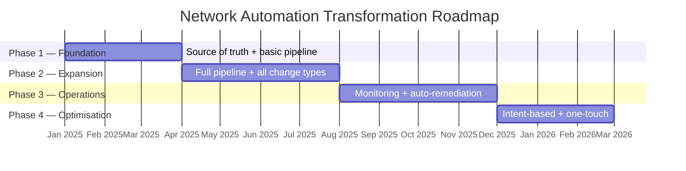

# Executive Summary

Network automation is not an IT infrastructure project. It is a strategic capability that determines how quickly an organisation can act on business decisions, how reliably it can demonstrate regulatory compliance, and whether infrastructure will be a constraint or an enabler as the business grows.

This handbook provides the frameworks, architecture patterns, and working implementations for organisations undertaking this transformation. This chapter provides the complete business case in a form suitable for senior leaders making investment decisions.

---

## The Problem

Most enterprise network operations teams face the same set of structural problems, regardless of their size or sector. They are not the result of poor engineering. They are the result of an approach to network management that was designed for a simpler era and does not scale with modern business demands.

**Manual configuration does not scale.** Network engineers configure devices individually, using command-line interfaces, applying changes that exist in their heads before they exist anywhere else. As the estate grows — more devices, more sites, more business requirements — the team's capacity is consumed entirely by keeping the network running. There is no capacity left for improvement.

**Change is slow and risky.** A change that should take hours takes days, because every step requires human expertise: understanding the current state, reasoning about the impact, applying the change carefully, testing it manually, and documenting it retrospectively. When a change causes an outage, the rollback is also manual — which means it is also slow. In a financial institution, minutes of trading downtime translate directly to revenue loss.

**Compliance is retrospective and labour-intensive.** When an auditor asks "does your network enforce the segmentation required by MiFID II Article 48?", the answer requires gathering configuration snapshots from production devices, cross-referencing them against policy requirements, and assembling a report. This work takes days, reflects a single point in time, and produces evidence that may already be stale by the time it is reviewed.

**The network becomes a bottleneck.** When adding a new branch office takes three weeks — two of which are network team configuration and testing time — the business's ability to act on strategic decisions is constrained by infrastructure. When a new regulatory requirement takes six weeks to implement across 200 devices, the compliance exposure window is six weeks long. The network, which should be an enabler, becomes a constraint.

These are solvable problems. They have a common root cause: the network is managed by hand, device by device, with human expertise as the only connection between what the business needs and what the network does. The systemic solution is automation — not as a collection of scripts, but as a fundamental change in how the network is designed, changed, and operated.

---

## The Opportunity

Network automation, implemented as a disciplined transformation rather than a collection of tools, delivers against four business value pillars simultaneously.

| Value Pillar | What Changes | Typical Outcome |
|---|---|---|
| **Risk Reduction** | Every change is validated before deployment. Automated testing catches errors before they reach production devices. | 60–80% reduction in change-related incidents; compliance evidence generated continuously |
| **Cost Reduction** | Routine operational tasks — configuration generation, compliance reporting, incident diagnosis — are automated. | 40–60% reduction in manual operational effort; engineering hours redirected to higher-value work |
| **Business Agility** | New sites, new connectivity, new security policies are provisioned through automation rather than manual configuration. | New branch provisioning from weeks to same-day; change lead time from days to hours |
| **Service Quality** | Automated monitoring, anomaly detection, and self-healing reduce the time between a problem occurring and it being resolved. | MTTR reduction of 50–70%; proactive detection replaces reactive response |

These outcomes are not theoretical. They are reported by organisations that have completed the transformation described in this handbook. The investment to achieve them is real, but so are the returns.

### The Compliance Dimension

For financial services organisations, the compliance case for automation is often the clearest. The pipeline that governs every change also produces the evidence of that change: what was proposed, what tests it passed, who approved it, when it was deployed, and what the network looked like before and after. This evidence is available immediately, from the pipeline history, without manual assembly.

The traditional compliance model — periodic audits that verify a point-in-time snapshot — is replaced by continuous compliance: every change is compliant before it is deployed, and the evidence is a natural by-product of the operational workflow. Audit preparation time falls from days to hours.

---

## The Transformation Journey

Automation does not arrive fully formed. Organisations progress through distinct maturity levels, each building on the one before. Understanding where an organisation sits on this spectrum is the starting point for planning the transformation.

| Level | Characteristic | What It Looks Like |
|---|---|---|
| **L1 — Reactive** | Manual, device-by-device operations | CLI access to devices; changes by individuals; no version control; compliance by audit |
| **L2 — Task-Based** | Scripts and templates for specific tasks | Some processes automated; inconsistent tool usage; no shared platform |
| **L3 — Integrated Workflows** | Source of truth and pipeline in place | All changes through version-controlled pipeline; configuration generated from data model |
| **L4 — Network as a Platform** | Intent-based design; automated compliance | Pipeline validates against design intents; behavioural testing before every deployment |
| **L5 — Adaptive / Intent-Based** | Self-provisioning and self-healing | New sites provisioned automatically; configuration drift corrected without human intervention |

Most organisations are at L1 or L2. A well-executed transformation programme reaches L3 or L4 within 12–18 months. L5 represents the mature state that organisations with strong L4 foundations can achieve as the next phase.

### The Four-Phase Roadmap

The transformation is structured as four phases, each delivering measurable capability and building the foundation for the next.

**Phase 1 — Foundation (months 1–3):** Establish the source of truth (a version-controlled data model of every device's intended configuration), build the initial CI/CD pipeline, and automate the highest-value, lowest-risk change types. Demonstrate early value through visible time savings on routine tasks.

**Phase 2 — Expansion (months 4–7):** Extend the pipeline to cover all change types. Add behavioural network testing. Establish intent-based design. Every change in scope goes through the pipeline; no manual exceptions.

**Phase 3 — Operational Maturity (months 8–11):** Build the observability and auto-remediation capability. Automated incident diagnosis, self-healing for defined fault categories, operational dashboards. The network team's on-call burden begins to fall measurably.

**Phase 4 — Optimisation (months 12–14):** One-touch provisioning for standard site and connectivity types. Intent-driven generation. The network becomes a platform that the business self-serves, within governed guardrails.

---

## The Investment

Automation is an investment with a clear three-year return curve: the first year has a negative return as the foundation is built; the second year breaks even as operational savings accumulate; the third year produces compounding returns as the automation scales.

The investment covers three dimensions:

### People

The most important investment and the most common underestimation. Automation requires skills that most network teams do not currently have: software engineering, pipeline design, data modelling, test automation. These skills must be either hired in or developed.

The right model for most organisations: hire two to three automation specialists (who know how to build pipelines and intent models) and invest in upskilling the existing network team (who know the network and carry the institutional knowledge the automation needs). The specialists build the capability; the existing team owns and operates it.

Do not attempt to build automation without automation expertise. And do not replace the network team with automation specialists — the domain knowledge walks out the door with them.

### Process

Automation changes how change management works. The pipeline becomes the change control system. Merge request approval replaces CAB approval for routine changes. The audit trail is the pipeline history.

This requires deliberate process change, not just tooling change. Engineers need to trust the pipeline before they will use it for everything. The trust is built through demonstrated reliability, low friction, and early wins. It is a leadership responsibility to create the conditions for that trust to develop.

### Technology

The tooling investment is smaller than most organisations anticipate, because most of the required capability can be assembled from open-source tools and cloud-native platforms. The significant cost is not the tools themselves; it is the integration work, the intent model design, and the ongoing maintenance.

The governing principle: buy commodity capabilities (source of truth platforms, monitoring stacks, CI/CD platforms, workflow orchestration), and build only what represents genuine competitive advantage specific to your architecture and compliance posture.

A three-year total cost of ownership analysis — covering licensing, hosting, integration, expertise, and ongoing maintenance — provides a more accurate investment picture than any single-year cost comparison.

---

## Measuring Return

Three dashboard views track the transformation's progress and demonstrate return to different audiences.

**Executive view (monthly, for sponsors and leadership):**
- Automation adoption rate — what percentage of eligible changes go through the pipeline
- Change lead time — how long from approved request to deployed change
- Incident rate — network-related incidents per month, trending against baseline
- Audit preparation effort — hours required to respond to a compliance request

**Engineering view (weekly, for the team):**
- Pipeline success rate — reliability of the automation tooling itself
- Intent test coverage — what percentage of design standards have automated verification
- Active contributors — how broadly the team is engaging with the automation
- Manual exception rate — how often engineers are bypassing the pipeline

**Operations view (daily, for operational awareness):**
- Drift detected vs remediated — the auto-healing system's effectiveness
- Incident auto-resolution rate — what proportion of incidents are handled without human intervention
- Mean time to detect — how quickly the monitoring layer identifies problems

The key principle: **capture the baseline before the programme starts**. Change lead time, incident rate, MTTR, and audit preparation time should be measured in the first month of the programme and tracked monthly thereafter. Without a baseline, the return cannot be demonstrated — and demonstrating the return is what sustains executive support through the investment period.

---

## What Makes Programmes Succeed or Fail

Across the organisations that have undertaken this transformation, the patterns of success and failure are consistent.

**Programmes succeed when:**
- Senior leadership provides sustained support and shields the programme from operational firefighting
- Early use cases are chosen for maximum engineer impact, not maximum business prestige — automation that removes painful manual tasks creates advocates faster than automation that solves abstract strategic problems
- The automation is treated as a product with a backlog, a product owner, and regular stakeholder engagement — not as a project that delivers once and concludes
- Networking expertise is preserved and paired with automation expertise, rather than one replacing the other

**Programmes fail when:**
- The investment is approved but the engineering team capacity is never protected — engineers are pulled back into operational work and the automation programme stalls
- The tooling is deployed but adoption is assumed rather than designed — engineers revert to manual workflows because the pipeline is slow, unfamiliar, or lacks trust
- The scope expands faster than the team's capability to deliver and support it — technical debt accumulates in the automation platform itself
- Leadership support evaporates before the second-year returns materialise — the programme is cancelled during the investment period before the return is visible

The common thread in failure is treating automation as a technology initiative. It is an organisational transformation. Technology is the mechanism; leadership, process change, and people development are the determinants of outcome.

---

## Where to Go Next

This handbook provides the detailed frameworks and working implementations for every aspect of the transformation described above.

| Your priority | Start here |
|---|---|
| **Assess where you are today** | [Chapter 3 — Maturity Model](../03-maturity-model/chapter.md) and assessment templates |
| **Build the business case** | [Chapter 2 — Business Alignment](../02-business-alignment/chapter.md) and business case template |
| **Design the roadmap** | [Chapter 4 — Transformation Roadmap](../04-transformation-roadmap/chapter.md) |
| **Understand the architecture** | [Chapter 6 — Architecture Patterns](../06-architecture-patterns/chapter.md) |
| **Build the first pipeline** | [Chapter 7 — Implementation Guides](../07-implementation-guides/chapter.md) |
| **Plan the people strategy** | [Chapter 10 — People and Skills](../10-people-and-skills/chapter.md) |
| **Make the compliance case** | [Chapter 12 — Security and Compliance](../12-security-compliance/chapter.md) |
| **Track the programme** | [Chapter 13 — Dashboards](../13-dashboards/chapter.md) |

---

*The rest of the handbook provides the detail behind this summary. Each chapter is structured to serve multiple audiences: the strategic overview is in the opening section; the implementation detail is in the body. Senior leaders can read the first section of each chapter and understand the decisions involved without reading the technical content.*
