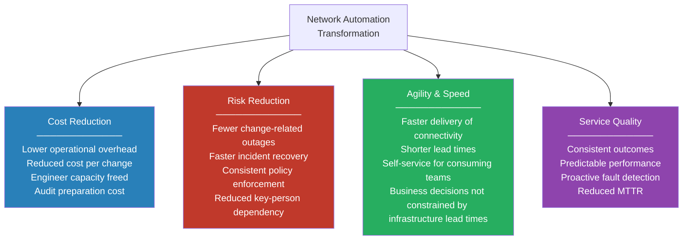
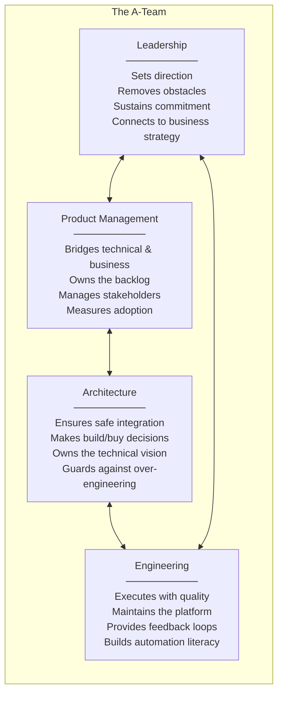
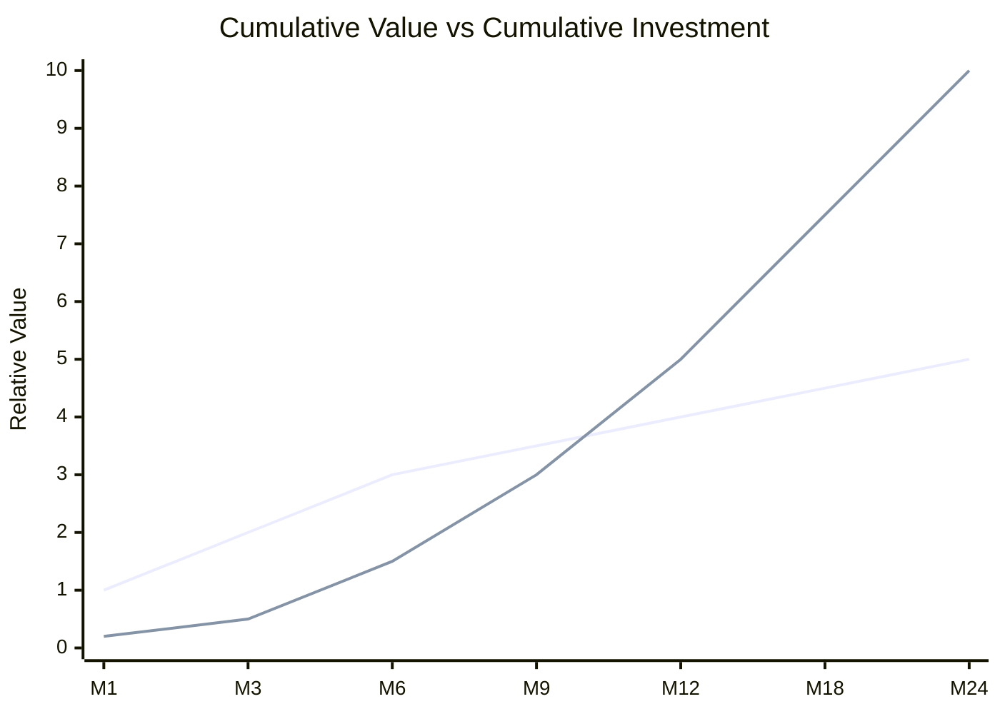

# Chapter 2: Business Alignment

> "Most automation programmes do not fail because the technology didn't work. They fail because nobody could explain why it mattered."

Network automation is a technical discipline. But the decisions that determine whether a transformation programme succeeds — whether it receives sustained investment, whether it survives a change in leadership, whether it earns the trust of consuming teams — are not technical decisions. They are business decisions.

This chapter provides the frameworks and language for keeping network transformation anchored to business value throughout its entire lifecycle: from building the initial business case, through sustaining alignment during execution, to measuring and communicating outcomes that leadership can act on.

The audience for this chapter is both inward and outward-facing. Inward: this is how architects and transformation leads should think about the work they are doing. Outward: this is the vocabulary and framing that will land in a leadership meeting, a budget review, or a board presentation.

---

## Why Business Alignment Fails

Network teams are typically good at articulating technical problems. They are less practised at translating those problems into the language of business risk, cost, and competitive capability. The result is a familiar dynamic: the network team knows what needs to change, presents it in technical terms, receives polite interest but insufficient investment, and eventually either shelves the initiative or proceeds with inadequate resources.

There are three patterns that consistently produce this outcome:

**The solution looking for a problem.** The initiative begins with a tool or technology — "we want to implement Ansible," "we should adopt NetBox" — and works backward to a justification. Leadership hears the technology first and the rationale second. This frames the investment as a technical preference rather than a business need.

**The maturity score without a business consequence.** Teams present their automation maturity level ("we are at Level 2") without connecting it to a specific, quantifiable business impact. Leaders cannot make investment decisions based on maturity levels — they can make decisions based on cost, risk, and capability gaps.

**The one-time business case.** A compelling case is made at programme initiation, funding is secured, and then business alignment is treated as complete. Six months later, when priorities shift or a delivery phase is messier than expected, there is no ongoing mechanism to reaffirm value and maintain commitment.

Each of these patterns has a remedy. The rest of this chapter provides them.

---

## The Four Value Pillars

Every meaningful business outcome from network automation falls into one of four categories. These are the value pillars — the language through which technical work is translated into business terms.



These pillars are not mutually exclusive — a single automation initiative will typically deliver value across more than one. But having a clear primary pillar for each initiative helps with prioritisation, investment justification, and measurement.

### Cost Reduction

Network operations is labour-intensive. In organisations without mature automation, a disproportionate share of skilled engineering time is spent on routine execution: provisioning VLANs, updating ACLs, applying firmware updates, gathering audit evidence. These tasks are repetitive, low-risk when well-understood, and poor uses of the most expensive resource in the team.

Automation shifts where engineer time goes. The cost reduction case is not primarily about headcount reduction — it is about redeployment of expensive capacity toward higher-value work. In practice:

- Time spent on routine changes is reduced or eliminated, freeing capacity for design, resilience improvement, and capability development
- Audit evidence that previously required weeks of manual assembly is generated automatically as a by-product of the pipeline
- Incident resolution time falls as automated detection and triage replace manual diagnosis
- The cost of adding new sites or services falls as templated provisioning replaces bespoke engineering effort

**How to quantify it:** Count the hours. How many engineer-hours per week are spent on tasks that a mature automation platform would handle automatically? Multiply by fully-loaded cost. The result is the addressable cost — the upper bound on what automation can recover. A conservative estimate of 30–40% recovery in Year 1, rising as coverage expands, is defensible in most organisations.

### Risk Reduction

Manual network operations carry inherent risk. Every change executed via CLI by an engineer under time pressure carries the possibility of error — a mistyped command, a missed dependency, a step executed in the wrong sequence. In a financial services environment, these errors translate directly to trading platform outages, regulatory exposures, and reputational damage.

Automation reduces this risk through consistency, validation, and traceability:

- Changes are validated before deployment — syntax, policy compliance, and intent correctness checked in the pipeline before a single device is touched
- Outcomes are consistent — the same change produces the same result regardless of who initiated it or when
- Rollback is automatic — when a deployment fails, the system reverts without requiring a human to diagnose and decide
- The audit trail is complete — every change is recorded with its author, its approval, its validation result, and its deployment outcome

**The key framing for risk:** The cost of inaction is not zero. Every month the organisation operates with manual change processes is a month of accumulating risk. Change-related outages have direct financial costs — for a trading firm, even a brief outage during market hours carries a measurable revenue impact. The risk reduction case asks: what is the expected annual cost of the incidents that better automation would prevent?

### Agility and Speed

Lead time — the elapsed time from a business request to its delivery — is where network automation most visibly changes the relationship between the network team and the rest of the organisation.

When a new trading venue connection takes four weeks, the business cannot move faster than four weeks. When it takes four hours, infrastructure stops being the bottleneck. This is not a marginal improvement — it changes the nature of what is possible commercially.

Agility is the value pillar most visible to stakeholders outside the network team. Application teams, business development, and product management all experience lead time directly. When it improves, they notice. When it stays long, they route around the network team through workarounds, shadow IT, or escalations.

**The competitive framing:** In financial services, the ability to onboard new connectivity — markets, exchanges, dark pools, data feeds — faster than competitors is a commercial capability. Every day of delay in bringing a new venue live is a day of missed opportunity. Automation that reduces that lead time from weeks to hours is not an IT efficiency improvement — it is a business enabler.

### Service Quality

Consistency and predictability are undervalued outcomes of automation. In manual operations, quality varies by engineer, by time of day, by how much pressure the team is under. The same type of change can produce different results depending on who handles it.

Automation delivers consistency at scale. Every change of a given type is handled identically. Configurations conform to standards because the templates enforce them, not because engineers remember to apply them. Policies are enforced because the pipeline checks for compliance, not because a reviewer catches violations in a post-change audit.

Over time, this consistency compounds. Networks with less drift are easier to operate. Configurations that conform to a known pattern are easier to troubleshoot. Teams that trust their automation are faster to make changes — the confidence that the pipeline will catch errors allows them to move with less hesitation.

---

## Tracing Business Requirements to Technical Implementation

One of the most practically useful things a network architect or transformation lead can do is maintain an explicit traceability chain from business requirement to technical implementation to KPI. This chain serves multiple purposes: it justifies design decisions, it identifies the right metrics for each initiative, and it provides the evidence for business case reviews.

The chain has four links:

```
Business Requirement
        ↓
Design Intent
        ↓
Technical Implementation
        ↓
KPI / Measurement
```

**Business Requirement** — a statement of what the business needs, in business terms, without reference to technology. It should be traceable to a specific stakeholder or business outcome.

**Design Intent** — a statement of what the network must do to meet that requirement. Still at an architectural level — not a configuration decision, but a network design commitment.

**Technical Implementation** — the specific technical capability, pattern, or change that delivers the design intent. This is where tooling and architecture choices appear.

**KPI** — the metric that will confirm the requirement is being met, and that will demonstrate value to the stakeholder who raised the requirement.

### ACME Investments — Worked Example

The following traces four of ACME's core business requirements through this chain.

---

**Requirement 1: MiFID II and FCA SYSC compliance**

| Link | Content |
|---|---|
| **Business Requirement** | All network changes must be fully auditable and traceable to an authorised requester. Evidence must be available on demand without manual assembly. |
| **Design Intent** | Every configuration change is version-controlled, peer-reviewed, and pipeline-validated. The pipeline generates a complete audit record: requester, approver, validation result, diff, and deployment timestamp. |
| **Technical Implementation** | GitLab CI pipeline with merge request approval gates, automated diff generation, and structured pipeline logs exported to the SIEM. All changes committed to Git with attribution. |
| **KPI** | Audit evidence preparation time (target: on-demand, zero manual effort). Percentage of changes with complete audit records (target: 100%). |

---

**Requirement 2: Faster onboarding of trading venues**

| Link | Content |
|---|---|
| **Business Requirement** | New trading venue connectivity — including network provisioning, firewall policy, and BGP peering — must be available within one business day of commercial agreement. |
| **Design Intent** | Trading zone connectivity follows a templated pattern. A new venue requires parameterisation of a known template, not bespoke design. All dependencies (firewall policy, BGP configuration, VLAN allocation) are automated within the same workflow. |
| **Technical Implementation** | `generate_venue.py` generates the full configuration set from a structured specification. Batfish validates the result against the existing topology model. Pipeline deploys on approval. |
| **KPI** | Lead time from commercial agreement to live connectivity (baseline: 15 days; target: same-day). |

---

**Requirement 3: Reduce change-related outages**

| Link | Content |
|---|---|
| **Business Requirement** | Network-related incidents caused by change errors should be below 2 per quarter, with MTTR under 30 minutes for those that do occur. |
| **Design Intent** | All production changes are validated in a model before deployment. Failed deployments trigger automatic rollback. No direct CLI access to production devices during standard change execution. |
| **Technical Implementation** | Batfish pre-deployment validation for all topology-affecting changes. Automatic rollback on pipeline failure. Break-glass process for emergency CLI access with mandatory post-incident review. |
| **KPI** | Change-related incident count per quarter. MTTR for change-related incidents. Change success rate (target: >99%). |

---

**Requirement 4: Reduce operational cost**

| Link | Content |
|---|---|
| **Business Requirement** | Reduce the proportion of senior engineer time spent on routine execution from the current ~60% to below 20%, redeploying that capacity toward platform development and resilience improvement. |
| **Design Intent** | All standard change types are fully automated. Engineers initiate changes through the pipeline; they do not execute them directly. Operational runbooks are replaced by automated workflows for all in-scope scenarios. |
| **Technical Implementation** | Full pipeline coverage for standard change types. Workflow orchestration for cross-team changes. Self-service portal for application team requests. |
| **KPI** | Percentage of engineer time on routine execution vs strategic work. Deployment frequency. Number of self-service requests processed without network team intervention. |

---

A blank traceability template is available at [`templates/business-requirement-traceability.md`](../templates/business-requirement-traceability.md).

---

## The A-Team: Aligning the Right People Before Selecting Tools

One of the most reliable predictors of automation programme failure is tool selection that precedes team and stakeholder alignment. When a team selects a platform before defining what they are trying to achieve and who needs to be committed to the outcome, the tool becomes the programme — and all subsequent decisions are filtered through the constraint of making the chosen tool work, rather than solving the original problem.

The right sequence is alignment first, tooling second. And alignment requires the right people in the room.

Successful transformation programmes are supported by four aligned roles. These do not need to be four separate individuals — in smaller organisations, one person may carry two of these responsibilities — but all four functions must be present and actively engaged.



### Leadership

The leadership role is not ceremonial. In a transformation programme, leadership provides the mandate — the authority to change how the team operates, the protection to make decisions that create short-term friction, and the connection between the automation programme and the business outcomes it is supposed to deliver.

Specific responsibilities:
- Defines the target state in business terms and secures the investment to pursue it
- Removes structural obstacles — change management processes that prohibit automated deployment, procurement constraints that delay tooling decisions, organisational boundaries that prevent cross-team coordination
- Sustains commitment through the messy middle — the period when foundations are being built and visible business outcomes are still ahead
- Holds the programme accountable to business outcomes, not just technical deliverables

What leadership failure looks like in practice: a sponsor who champions the programme in presentations but is unavailable when actual blockers need to be resolved. A leader who delegates the business case to the engineering team and then finds the resulting document too technical to advocate for in a budget review.

### Product Management

The product management role is the one most commonly absent from network automation programmes. Engineering teams assume that because automation is a technical initiative, it does not require product management. The result is a technically capable platform with low adoption, no feedback loop, and no clear answer to "what does the business get from this?"

The product manager's role is to own the relationship between the automation platform and its consumers. They maintain the backlog — the prioritised list of capabilities to build — with input from all stakeholders. They measure adoption and surface the signals that tell the engineering team whether the platform is actually delivering value. They communicate progress in business terms.

In organisations where a dedicated product manager is not available, this function can be filled by a technically fluent project manager or by a senior engineer who is explicitly given the mandate and the time to fulfil it. What it cannot be is a secondary responsibility that nobody owns clearly.

### Architecture

The architecture role ensures that automation decisions are made with a complete view of the technical landscape — what integrations are required, what risks are introduced, what technical debt accumulates with each choice, and when a build decision should be a buy decision instead.

Architecture in a transformation programme is not primarily about designing elegant systems. It is about preventing expensive mistakes: the source of truth data model that has to be redesigned after eighteen months because it cannot accommodate multi-vendor environments; the pipeline architecture that works perfectly for one team and cannot be extended to others; the intent abstraction that is the right level for the current use case but creates a ceiling for future evolution.

Architecture also makes the buy-versus-build decisions explicit. Every internally built component has a total cost of ownership that is frequently underestimated. The architect's role is to ensure those costs are visible before the decision is made, not discovered after the component is in production.

### Engineering

The engineering team executes the transformation — building the automation, operating the pipeline, maintaining the platform. Their specific contribution to business alignment is closing the feedback loop: surfacing what is working, what is not, what the platform needs to do better to serve its consumers.

Engineers who are given no visibility into the business outcomes they are contributing to will optimise for technical elegance over business value. Engineers who understand why a particular capability matters — why faster venue onboarding is commercially significant, why the audit trail matters to the compliance team — make better decisions and build better products.

This is not about overwhelming engineers with business context. It is about ensuring that the team building the platform understands who they are building it for and what success looks like for those people.

---

## The Software Mindset as Competitive Advantage

There is a broader framing for network automation that is worth establishing in any business case directed at senior leadership, particularly in financial services.

The organisations that have disrupted established industries in the last decade have not necessarily had more capital, more people, or better access to markets than the incumbents they displaced. What they had was a fundamentally different relationship with software — they treated it as the primary mechanism through which they operated, competed, and improved.

The lesson for network infrastructure organisations is specific: the speed at which you can learn, build, deploy, and improve is increasingly a competitive advantage equal to — and in many scenarios greater than — the quality of the hardware you operate.

Manual network operations have a fixed rate of change. Every change requires an engineer, a change window, a review, and a recovery plan. The throughput ceiling is set by human capacity. A mature automation platform has a very different ceiling — the rate of change is limited by the quality of the automation and the discipline of the team, not by the number of engineers available to execute CLI commands.

This matters in financial services in a direct and specific way. The ability to onboard new connectivity, respond to market structure changes, adapt network policy to new regulatory requirements, or expand into new geographies faster than competitors is a commercial capability. Every week saved in delivery is a week of competitive advantage.

**The reframe for leadership:** Network automation is not an IT efficiency programme. It is infrastructure investment in the organisation's ability to move faster. Frame it that way — and measure it that way.

Three principles from this framing that should shape how automation programmes are designed:

**Design from outcomes, not from current state.** Rather than asking "how do we automate what we do today?", ask "if we were building this network operation from scratch today, what would it look like?" The answer is almost always more API-first, more intent-driven, and more automated than the current state. Use that answer to set the direction, then sequence the work to get there.

**Stability and compliance are not friction.** In regulated environments, automation programmes are sometimes designed *around* compliance requirements — treating audit trails, change controls, and policy enforcement as constraints that slow things down. The right design makes compliance a by-product of good automation. The pipeline that generates an audit trail automatically is faster than the one that requires manual evidence assembly. Design for compliance first; speed follows.

**Learning speed compounds.** The value of investing in automation capability is not just the efficiency of the current deployment. It is the rate at which the team can learn, improve, and extend the platform. An organisation that builds strong automation foundations in Year 1 is not just more efficient in Year 1 — it is positioned to deploy Year 2 and Year 3 capabilities faster than an organisation that is still building foundations.

---

## Building the Business Case

A business case for network automation investment has five components. Each is addressed below, with the framing that is most likely to land with a senior leadership audience.

### 1. The Current-State Cost

Quantify what the current state costs. This requires honest measurement, not estimation. The most credible numbers come from the organisation's own data.

Sources to draw from:
- Change management system: how many network changes are raised per month? What is the average elapsed time from request to completion?
- Incident records: how many incidents in the last 12 months were caused by network change errors? What was the aggregate business impact (downtime, trading interruption, regulatory notification)?
- Engineer time: what percentage of the team's time is spent on routine execution versus strategic work? How does this compare to the team's intended purpose?
- Audit costs: how many days of engineering time are spent preparing evidence for the last regulatory review?

These numbers establish the baseline. They also establish the cost of inaction — the cumulative expense of continuing to operate as today, before any transformation investment is made.

### 2. The Target-State Value

Project the value of the target state across all four value pillars. Be conservative — credibility matters more than ambition at this stage.

| Value Pillar | Metric | Conservative Estimate |
|---|---|---|
| Cost Reduction | Engineering hours recovered per week | 30–40% of current routine execution time |
| Risk Reduction | Change-related incident reduction | 70–80% reduction in change-related outage frequency |
| Agility | Lead time improvement | Standard changes: 10 days → same day |
| Service Quality | MTTR improvement | P1 network incidents: 50% reduction |

Each of these should be expressed in financial terms wherever possible. Recovered engineering hours have a fully loaded cost. Avoided outages have a revenue impact. Faster delivery has a commercial value.

### 3. The Investment Required

Be explicit about what is being asked for. Vague investment requests lose in budget reviews. Specific, phased investment requests — tied to specific outcomes at each phase — win.

Structure the investment across the four transformation pillars:

| Phase | People | Tooling | Programme Management | Total |
|---|---|---|---|---|
| Phase 1 — Foundation | Upskilling + 0.5 FTE platform engineering | Source of truth platform, version control | Project management (0.25 FTE) | |
| Phase 2 — Scale | +1 FTE automation engineer | Workflow orchestration tooling, observability | | |
| Phase 3 — Platform | Architect time, self-service portal development | | | |

### 4. The ROI Timeline

Network automation investment returns unevenly. Phase 1 foundations cost money without returning full value immediately. The return curve accelerates in Phase 2 and reaches full velocity in Phase 3 and beyond, as automation coverage expands and the compounding benefits of consistent, fast, auditable change delivery accumulate.



The crossover point — where cumulative value delivered exceeds cumulative investment — typically falls between Month 9 and Month 15, depending on the organisation's starting point and the pace of Phase 1 delivery. The business case should show this curve explicitly. It sets honest expectations and demonstrates that the programme has been designed with return on investment in mind, not just capability delivery.

### 5. The Cost of Inaction

The most persuasive element of a network automation business case is often the cost of doing nothing. This is not a rhetorical device — it is a genuine calculation.

Every year of continued manual operations has a quantifiable cost:
- Engineering hours on routine execution that could be redeployed
- Incidents caused by change errors that mature automation would prevent
- Regulatory audit effort that automated evidence generation would eliminate
- Business opportunities constrained by long infrastructure lead times

The cost of inaction compounds. An organisation that delays transformation by 18 months does not simply delay the benefits — it accumulates 18 months of preventable cost.

Present this framing to leadership. The question is not "should we invest in automation?" The question is "how much is it costing us each month to continue without it?"

---

## Maintaining Alignment Through the Transformation

Alignment at programme initiation is necessary but not sufficient. The organisations that sustain transformation programmes through to full maturity are those that treat business alignment as an ongoing discipline, not a one-time activity.

Three practices sustain alignment over time:

**Monthly stakeholder updates in business language.** Not pipeline deployment counts or automation coverage percentages — but lead time improvements, incident reductions, and engineer capacity recovered. Each update should answer: what business value was delivered this month that could not have been delivered without the automation programme?

**Early and visible wins.** Phase 1 is designed to deliver a demonstrable improvement in a short timeframe. The specific improvement — VLAN provisioning from four days to two hours, audit evidence on demand, one-touch branch deployment — is less important than the visibility of that improvement to stakeholders beyond the network team. A win that is delivered but not communicated is half a win.

**Explicit tracking against the original business case.** The metrics established at programme initiation should be reviewed quarterly against the targets set in the business case. If the programme is on track, this reinforces confidence. If it is behind, it surfaces the issue early enough to address it. What erodes alignment fastest is the absence of data — when leadership cannot tell whether the investment is working, their confidence defaults to scepticism.

---

## Downloadable Templates

| Template | Purpose | Format |
|---|---|---|
| [Business Requirement Traceability](../templates/business-requirement-traceability.md) | Four-link chain from requirement to KPI | Markdown |
| [Business Case Template](../templates/business-case.md) | Five-component business case structure | Markdown |
| [A-Team Roles and Responsibilities](../templates/a-team-roles.md) | Role definitions and gap assessment | Markdown |
| [Value Pillar Mapping](../templates/value-pillar-mapping.md) | Map initiatives to value pillars with KPIs | Markdown |

---

## Summary

Business alignment is not a box to tick at programme initiation. It is the discipline that keeps a transformation programme funded, trusted, and directionally correct from the first workshop to the final phase.

The four value pillars — cost reduction, risk reduction, agility, and service quality — provide the vocabulary. The traceability chain turns business requirements into measurable technical commitments. The A-Team structure ensures the right people are aligned before tool selection. The software mindset provides the competitive framing that elevates the conversation from IT efficiency to strategic capability.

Build the business case on honest numbers, not aspirational estimates. Present the cost of inaction alongside the cost of investment. And maintain alignment actively — through regular communication, visible wins, and explicit measurement against the original commitments.

The transformation programme that leadership trusts is the one that delivers what it said it would deliver, and is honest about the difference when it does not.

---

*Next: [Chapter 3 — Maturity Model](../03-maturity-model/) — assessing where your organisation stands today, as the foundation for everything that follows.*
