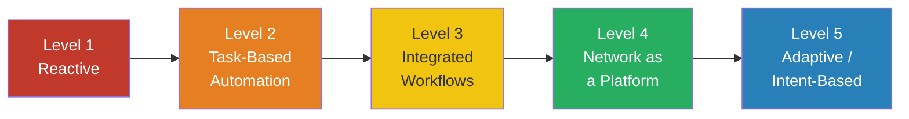

# Chapter 3: The NetDevOps Maturity Model

> "Before running a marathon, you need to understand your current health — not just your ambitions."

Transformation programmes fail not because organisations lack ambition, but because they misread their starting point. Teams invest in sophisticated tooling before establishing the foundations that make those tools useful. Leaders set timelines based on aspiration rather than capability. Engineers adopt automation patterns that their organisation is not yet structured to support.

The maturity model exists to prevent this. It is not a grading exercise. It is a shared diagnostic — a way for engineering, operations, security, and business stakeholders to agree on where the organisation stands today, before debating where it should go next.

This chapter presents the NetDevOps Maturity Model, explains what each level means in practice, and provides a structured approach to running your own assessment. The output feeds directly into the transformation roadmap covered in [Chapter 4](../04-transformation-roadmap/).

---

## Why Assess Before You Act

The instinct in most organisations is to move quickly. There is pressure to show progress, demonstrate investment in modern tooling, and keep pace with peers. This instinct is understandable — and frequently counterproductive.

Skipping the assessment creates predictable problems:

- **Misaligned investment.** Funding goes toward automation tooling when the real blocker is the absence of a source of truth, or a change process that cannot support rapid deployment.
- **Wasted effort.** Teams build capabilities that the wider organisation is not ready to consume or maintain.
- **Frustrated engineers.** Skilled people are hired or retrained for a future state that never materialises because the foundational work was skipped.
- **Stalled transformation.** Progress is visible in demos and proofs of concept, but never transitions into production operations.

A maturity assessment forces a different conversation — one grounded in current operational reality rather than vendor roadmaps or conference presentations. It answers a simple but critical question: *given where we actually are today, what do we need to do first?*

---

## Anchoring to Business Outcomes

A maturity model without business context is just a technical scorecard. The goal is not to reach Level 5 — it is to deliver outcomes that matter to the business.

Before scoring any capability, establish your organisation's value pillars. These are the business outcomes that network transformation must serve. In most enterprises, they fall into four categories:

| Outcome | What It Means in Practice |
|---|---|
| **Reliability & Resilience** | Fewer outages, faster recovery, predictable performance under load |
| **Speed & Agility** | Faster delivery of connectivity, reduced lead times, ability to respond to business change |
| **Cost Efficiency** | Reduced operational overhead, better use of engineer time, lower cost per change |
| **Risk & Compliance** | Consistent controls, auditable changes, reduced exposure from human error |

Every capability improvement you identify during the assessment should map to at least one of these outcomes. If it does not, question whether it belongs on the roadmap at all.

For ACME Investments, the mapping looked like this:

| Business Driver | Outcome Category | Network Implication |
|---|---|---|
| Faster onboarding of trading venues | Speed & Agility | Reduce branch and connectivity provisioning from weeks to hours |
| MiFID II and FCA SYSC compliance | Risk & Compliance | Full audit trail for every network change, automated evidence generation |
| Reduce operational cost | Cost Efficiency | Reduce manual effort per change; redeploy engineering capacity toward higher-value work |
| Improve trading platform resilience | Reliability & Resilience | Faster incident detection, automated failover, reduced MTTR |

This framing matters when presenting the assessment output to senior leadership. The question is never "what maturity level are we?" — it is "what business outcomes are we unable to deliver reliably today, and what capability gaps are causing that?"

---

## The Five Maturity Levels

The model describes five levels of capability. Each level is defined not only by what tools are in use, but by how the organisation *behaves* — how changes are made, how knowledge is held, how incidents are resolved, and how engineering capacity is spent.



---

### Level 1 — Reactive

**The defining characteristic:** Everything starts with a ticket.

Engineers log into devices directly. IP addresses may still live in spreadsheets. Configuration knowledge exists in the heads of a small number of experienced individuals. When those individuals leave, knowledge walks out of the door with them.

Change windows are high-anxiety events. The team spends significant energy preparing for, executing, and recovering from routine changes. Incidents trigger manual triage, with no systematic tooling to accelerate diagnosis or resolution.

**Organisational behaviour:**
- Changes are made by connecting to devices individually and applying commands manually
- Documentation is sparse, often out of date, and not trusted
- A small group of "heroes" carry disproportionate operational burden
- Application teams wait weeks for basic connectivity changes

**Business impact:**
- Long lead times constrain business agility
- High change failure rate increases operational risk
- Manual audit evidence gathering consumes weeks of effort before regulatory reviews
- Engineer burnout and retention risk from sustained reactive pressure

**Key metrics:**
- Lead time for change: 10+ days
- Change success rate: below 85%
- Audit preparation time: weeks

---

### Level 2 — Task-Based Automation

**The defining characteristic:** Some things are automated, but only informally.

A handful of engineers have begun writing scripts to handle repetitive tasks. Python scripts run backups. Ansible playbooks deploy VLAN configurations. Some of the most time-consuming manual work has been partially automated.

The critical weakness at this level is that automation is personal, not organisational. Scripts live on individual laptops. There is no shared repository, no standards, no peer review. When the engineer who wrote the script moves on, the automation often becomes unusable or undiscoverable.

Outcomes are inconsistent — a request handled by the automation-capable engineer completes in minutes; the same request handled by another engineer takes days.

**Organisational behaviour:**
- Scripting is practiced by a few individuals, not adopted as a team discipline
- No source of truth — scripts pull data from wherever the engineer happens to look
- Automation coverage is patchy and unmeasured
- Scripts frequently break when device software versions change

**Business impact:**
- Inconsistent service delivery depending on who handles the request
- Automation debt accumulates — scripts that no one else can maintain
- Apparent progress masks the absence of systematic change

**Key metrics:**
- Automation coverage: below 20% of change types
- MTTR improving for known issue patterns, but inconsistent overall

> **The scripting trap:** Level 2 feels like progress — and for individual engineers, it is. But organisations sometimes confuse informal scripting activity with structural automation capability. The distinction matters: individual scripts are productivity tools; a shared, maintained, tested automation platform is an organisational capability. Level 2 organisations often stall here for years.

---

### Level 3 — Integrated Workflows

**The defining characteristic:** Automation becomes an organisational discipline, not an individual habit.

This is the turning point. A source of truth is established — a single, authoritative record of what the network is supposed to look like. Automation is version-controlled, peer-reviewed, and shared. Processes are documented and repeatable.

The key shift is behavioural: engineers stop asking "did you remember to do X?" and start asking "does the pipeline confirm X was done correctly?" Outcomes are consistent regardless of which engineer is on shift.

**Organisational behaviour:**
- A source of truth exists and is actively maintained (e.g., structured YAML, a CMDB, or a dedicated IPAM/DCIM tool)
- Configuration management is version-controlled
- Standard automation workflows exist for the most common change types
- Configuration drift is detected, even if not yet automatically remediated

**Business impact:**
- Consistent service delivery — outcomes no longer depend on individual expertise
- Audit evidence becomes easier to produce — version history is a record
- Onboarding new engineers is faster — the process is documented in code
- Foundation is established for more advanced automation

**Key metrics:**
- Proportion of changes executed via automation pipeline (target: above 60%)
- Configuration drift detection coverage
- Mean time to onboard a new engineer to operational capability

---

### Level 4 — Network as a Platform

**The defining characteristic:** The network is a product delivered through a platform, not a service delivered through tickets.

CI/CD pipelines exist for network change. Changes are validated in a virtual environment before they reach production. Automated testing provides confidence without manual review for every change. Workflow orchestration coordinates multi-team changes without manual handoffs.

Application teams can request connectivity through a portal or API — they do not need to raise tickets to a network queue and wait for a human to interpret the request and make the change.

**Organisational behaviour:**
- All network changes flow through a pipeline with automated validation stages
- Engineers build and maintain the platform; they do not execute routine changes directly
- Self-service capabilities exist for well-understood, bounded change types
- One-touch deployment is possible for templated infrastructure (new branch, new VLAN, new connectivity segment)

**Business impact:**
- Delivery speed matches business need — a new trading venue connection is a business decision, not a multi-week engineering project
- Risk reduces — automated testing and guardrails catch errors before production
- Engineering capacity is redirected from execution to design and improvement
- Compliance evidence is generated automatically by the pipeline

**Key metrics:**
- Lead time for change: under one hour for standard changes
- Deployment frequency: multiple times per day
- Automated test coverage for change types
- Self-service adoption rate by consuming teams

---

### Level 5 — Adaptive / Intent-Based

**The defining characteristic:** Engineers govern intent; systems handle configuration.

Rather than specifying how the network should be configured, engineers define what the network should achieve. The system — informed by intent, topology awareness, and real-time telemetry — determines the appropriate configuration and applies it.

Telemetry continuously monitors actual behaviour against intended behaviour. When deviations occur, the system responds automatically — alerting, remediating, or escalating based on defined policy.

**Organisational behaviour:**
- Intent is expressed at a high level of abstraction (e.g., "this workload requires low-latency, isolated connectivity with no shared segments")
- The automation layer translates intent into device configuration and validates compliance continuously
- Self-healing workflows resolve a defined class of incidents without human intervention
- AI-assisted observability surfaces anomalies that pattern-based monitoring would miss

**Business impact:**
- Infrastructure becomes largely invisible — it simply works, continuously
- Engineering effort shifts entirely to intent design, platform evolution, and exception handling
- Compliance is a continuous state, not a periodic audit exercise
- Mean time to detect incidents approaches zero; many are resolved before impact is felt

**Key metrics:**
- Mean time to detect (MTTD): near zero
- Self-healing success rate: proportion of incidents resolved automatically
- Intent compliance rate: proportion of network state conforming to declared intent

> **A practical note on Level 5:** Few organisations operate here across their entire estate. More commonly, specific domains reach this level — a highly automated greenfield data centre, a standardised branch network — while other areas remain at Level 3 or 4. The goal is not uniform Level 5; it is deliberate, outcome-driven progression in the areas that matter most.

---

## Maturity at a Glance

| Dimension | Level 1 | Level 2 | Level 3 | Level 4 | Level 5 |
|---|---|---|---|---|---|
| **Change execution** | Manual, CLI | Ad-hoc scripts | Automated workflows | CI/CD pipeline | Intent-driven |
| **Knowledge location** | Individuals | Individuals + laptops | Shared repo + SoT | Platform + docs | Intent model |
| **Consistency** | Varies by engineer | Varies by engineer | Consistent | Consistent + validated | Continuous |
| **Change lead time** | 10+ days | Days | Hours | <1 hour | Near-instant |
| **Compliance evidence** | Manual, weeks | Manual, days | Partial automation | Auto-generated | Continuous |
| **Self-service** | None | None | Limited | Yes, for standard changes | Broad |
| **Incident response** | Reactive, manual | Reactive, some tooling | Faster triage | Automated detection | Self-healing |

---

## How to Run a Maturity Assessment

The model is only useful if the assessment is credible. A score assigned by the network team alone, without cross-functional input, will reflect the team's perception of its own capability — which is rarely the same as the experience of the teams depending on it.

A well-run assessment is a structured conversation, not a form-filling exercise.

### Who Should Be in the Room

Broadening participation is not about bureaucracy — it is about accuracy. Each stakeholder group surfaces a different dimension of the truth.

| Participant | What They Contribute |
|---|---|
| Network engineering leads | Technical capability assessment, honest view of what works and what does not |
| Network operations | Operational reality — where processes actually break down day to day |
| Application / platform teams | Consumer experience — how long things actually take, where they get stuck |
| Security and compliance | Control effectiveness, audit readiness, risk posture |
| Senior IT leadership | Strategic priorities, investment appetite, tolerance for current pain |
| Change management | How the existing change process supports or inhibits automation |

Include skeptics deliberately. The team member who believes automation is impractical or risky often holds important institutional knowledge about why previous efforts failed. Their concerns are data.

A facilitator who is not part of the network team will elicit more honest responses. An internal facilitator from a different team — architecture, programme management, or a trusted peer — works well. An external facilitator is appropriate when internal dynamics make candour difficult.

### Workshop Structure

A half-day workshop is sufficient for most organisations. A full day allows more depth and is appropriate when the estate is large or complex.

**Recommended agenda:**

```
Morning (3 hours)
├── 00:00 — Context setting: why we are here, what we are trying to achieve
├── 00:20 — Business outcomes: what does the business need from the network?
├── 00:50 — Walkthrough of maturity levels (present, don't score yet)
├── 01:20 — Break
├── 01:35 — Working groups: assess current state by dimension
└── 02:45 — Group readout and discussion

Afternoon (optional — 2 hours)
├── 00:00 — Gap analysis: what is preventing us from moving up?
├── 00:45 — Prioritisation: which gaps matter most given business outcomes?
└── 01:30 — Next steps: who owns the assessment output?
```

### The Assessment Questions

For each dimension below, ask the group: *where are we today, and what evidence supports that view?*

The questions are deliberately operational. Resist abstract scoring. Ground every answer in a real example.

---

**Dimension 1: Change Execution**

- Walk me through the last non-trivial network change. What did the process look like?
- How many people were involved? What tools did they use?
- What could have gone wrong, and what would have happened if it did?
- How would we know if the change had an unintended side-effect?

---

**Dimension 2: Knowledge and Documentation**

- If your three most experienced engineers left tomorrow, what would we lose?
- How do new engineers learn how to make changes? What do they reference?
- If I asked you to show me the current configuration of a specific device, how long would it take?
- Is there a single authoritative record of what the network is supposed to look like?

---

**Dimension 3: Consistency and Repeatability**

- Does the same type of change always produce the same outcome, regardless of who handles it?
- Are there change types where the outcome depends on individual knowledge or judgement?
- How do you detect configuration drift — devices that have diverged from their intended state?

---

**Dimension 4: Speed and Lead Time**

- What is the actual elapsed time from a connectivity request being raised to it being delivered?
- What proportion of that time is waiting (queue time, approvals, handoffs) versus active work?
- What is the fastest you have ever delivered a significant change? What made that possible?
- What would need to change to make that speed routine rather than exceptional?

---

**Dimension 5: Testing and Validation**

- How do you know a change is safe to deploy before you deploy it?
- What testing happens before a change reaches production?
- How are changes rolled back when something goes wrong?
- How long does a rollback typically take?

---

**Dimension 6: Compliance and Audit Readiness**

- How would you demonstrate to an auditor that all changes were authorised, tested, and correctly implemented?
- How long does it take to compile change evidence for a regulatory review?
- Are security policies enforced automatically, or do they depend on engineers following documented procedures?

---

**Dimension 7: Consumer Experience**

- How do application teams request network changes?
- What feedback do you receive from consuming teams about the network team's responsiveness?
- Are there workarounds in place because the network cannot move fast enough?

---

### Scoring the Assessment

After working through the questions, map each dimension to a maturity level. Use the following approach:

1. Score each dimension independently — avoid averaging to a single number too early
2. Use evidence, not opinion — "we version-control our configurations in Git" scores differently from "we intend to version-control our configurations"
3. Score to the lower level when evidence is mixed — if some engineers follow a consistent process but others do not, that is Level 2, not Level 3
4. Note where scores diverge between stakeholder groups — that divergence is itself important data

The result is a dimension-level profile, not a single maturity score. An organisation may be at Level 4 for change execution but Level 2 for compliance evidence. That specificity is what makes the assessment actionable.

---

## Assessment Output and Templates

The assessment produces three artefacts, each serving a different audience.

### Artefact 1: Current State Profile

A one-page visual summary of the organisation's maturity across each dimension. Designed for leadership communication.

```
ACME Investments — NetDevOps Maturity Assessment
Current State Profile (Q1 2025)

Dimension                  L1    L2    L3    L4    L5
─────────────────────────────────────────────────────
Change Execution           ░░░░  ████  ░░░░  ░░░░  ░░░░
Knowledge & Documentation  ████  ░░░░  ░░░░  ░░░░  ░░░░
Consistency & Repeatability░░░░  ████  ░░░░  ░░░░  ░░░░
Speed & Lead Time          ████  ░░░░  ░░░░  ░░░░  ░░░░
Testing & Validation       ████  ░░░░  ░░░░  ░░░░  ░░░░
Compliance & Audit         ████  ░░░░  ░░░░  ░░░░  ░░░░
Consumer Experience        ████  ░░░░  ░░░░  ░░░░  ░░░░

Overall: Transitioning Level 1 → Level 2
Key strength: Emerging scripting capability in a small team
Key gap: No source of truth; knowledge is not institutionalised
```

### Artefact 2: Gap Analysis Table

A structured view of the gaps between current state and target state, mapped to business outcomes. This is the primary input to the transformation roadmap.

```
┌─────────────────────────────────┬───────────┬───────────┬──────────────────────────┬─────────────────────────┐
│ Dimension                       │ Current   │ Target    │ Business Outcome         │ Key Gap                 │
├─────────────────────────────────┼───────────┼───────────┼──────────────────────────┼─────────────────────────┤
│ Change Execution                │ Level 2   │ Level 4   │ Speed & Agility          │ No CI/CD pipeline       │
│ Knowledge & Documentation       │ Level 1   │ Level 3   │ Risk & Compliance        │ No source of truth      │
│ Consistency & Repeatability     │ Level 2   │ Level 3   │ Reliability              │ No shared repo/standards│
│ Speed & Lead Time               │ Level 1   │ Level 4   │ Speed & Agility          │ Process & tooling gaps  │
│ Testing & Validation            │ Level 1   │ Level 4   │ Risk & Reliability       │ No pre-deploy testing   │
│ Compliance & Audit              │ Level 1   │ Level 3   │ Risk & Compliance        │ Manual evidence only    │
│ Consumer Experience             │ Level 1   │ Level 3   │ Speed & Agility          │ No self-service pathway │
└─────────────────────────────────┴───────────┴───────────┴──────────────────────────┴─────────────────────────┘
```

### Artefact 3: Assessment Summary for Leadership

A short narrative (one to two pages) that translates the technical assessment into business language. This document is written for senior stakeholders who were not in the workshop.

**Template structure:**

```markdown
## Network Automation Maturity Assessment — Executive Summary

**Organisation:** [Name]
**Assessment date:** [Date]
**Facilitated by:** [Name/Role]

### Where We Are Today

[2–3 sentences describing overall maturity level and what it means operationally.
Example: "ACME Investments' network operations are currently at the early stages of
automation maturity. Most changes are executed manually, with pockets of scripting
activity in the core engineering team. Knowledge is concentrated in a small number
of individuals, and processes vary depending on who handles a request."]

### What This Costs the Business

[Map current-state gaps directly to business outcomes. Be specific.]

- **Trading platform resilience:** Incident response relies on manual triage.
  Average MTTR for P1 incidents is [X] hours, with significant variance.
- **Regulatory compliance:** Change evidence is compiled manually before each
  audit, consuming approximately [X] days of engineering effort per quarter.
- **Business agility:** New connectivity requests take an average of [X] days
  from request to delivery, constraining the speed at which business change
  can be executed.

### What Good Looks Like

[Describe the target state in business terms — not tool names.]

### Recommended Next Steps

[3–5 prioritised actions that follow from the assessment, framed as investments
with expected outcomes. Feed into the transformation roadmap.]
```

---

## Patterns and Pitfalls

Organisations that have run these assessments repeatedly encounter the same dynamics. Being aware of them in advance improves the quality of the output.

**The self-assessment inflation problem.** When the network team scores itself, scores tend to be optimistic. Teams conflate capability with intent ("we're planning to implement a source of truth" scores as Level 3) or conflate the team's best practice with organisational practice. Using cross-functional participants and requiring evidence for each score addresses this.

**The tool confusion pattern.** Many teams equate tool adoption with maturity. "We have Ansible" does not mean Level 3. "We have a shared, tested, version-controlled Ansible codebase that all engineers use for standard change types" might. The assessment questions are designed to surface this distinction.

**The island of excellence.** One team or domain operates at Level 4 while the broader organisation is at Level 2. This is valuable to identify — it demonstrates what is possible and provides a model for wider adoption. But it should not inflate the overall score. Islands of excellence do not yet represent organisational capability.

**Scoring paralysis.** Groups sometimes get stuck debating whether they are a 2 or a 3 on a given dimension. This is unproductive. A useful heuristic: if you are unsure whether you're a 2 or a 3, you're a 2. The higher level requires consistent, evidenced capability — uncertainty itself suggests it is not yet embedded.

---

## From Assessment to Action

The assessment is not the destination. Its value is entirely in what it enables next.

A completed assessment produces:
- A shared, evidence-based view of current state — agreed across stakeholder groups
- A clear picture of which gaps are creating the most business impact
- A prioritised set of capability improvements to feed into the transformation roadmap
- A baseline against which future progress can be measured

Take the gap analysis table directly into the transformation roadmap workshop described in [Chapter 4](../04-transformation-roadmap/). The questions shift from *"where are we?"* to *"what do we do first, and why?"*

The business outcomes mapping ensures that prioritisation is driven by business impact, not engineering preference. The highest-maturity dimension is not necessarily the one to invest in next — the right next investment is the one that closes the gap most likely to be holding the business back.

---

## Downloadable Templates

The following templates support the assessment process. They are available in the `templates/` directory of this handbook.

| Template | Purpose | Format |
|---|---|---|
| [Assessment Workshop Agenda](../templates/maturity-assessment-agenda.md) | Facilitator guide for the half-day workshop | Markdown |
| [Assessment Questionnaire](../templates/maturity-assessment-questionnaire.md) | Structured question set for working groups | Markdown |
| [Current State Profile](../templates/maturity-current-state-profile.md) | Dimension-level scoring template | Markdown |
| [Gap Analysis Table](../templates/maturity-gap-analysis.md) | Current → target mapping with business outcome links | Markdown |
| [Executive Summary Template](../templates/maturity-executive-summary.md) | Leadership-facing assessment output | Markdown |

---

## Summary

The maturity model is a diagnostic, not a destination. Its purpose is to create shared understanding — a common language between engineering, operations, security, and business stakeholders — about where the organisation stands today and what that means in practice.

Effective assessments are cross-functional, evidence-based, and grounded in business outcomes. They produce actionable artefacts: a dimension-level profile, a gap analysis table, and a leadership summary that connects technical gaps to business impact.

With the assessment complete, the transformation roadmap becomes a structured conversation about priorities — not a wish list of technologies, but a sequenced plan for closing the gaps that matter most.

---

*Next: [Chapter 4 — Transformation Roadmap](../04-transformation-roadmap/) — translating maturity gaps into a phased, business-aligned plan for change.*
