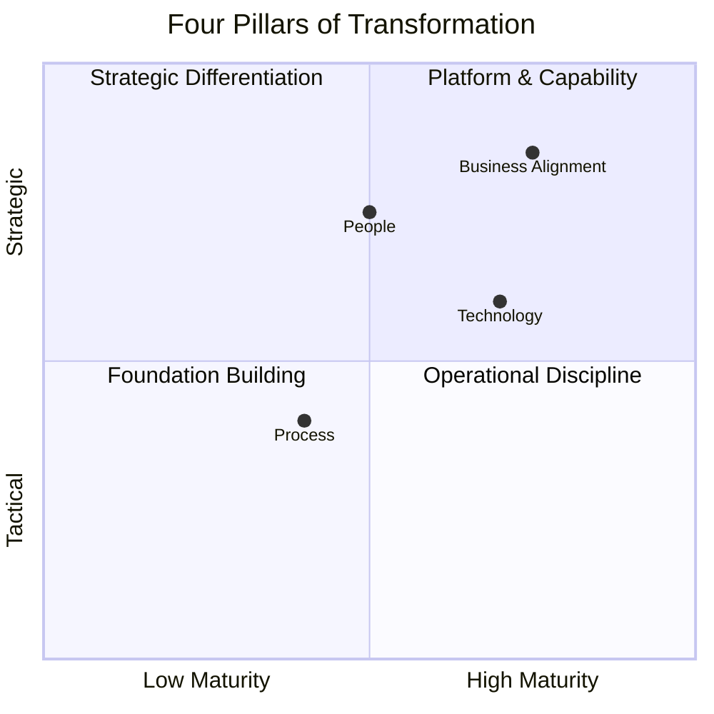
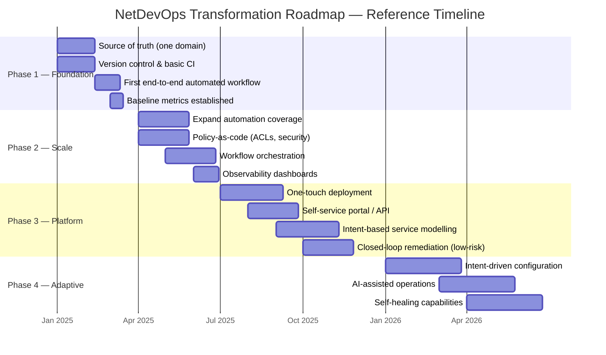

# Chapter 4: The Transformation Roadmap

> "A health assessment tells you where you are. A training plan tells you how to get where you need to be. One without the other is either denial or ambition without direction."

The maturity assessment from [Chapter 3](../03-maturity-model/chapter.md) produces a clear view of where the organisation stands. This chapter addresses what comes next: turning that view into a structured, executable plan for change.

A transformation roadmap is not a project plan. It does not prescribe tools, or list every task that needs to be completed, or promise a delivery date for full automation. What it does is define the *sequence of capability-building* required to move the organisation from its current state to its target state — and it does so in a way that delivers measurable business value at every stage.

Done well, the roadmap becomes the foundation for leadership alignment, investment decisions, team planning, and progress measurement. Done poorly — treated as a one-time deliverable rather than a living plan — it becomes another document that sits unread in a SharePoint folder.

---

## From Assessment to Roadmap

The gap analysis from the maturity assessment is the direct input to the roadmap. It answers: *what are we missing, and which absences are creating the most business impact?*

The roadmap answers: *in what order do we close those gaps, and what does each stage of progress look like?*

Three principles govern this translation:

**1. Define the target state by capability, not by tool.**
"We will implement Ansible" is a tool decision. "We will have version-controlled, peer-reviewed, consistently executed automation for all standard change types" is a capability. The former may or may not deliver the latter. The roadmap should always lead with capabilities — the tools that enable them are an implementation concern, addressed in [Chapter 5](../05-tooling-strategy/).

**2. Sequence for foundations first.**
Every phase builds on what precedes it. A CI/CD pipeline has no value without a source of truth to read from. Automated testing cannot catch intent violations if intent has never been formally defined. The most common cause of stalled transformation programmes is skipping foundations because they feel unglamorous compared to the capabilities they enable.

**3. Deliver business value at every phase.**
The roadmap should not be structured so that all visible business benefit arrives at Phase 3 or 4. Leadership support erodes when transformation programmes consume investment for 18 months without demonstrable output. Each phase must be designed to close a gap that matters to the business and produce a measurable improvement in at least one business outcome.

---

## Transformation Is Not a Technology Programme

The instinct in most organisations is to treat network automation as a technology initiative: choose tools, deploy infrastructure, train engineers, declare success. This framing is the single most reliable predictor of failure.

Every successful network transformation has four interdependent dimensions that must advance together:



### Technology

The platforms, pipelines, and tooling that enable automation. This is the dimension organisations default to — and frequently over-invest in relative to the others.

Technology investment questions for the roadmap:
- What platforms need to be in place before the next phase can begin?
- What are the build versus buy decisions at each stage? (See [Chapter 5](../05-tooling-strategy/))
- What is the infrastructure required to support the automation platform itself?
- What technical debt will accumulate if certain choices are made now?

### Process

How work gets done — change management, approval workflows, incident response, and the governance structures that govern how the network is operated.

Automation does not fit into existing manual processes. It requires those processes to be redesigned. A change management process built for two changes per week cannot support a CI/CD pipeline that deploys ten times per day. A human approval gate that takes 48 hours does not belong in a pipeline designed to deliver in under an hour.

Process investment questions for the roadmap:
- Which existing processes actively prevent automation from being used?
- What does the change management process need to look like at each maturity level?
- How are exceptions and failures handled in an automated environment?
- How does compliance evidence generation change as automation matures?

### People

Skills, team structures, roles, and the culture that determines whether automation is embraced or bypassed.

This dimension is consistently underfunded and underplanned. Organisations invest in technology and process, then are surprised when adoption is low, when scripts are unmaintained, or when engineers revert to manual processes because they are faster or more familiar.

The people dimension is addressed in depth in [Chapter 10](../10-people-and-skills/). Key questions for the roadmap:
- What skills does the team need at each phase, and how will they be acquired?
- How do existing roles evolve as automation matures?
- Who owns the automation platform — and is that ownership acknowledged with time and resources?
- How will reluctant stakeholders be brought along?

### Business Alignment

Stakeholder engagement, investment justification, and the mechanisms by which the transformation demonstrates its value to the organisation.

Without sustained leadership support, transformation programmes are cut when priorities shift, budgets tighten, or early progress is slower than expected. Business alignment is not a one-time activity at programme initiation — it is an ongoing discipline that requires regular communication, visible metrics, and a feedback loop between engineering progress and business outcome.

Business alignment questions for the roadmap:
- Who are the internal sponsors, and what outcomes are they committed to?
- How will progress be communicated at each phase?
- What metrics will demonstrate value in terms leadership understands?
- Which consuming teams (application, trading, compliance) need to be engaged at each stage?

---

## Treating Automation as a Product

One of the most consequential framing decisions in a transformation programme is whether automation is treated as a *project* or a *product*.

The project framing is familiar: define scope, allocate budget, build, deliver, hand off, close. It is how most organisations default to running technology initiatives. It is also how most automation programmes eventually fail.

The failure pattern is consistent. A team builds something useful. It is demonstrated, celebrated, and declared complete. Budget moves on. Six months later, a device upgrade breaks the templates. A process change invalidates the logic. A new engineer does not know the automation exists. The team reverts to doing things manually because the automation is no longer reliable, and there is no backlog of improvements, no owner committed to maintaining it.

**Automation is not a project. It is a platform — and platforms require continuous investment to remain useful.**

The product framing requires a different structure:

| Dimension | Project Thinking | Product Thinking |
|---|---|---|
| **Scope** | Fixed, defined upfront | Evolves based on usage and feedback |
| **Timeline** | Has an end date | Continuous delivery with regular releases |
| **Success measure** | Delivered on time and budget | Adoption, reliability, business impact |
| **Team** | Temporary, disbanded at delivery | Persistent, with ongoing ownership |
| **Stakeholders** | Recipients of a deliverable | Customers with ongoing needs |
| **Feedback** | Post-project review | Continuous, built into the operating model |

In practice, this means the roadmap should produce a *backlog*, not a fixed plan. Capabilities are prioritised based on business value, not sequenced according to an original design that may no longer reflect reality. Releases happen regularly. Metrics track adoption and impact, not just delivery milestones.

A simple test: at any point in the transformation, can you answer these questions?
- What is in the backlog for the next sprint or quarter?
- Who are the internal consumers of the automation platform, and what feedback have they given recently?
- What is the adoption rate for the automation capabilities that have been delivered?
- What would be lost if the automation team stopped working for three months?

If these questions cannot be answered, the programme is being run as a project, not a product.

---

## The Four-Phase Roadmap

The roadmap is structured across four phases, each representing a meaningful step change in organisational capability. The phases are not rigid — their duration will vary depending on starting point, team size, and organisational complexity — but the *sequence* is non-negotiable. Each phase creates the foundations that the next phase builds on.



---

### Phase 1 — Foundation (Months 0–3)

**Objective:** Prove that disciplined, reliable, version-controlled automation is achievable in this organisation. Establish the infrastructure that all future phases depend on.

The temptation at Phase 1 is to automate broadly. Resist it. Breadth comes later. The goal is depth on a narrow slice — one workflow, one domain, executed end-to-end with the disciplines that will later be applied at scale.

**What Phase 1 must deliver:**

| Capability | Description |
|---|---|
| Source of truth (one domain) | A single, authoritative, version-controlled record of intended network state for the chosen domain. Typically the data centre fabric or a branch template. |
| Version control | All configuration, templates, and automation code in a shared repository. No more scripts on laptops. |
| Basic CI pipeline | Automated linting and syntax validation on every commit. The pipeline does not need to deploy yet — it needs to establish the discipline. |
| One end-to-end automated workflow | A single change type — VLAN provisioning, firewall rule update, or branch connectivity — executed from source of truth to device, with validation and rollback. |
| Baseline metrics | Lead time, change success rate, and manual versus automated change ratio recorded. These are the baselines against which progress will be measured. |

**What Phase 1 is not trying to do:**
- Automate all change types
- Replace the existing change management process entirely
- Deploy to all domains simultaneously
- Achieve Level 4 or Level 5 maturity

**ACME Investments — Phase 1 example:**

ACME began with VLAN provisioning in lon-dc1. The source of truth was established as a structured YAML inventory (`nodes.yml`) held in GitLab. A basic CI pipeline ran yamllint and a syntax check on every merge request. The first automated workflow provisioned a new VLAN from a merge request approval through to device deployment, with a pre-deployment diff and automatic rollback on failure.

Lead time for VLAN provisioning dropped from four days (ticket queue + manual execution) to under two hours. That single, visible improvement generated more internal support for the programme than six months of presentations had.

**The "MVP first" principle:** Phase 1 should be completed in 6–8 weeks. If it is taking longer, scope has drifted. The measure of Phase 1 success is not the sophistication of what was built — it is that the organisation now has a demonstrated, repeatable, trustworthy automated workflow and a team that knows how to build more of them.

---

### Phase 2 — Scale (Months 3–6)

**Objective:** Extend the disciplines established in Phase 1 across more change types, more domains, and more stakeholders.

Phase 2 is where the product thinking becomes visible. The backlog is now the mechanism for deciding what gets automated next. Priorities are driven by: which change types have the highest volume? Which carry the highest risk when executed manually? Which are most important to the consuming teams?

**What Phase 2 must deliver:**

| Capability | Description |
|---|---|
| Expanded automation coverage | The Phase 1 workflow pattern applied to additional change types. Coverage should reach 50–60% of routine change volume. |
| Policy-as-code | Security and compliance policies encoded as automation logic — ACL rules, zone segmentation, VLAN allocation boundaries. Violations are caught in the pipeline, not discovered in audits. |
| Workflow orchestration | Cross-team change types — those involving network, security, server, and application teams — coordinated through a workflow system rather than manual handoffs. |
| Observability dashboards | Engineering and operations visibility into automation performance: pipeline success rates, deployment frequency, drift detection. (See [Chapter 13](../13-dashboards/).) |

**People investment at Phase 2:**

By Phase 2, the automation platform is visible enough that other teams want to consume it — and that creates work. Self-service is not free. Each new consumer requires documentation, support, and potentially capability extensions. The team needs to explicitly acknowledge this overhead and account for it in their capacity planning.

This is also the phase at which "automation ambassadors" in consuming teams become valuable — engineers embedded in application, security, or operations teams who understand the platform well enough to advocate for it and handle first-line queries. Identifying and enabling these individuals has a disproportionate impact on adoption.

---

### Phase 3 — Platform (Months 6–12)

**Objective:** Make the network a platform — a capability that other teams consume through well-defined interfaces, without needing to understand the underlying implementation.

Phase 3 is the phase most organisations aspire to from the start but few can reach without the foundations laid in Phases 1 and 2. The capabilities delivered here — one-touch deployment, self-service, intent-based modelling — are the ones that directly change the conversation with business stakeholders.

**What Phase 3 must deliver:**

| Capability | Description |
|---|---|
| One-touch deployment | Templated infrastructure — new branch office, new trading connectivity segment, new DR site — provisioned end-to-end from a single request or approval, with no manual engineering steps. |
| Self-service interfaces | Consuming teams can request defined network resources through a portal, API, or ITSM integration. The network team's role shifts from execution to platform management. |
| Intent-based service modelling | Services are defined at the level of business intent (connectivity requirements, isolation policies, performance SLAs) rather than device-level configuration. |
| Closed-loop remediation | A defined class of low-risk, well-understood incidents — link flap recovery, BGP session reset, configuration drift correction — resolved automatically without human intervention. |

**The one-touch deployment principle:**

Adding a new site or expanding a connectivity domain should be a *business decision*, not an *engineering project*. When the network team can provision a new branch office in under an hour from a single approved request, the business's ability to act on strategic decisions is no longer constrained by infrastructure lead times. This is a material commercial capability — not just an operational efficiency.

For ACME Investments, Phase 3 delivered `generate_branch.py` — a generator that, given a branch specification (location, connectivity requirements, security zone, WAN provider), produces a complete, validated configuration set and raises it as a merge request for approval. The human decision is whether to approve the business need. The engineering work is entirely automated.

---

### Phase 4 — Adaptive (12+ Months)

**Objective:** Move from automation of defined workflows to a network that continuously understands, enforces, and adapts to intent.

Phase 4 is not a destination with a completion date. It is a direction. The capabilities in this phase are genuinely complex to build and operate, and most organisations will implement them progressively across specific domains rather than across the entire estate simultaneously.

**What Phase 4 introduces:**

| Capability | Description |
|---|---|
| Intent-driven configuration generation | Engineers declare what a service requires; the system determines the device configuration required to deliver it. Configuration is an output, not an input. |
| Automated design verification | Changes to intent are validated for correctness and consistency against the existing network model before deployment. |
| AI-assisted operations | Anomaly detection, predictive fault identification, and intelligent alerting that surfaces genuine signals from high-volume telemetry data. |
| Self-healing capabilities | Closed-loop workflows that detect, diagnose, and remediate a broader class of incidents — including novel fault patterns — without human initiation. |

Intent-based networking and AI-driven operations are explored in depth in [Chapter 11](../11-advanced-topics/).

> **A practical note on sequencing Phase 4:** The organisations that reach Phase 4 most effectively are those that resisted the temptation to start there. Intent modelling requires deep understanding of the network's current behaviour. AI-assisted operations requires high-quality telemetry and labelled historical data — both of which are by-products of Phase 2 and Phase 3 disciplines. Self-healing requires the confidence that comes from extensive experience with automated deployment and rollback. Phase 4 is earned, not installed.

---

## Prioritising the Roadmap

The phased structure above is a reference model. The specific initiatives within each phase should be determined by the gap analysis from Chapter 3, filtered through three prioritisation lenses:

**Business impact:** Which gap, if closed, most directly improves a business outcome that leadership has committed to? An organisation with a regulatory deadline will prioritise compliance evidence automation. An organisation losing business because connectivity provisioning is too slow will prioritise one-touch deployment.

**Feasibility:** Which gap can be closed with the team's current skills and the organisation's current appetite for change? Starting with the highest-impact but highest-complexity initiative is a reliable way to produce a visible failure that undermines confidence in the entire programme.

**Dependencies:** Which gaps are prerequisites for others? Source of truth before pipelines. Pipelines before self-service. Self-service before intent modelling. Violating the dependency sequence does not save time — it creates rework.

A simple prioritisation matrix:

```
                    HIGH FEASIBILITY
                           │
            QUICK WINS     │    STRATEGIC PRIORITIES
            (do now)       │    (plan and resource)
                           │
LOW IMPACT ────────────────┼──────────────────── HIGH IMPACT
                           │
            DEFER/DROP     │    INVEST TO ENABLE
                           │    (address blockers first)
                           │
                    LOW FEASIBILITY
```

Plot the high-priority gaps from the gap analysis on this matrix. Quick wins should dominate Phase 1. Strategic priorities shape Phase 2 and beyond. Items in the "invest to enable" quadrant represent blockers — often foundational capabilities like source of truth or skills development — that must be addressed before other priorities become feasible.

---

## Governance and Decision Making

Transformation programmes stall when decision-making slows. This is typically not because the organisation lacks opinions — it is because there is no agreed mechanism for making and recording architectural decisions in a way that allows the team to move forward without relitigating the same debates.

### Architecture Decision Records

An Architecture Decision Record (ADR) is a short document that captures a significant architectural or design decision: what was decided, why, what alternatives were considered, and what trade-offs were accepted. It is not a lengthy governance document — the value is in the discipline of recording the decision at the time it is made, with the context that informed it.

ADRs serve three purposes in a transformation programme:

1. **Momentum.** Once a decision is recorded, it is closed. The team moves forward rather than re-debating the same questions at every planning meeting.
2. **Institutional memory.** When team members change, context is not lost. New engineers can understand *why* the architecture looks the way it does, not just *what* it is.
3. **Accountability.** Decisions are explicit, attributed, and time-stamped. When a decision proves to have been wrong, the organisation can learn from it in a structured way rather than assigning blame retrospectively.

A standard ADR template is provided at [`templates/architecture-decision-record.md`](../templates/architecture-decision-record.md).

**Decisions that warrant an ADR in a network transformation programme:**
- Choice of source of truth platform and data model
- Version control strategy (branching model, review process, merge requirements)
- CI/CD pipeline architecture
- Policy-as-code framework and enforcement model
- Self-service interface design (API, portal, ITSM integration)
- Intent model abstraction level
- Observability and telemetry platform selection

Not every decision needs an ADR. The heuristic is: if the decision is likely to be questioned later, or if it involves a non-obvious trade-off, record it.

### Transformation Governance Model

At programme level, three governance mechanisms keep the roadmap healthy:

| Mechanism | Frequency | Purpose |
|---|---|---|
| **Roadmap review** | Quarterly | Review phase progress, reprioritise backlog, validate business alignment |
| **Stakeholder update** | Monthly | Communicate progress to leadership and consuming teams; surface emerging requirements |
| **Engineering retrospective** | Every sprint / fortnightly | What is working, what is not, what should change in the next cycle |

The roadmap review is the most important. It is the mechanism by which the roadmap remains a living document rather than a frozen plan. Business priorities change. Technical discoveries create new opportunities or reveal new blockers. The quarterly review incorporates these signals and adjusts accordingly.

---

## Measuring Transformation Progress

Metrics serve two functions in a transformation programme: they demonstrate progress to leadership, and they surface problems early enough to address them.

The right metrics are those that measure *outcomes*, not *activity*. Lines of code written, number of playbooks created, and hours of training delivered are activity metrics. They feel like progress but tell you nothing about whether the organisation is actually operating differently.

### Core Metrics

| Metric | What It Measures | Target Direction |
|---|---|---|
| **Automation coverage** | Percentage of change types executed via pipeline, not manually | Increasing |
| **Lead time for change** | Elapsed time from request raised to change implemented | Decreasing |
| **Change failure rate** | Percentage of changes requiring rollback or emergency fix | Decreasing |
| **Deployment frequency** | Number of automated deployments per week | Increasing |
| **Mean time to recover** | Average time from incident detection to resolution | Decreasing |
| **Compliance evidence lag** | Time required to compile audit evidence on demand | Decreasing toward zero |

### Adoption Metrics

Technical delivery is necessary but not sufficient. Adoption — whether the automation is actually being used by the teams it was built for — is the real measure of success.

| Metric | What It Measures |
|---|---|
| **Self-service utilisation rate** | Proportion of eligible requests submitted via self-service versus manual ticket |
| **Consumer NPS / satisfaction** | Feedback from application and business teams on the network team's responsiveness |
| **Pipeline bypass rate** | Proportion of changes made outside the automated pipeline (the "cowboy change" indicator) |
| **Onboarding time for new engineers** | Time from hire to productive contribution — a proxy for how well knowledge is institutionalised |

### Business Outcome Metrics

These are the metrics that matter most to senior leadership. Each should be explicitly linked to the business outcomes established in the Chapter 3 assessment.

| Business Outcome | Metric Example |
|---|---|
| Speed & Agility | Time to provision new trading venue connectivity (days → hours) |
| Reliability & Resilience | MTTR for P1 network incidents |
| Risk & Compliance | Engineering hours consumed in regulatory audit preparation per quarter |
| Cost Efficiency | Percentage of engineering capacity spent on routine execution versus strategic work |

A dashboard design covering these metrics across executive, engineering, and operations views is provided in [Chapter 13](../13-dashboards/).

---

## Communicating the Roadmap

The roadmap is a communication tool as much as a planning tool. Different audiences need different views of the same plan.

**For senior leadership:** A one-page view showing the four phases, the business outcome delivered at each phase, and the key metrics that will demonstrate progress. No implementation detail. The question it answers: *"What are we investing in, and what will it deliver?"*

**For architecture and engineering leadership:** The capability-level view — what is being built, what it depends on, what trade-offs have been made. The question it answers: *"What are we building, in what order, and why?"*

**For the engineering team:** The backlog — sprint-level priorities, acceptance criteria, and ownership. The question it answers: *"What are we working on, and what does done look like?"*

The roadmap presentation template at [`templates/roadmap-presentation.md`](../templates/roadmap-presentation.md) structures these three views.

---

## Common Pitfalls

**Trying to do too much in Phase 1.** Phase 1 scope creep is the most common reason transformation programmes stall. If the MVP takes six months, something has gone wrong. Narrow the scope until it can be delivered in six to eight weeks.

**Automating a broken process.** If the manual process is poorly designed, automating it makes a poor process faster. Phase 1 is an opportunity to redesign the workflow, not just encode the existing one.

**Skipping the people dimension.** Technology can be procured quickly. Skills take time to develop, and culture takes longer. Under-investing in the people dimension creates programmes that have sophisticated tooling and low adoption.

**Reporting activity as progress.** "We have deployed the tooling" is not a milestone. "We have reduced lead time for VLAN provisioning from four days to two hours" is a milestone. Hold the programme accountable for outcomes, not deliverables.

**Treating the roadmap as fixed.** The roadmap is a plan for navigating uncertainty, not a contract. It should be reviewed and adjusted every quarter. An organisation that is six months into a transformation and still executing against the original plan without revision has either been extraordinarily lucky or has not been paying attention.

---

## Downloadable Templates

| Template | Purpose | Format |
|---|---|---|
| [Roadmap Planning Canvas](../templates/roadmap-planning-canvas.md) | Four-phase capability planning template | Markdown |
| [Architecture Decision Record](../templates/architecture-decision-record.md) | ADR format for recording architectural decisions | Markdown |
| [Phase Milestone Checklist](../templates/roadmap-phase-milestones.md) | Exit criteria for each roadmap phase | Markdown |
| [Roadmap Presentation](../templates/roadmap-presentation.md) | Three-audience roadmap communication template | Markdown |
| [Metrics Tracking Template](../templates/roadmap-metrics.md) | Core, adoption, and business outcome metrics | Markdown |

---

## Summary

The transformation roadmap is the training plan that follows the health assessment. Its purpose is to build capability progressively — across technology, process, people, and business alignment — in a sequence that delivers visible business value at every stage.

Treat automation as a product, not a project. Maintain a backlog. Measure adoption. Communicate progress in business terms. Adjust the plan when reality diverges from assumptions.

The organisations that successfully navigate this transformation are not those with the most sophisticated tooling or the largest automation teams. They are the ones that got the foundations right, sustained leadership alignment, and treated continuous improvement as the operating model — not the goal.

---

*Next: [Chapter 5 — Tooling Strategy](../05-tooling-strategy/) — how to make buy versus build decisions, evaluate platforms by category, and avoid the most common tooling mistakes.*
