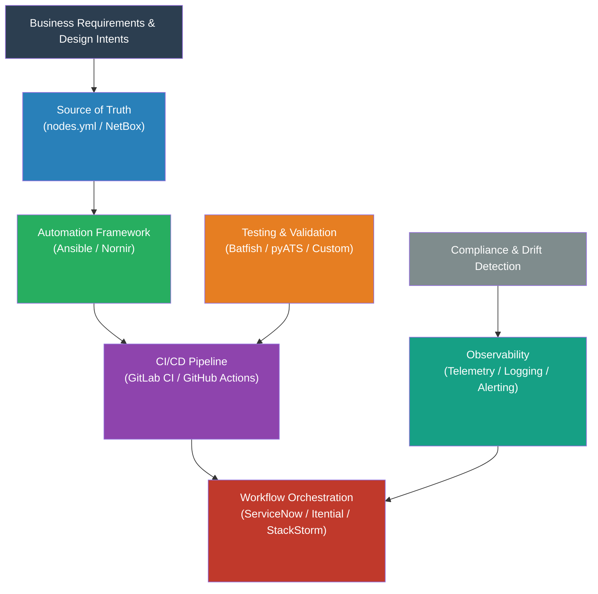
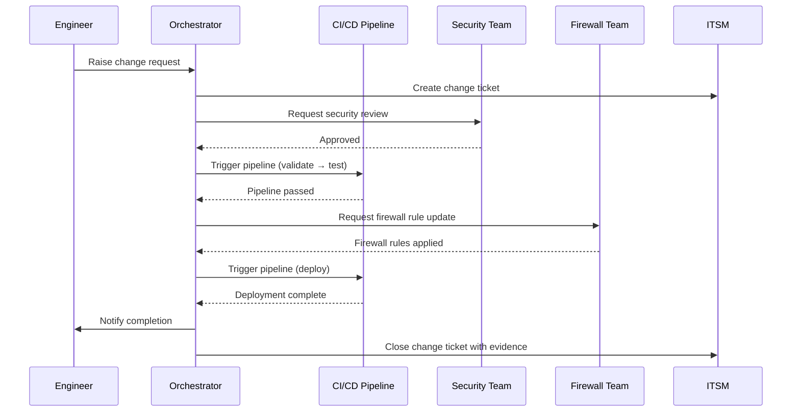

# Chapter 5: Tooling Strategy

> "The most expensive tool is the one your team cannot operate, maintain, or evolve."

Tooling decisions are among the most consequential choices in a network automation programme — and among the most frequently made in the wrong order. Teams select platforms before they have defined what they are trying to build. They choose tools based on conference demos or vendor relationships rather than capability fit. They build what they could have bought, and buy what they should have built.

This chapter provides a framework for making tooling decisions well: starting with categories rather than products, evaluating trade-offs against your organisation's specific context, and applying a consistent buy-versus-build discipline that keeps the total cost of ownership visible.

The tooling landscape changes faster than this handbook can track. Specific products will evolve, merge, be superseded, or cease to exist. The categories and the decision principles will not.

---

## Principles for Tooling Decisions

Four principles should govern every tooling decision in a network automation programme. They apply whether you are choosing a source of truth platform, a CI/CD system, or a workflow orchestrator.

### Choose categories first, products second

The question "should we use Ansible or Nornir?" is the wrong starting question. The right question is "what automation framework capabilities do we need, and what trade-offs are we willing to accept?" Once you have answered that question clearly, the product choice becomes a structured evaluation within a defined category — not a debate between advocates for competing tools.

This matters because tool debates generate heat without light. Engineers have strong preferences shaped by prior experience. Vendors have sales incentives. The category-first approach subordinates both to the actual requirements.

### Buy commodity; build competitive advantage

Network automation tooling is largely a commodity. Source control, CI/CD platforms, IPAM systems, observability platforms — these capabilities exist as mature commercial or open-source products because they are common requirements across many organisations. Building them from scratch delivers no competitive advantage. It delivers a maintenance burden.

Build only where two conditions are simultaneously true: the capability is genuinely unavailable from existing products, and it creates a specific, durable advantage for your organisation. The integration layer between existing tools — the glue that connects your source of truth to your pipeline to your ITSM — is often the right thing to build. The tools themselves rarely are.

### Every tool you adopt becomes part of your operational surface

Adding a tool to the automation stack is not just a capability decision — it is an operational commitment. Someone must deploy it, upgrade it, monitor it, recover it when it fails, and maintain the integration with everything else it connects to. In some organisations, that operational overhead is absorbed by a platform team. In others, it falls on the same engineers trying to build automation capability.

Before adopting any tool, ask: who owns this in production? If the answer is unclear, that is a governance problem that needs to be solved before the tool is deployed.

### Integration patterns matter as much as individual capability

A toolchain is more than the sum of its tools. The patterns by which tools connect — how the source of truth feeds the pipeline, how the pipeline communicates with the orchestrator, how the orchestrator integrates with the ITSM — determine whether the overall system is robust or fragile.

The most capable individual tool in a poorly integrated toolchain delivers less value than a more modest tool that integrates cleanly. Evaluate integration complexity as a first-class criterion in every tool selection decision.

---

## Core Tool Categories

The automation toolchain can be divided into seven functional categories. Each category addresses a distinct layer of the automation capability stack.



---

### Category 1: Source of Truth

The source of truth is the authoritative record of intended network state — the single place that answers the question "what is this network supposed to look like?" Every other tool in the stack reads from it, generates from it, or validates against it. Getting this choice right is foundational; getting it wrong creates technical debt that is expensive to correct.

#### The options

**Structured files in version control (YAML/JSON in Git)**

The simplest viable approach. The source of truth is a set of YAML files committed to a Git repository — `nodes.yml`, `inventory.yml`, `requirements.yml`, `design_intents.yml`. No additional infrastructure. No database to operate. The version history is the audit trail. The CI pipeline is the validation layer.

This is the approach used by ACME Investments, and it is appropriate for a wide range of organisations — particularly those starting their automation journey, those with a well-defined estate that does not change frequently, and those where engineering teams are comfortable with Git workflows.

*When to choose:* Starting from scratch; smaller or well-defined estate; team is Git-native; you want to minimise operational overhead; you value simplicity over feature richness.

*When it becomes a constraint:* Large, dynamic estates where manual YAML editing becomes error-prone; teams that need a UI for non-engineers to contribute data; environments requiring multi-system reconciliation (CMDB, IPAM, NMS all contributing to the same record).

**Purpose-built DCIM/IPAM platforms (NetBox, Nautobot)**

Database-backed platforms with a UI, a REST API, and an ecosystem of plugins. They provide richer data modelling, a web interface for non-technical contributors, and API-driven integration with other systems. Nautobot in particular is designed as an automation platform with an SDK for custom application development.

The trade-off is operational overhead: you are now running a database-backed web application that needs to be deployed, upgraded, backed up, and maintained. The API is powerful, but consuming it in an automation pipeline requires more code than reading a YAML file.

*When to choose:* Larger or more dynamic estates; multiple teams contributing source of truth data; strong requirement for a UI; existing investment in the NetBox/Nautobot ecosystem; need for API-driven integration with other systems.

*When it becomes a constraint:* Small teams where operational overhead is disproportionate; environments where simplicity and auditability of a flat-file approach are valued; early-stage programmes where getting started quickly matters more than long-term scalability.

**Hybrid approach**

Some organisations use a purpose-built platform as the system of record for human-managed data (IP addressing, site metadata, device inventory) while maintaining Git-based YAML as the automation-consumed source of truth — either synced from the platform via an export pipeline, or maintained in parallel with the platform as the source of truth for automation-specific data.

This is a reasonable pattern for larger organisations with existing IPAM investments, but it introduces a synchronisation problem: two representations of the same data can diverge. If you adopt this pattern, define clearly which system is authoritative for which data, and build the reconciliation mechanism before it becomes a production issue.

#### Selection guidance

| Consideration | YAML in Git | NetBox / Nautobot | Hybrid |
|---|---|---|---|
| Operational overhead | Minimal | Moderate | High |
| Scale ceiling | Medium estate | Large estate | Large estate |
| UI for non-engineers | No | Yes | Partial |
| API integration | Via CI/CD | Native REST API | Mixed |
| Version history | Git native | Plugin required | Git for YAML side |
| Getting started speed | Fast | Slower | Slowest |
| Best for | Phase 1–2 start | Established programmes | Complex multi-team estates |

---

### Category 2: Automation Frameworks

The automation framework is the execution engine — it takes data from the source of truth, applies templates, and pushes the resulting configuration to devices. It is the mechanism by which intent becomes configuration.

#### The options

**Ansible**

The most widely deployed network automation framework. Agentless, module-rich, and readable by engineers who do not have deep Python backgrounds. The playbook format (YAML) is approachable. The module ecosystem covers most major network vendors. Its Jinja2 integration is well-established for template-based configuration generation.

Ansible's limitations surface as complexity grows. Playbooks that begin as simple and readable tend to accumulate conditionals, loops, and variable files until they become difficult to maintain. Error messages are sometimes opaque. Performance at scale — many devices, complex logic — can require careful optimisation.

*When to choose:* Teams new to automation; broad vendor coverage needed; readable playbooks valued for auditability; strong existing Ansible skills in the broader engineering organisation.

*When it becomes a constraint:* Complex programmatic logic that does not map well to YAML DSL; large-scale operations where performance is critical; teams with strong Python skills who find the YAML abstraction limiting.

**Nornir**

A Python-native automation framework. Rather than a DSL, Nornir gives you Python — and all the power and flexibility that implies. Complex logic, conditional execution, error handling, and integration with external systems are all first-class Python patterns. For teams with strong software engineering skills, Nornir offers significantly more expressive power than Ansible.

The barrier to entry is higher. Engineers need Python fluency, not just familiarity. Code reviews require understanding Python idioms, not just YAML structure. The ecosystem of pre-built integrations is smaller.

*When to choose:* Teams with strong Python skills; complex automation logic that fits poorly in playbooks; high-performance requirements; custom integration with internal systems.

*When it becomes a constraint:* Teams without Python depth; environments where readability and accessibility for non-specialists matter; quick-start scenarios where Ansible's rich module library accelerates delivery.

**The practical position**

Most organisations start with Ansible and extend with Python where Ansible's limitations create friction. This is a reasonable trajectory. The important principle is not to build a custom abstraction layer on top of either framework — the temptation to create an internal DSL or a "better Ansible" is reliably a path to a multi-year maintenance burden.

Both Ansible and Nornir are execution engines in the intent-based model, not design tools. They take structured data from the source of truth and produce configuration from templates. At that level of abstraction, the choice between them is primarily about team skills and logic complexity.

---

### Category 3: CI/CD Pipelines

The CI/CD pipeline is the governance layer — the automated sequence of checks and approvals through which every proposed change must pass before reaching production. It is not primarily a deployment tool; it is a validation and governance tool that happens to also deploy.

The pipeline design matters as much as the platform choice. A well-designed pipeline on a modest platform is more valuable than a poorly designed pipeline on a sophisticated one.

#### The options

**GitLab CI**

Tightly integrated with GitLab's merge request workflow. Self-hosted option available, which matters in regulated environments with data sovereignty requirements. Runner architecture is flexible. The `.gitlab-ci.yml` format is readable and well-documented. Native support for environments, approvals, and artefact management.

*When to choose:* Organisation already uses GitLab for source control; self-hosting is required or preferred; tight integration between code review and pipeline is valued.

**GitHub Actions**

Cloud-native with a large marketplace of pre-built actions. Well-integrated with the GitHub ecosystem. The workflow syntax is readable. Suitable for teams already in the GitHub ecosystem. Less natural for self-hosted environments, though GitHub Enterprise exists.

*When to choose:* Organisation already uses GitHub; cloud-native deployment is acceptable; marketplace of pre-built actions accelerates delivery.

**The platform-agnostic principle**

The most important guidance is: use whatever CI/CD platform your broader engineering organisation already uses. Network automation CI/CD should share infrastructure, tooling, and — ideally — operational knowledge with software delivery CI/CD. Running a separate pipeline platform for network changes introduces operational overhead and creates an artificial separation between network and software engineering disciplines.

#### Pipeline design principles

The platform is less important than the pipeline design. Regardless of which platform is chosen, effective network automation pipelines share common structural principles:

**Validation before deployment.** The pipeline stages are: validate → test → approve → deploy. Never deploy a change that has not been validated and tested. The investment in validation stages pays for itself every time they catch an error before production.

**Artefact separation.** Rendered configurations are build artefacts. They are generated by the pipeline, stored with the pipeline run, and deployed from that stored artefact. Engineers do not edit rendered configurations — they edit the source of truth and re-run the pipeline.

**Explicit approval gates.** Not every change requires human review, but the pipeline must make the approval requirement explicit and enforce it. Low-risk changes may run through the pipeline automatically. High-risk changes require named approvers. The logic that determines which is which should be in the pipeline configuration, not in someone's head.

**Deployment isolation.** The deployment stage should be isolated from the validation stages — ideally a separate pipeline stage that can be re-run independently if deployment fails, without re-running validation. Partial deployments that fail mid-execution need a clear recovery path.

---

### Category 4: Workflow Orchestration

Workflow orchestration is the category most underestimated in early-stage automation programmes, and the one that most limits scale in mature ones. Understanding the distinction between a CI/CD pipeline and a workflow orchestrator is essential.

**The distinction:** A CI/CD pipeline is excellent at executing a defined sequence of automated steps within a single domain of control. A workflow orchestrator coordinates across multiple systems, teams, and approval processes — including steps that require human decisions, dependencies on external system states, and conditional branching based on factors outside the pipeline's control.

In a development or lab environment, the pipeline is sufficient. In a production enterprise, it is not.

Consider a production network change at ACME Investments. The technical steps — validate, render, test, deploy — are handled by the CI/CD pipeline. But surrounding those technical steps is a coordination layer: the change request raised in the ITSM system, the security team review that may require waiting 24 hours, the firewall rule update that must complete before the network change is deployed, the DNS update that must happen in parallel, the notifications to the application team, and the change ticket closure that generates the compliance record. None of these are pipeline steps. They are orchestration steps.



The orchestrator is the conductor. The pipeline is one of several instruments.

#### The options

**ServiceNow Flow Designer**

If ServiceNow is already the ITSM platform — and in large financial institutions and enterprises, it frequently is — Flow Designer is the natural choice for workflow orchestration. The integration with the change management process is native. Change tickets, approvals, and audit evidence live where the organisation already expects them. The development model is low-code, which broadens the team's ability to build and maintain workflows.

The trade-off is performance and flexibility. Flow Designer is not designed for high-frequency, low-latency automation. It is designed for the enterprise governance workflows it was built for. Do not attempt to replace the CI/CD pipeline with ServiceNow; use it for the coordination layer above and below the pipeline.

*When to choose:* ServiceNow is the existing ITSM; strong integration with change management required; broad enterprise governance workflow needed; low-code development is valuable.

**Itential**

Purpose-built for network automation orchestration. Provides a visual workflow builder, deep network-specific integrations, and a network-aware data model. Stronger than ServiceNow for network-specific coordination patterns. Weaker than ServiceNow for broader enterprise IT governance integration.

*When to choose:* Network-specific orchestration is the primary need; existing investment in or evaluation of Itential's ecosystem; network automation team is the primary builder and operator of orchestration workflows.

**StackStorm**

Open-source, event-driven, highly extensible. Designed around the concept of sensors (event detection), triggers (event-to-action mapping), and actions (the steps executed). Very powerful for event-driven automation — detecting a network event and automatically triggering a remediation workflow. Higher operational overhead than commercial platforms.

*When to choose:* Event-driven automation is a primary requirement; open-source is strongly preferred; team has the engineering capacity to build and operate the platform; closed-loop automation patterns are an early priority.

**AWX / Ansible Automation Platform**

If Ansible is already the automation framework, AWX (the open-source version) or Red Hat's Ansible Automation Platform provides workflow features built on top of Ansible playbooks. The workflow capability is less sophisticated than dedicated orchestration platforms, but the integration with existing Ansible content is seamless.

*When to choose:* Ansible is deeply established as the automation framework; lightweight orchestration is sufficient; avoiding an additional platform is a priority.

#### The buy-versus-build position on orchestration

Building a production-grade workflow orchestrator is a multi-year commitment. State management, retry logic, audit logging, role-based access control, API integrations, a UI for visibility, and failure recovery are all required capabilities. Every mature orchestration platform has spent years solving these problems. Building them from scratch delivers no advantage.

Build integrations between your orchestrator and your tools. Do not build the orchestrator itself.

---

### Category 5: Testing and Validation

Testing is not a single tool decision — it is a layered strategy. Different testing tools answer different questions, at different stages in the pipeline, at different speeds and with different coverage. The right answer is almost always to use multiple tools, each filling a specific gap.

#### The layers

**Structural validation (linting, syntax checking)**

The first gate in every pipeline. Tools like `yamllint`, `ansible-lint`, and vendor-specific syntax checkers catch formatting and structural errors before any logic runs. These are fast (seconds), cheap, and should block every pipeline run on failure. No additional tooling investment required beyond the framework's own validation capabilities.

**Source of truth intent verification**

Custom Python checks that validate the data model against design intents — before any configuration is rendered. This is the `verify_intents.py` layer in the ACME pipeline: checking that every device has the required management configuration, that no ACL contains a permit-any rule, that every IP address falls within its declared zone prefix. These checks run in under a second and catch structural compliance violations early.

This layer requires writing and maintaining custom Python. It is the right thing to build, because it is specific to your organisation's design intents. No commercial product can encode your architectural decisions for you.

**Model-based behavioural validation (Batfish)**

Batfish builds a complete model of the network from the rendered device configurations and answers behavioural questions: will this BGP session reach Established state? Does any path from the trading zone reach the DMZ without traversing a firewall? What is the blast radius of this routing change? These questions cannot be answered from the data model alone — they require modelling the protocol behaviour of the entire network.

Batfish runs against rendered configurations without connecting to any live device. It is fast enough to run in a CI pipeline (minutes, not hours) and provides a level of pre-deployment confidence that no manual review process can match.

*When to choose:* Pre-deployment behavioural validation is required; avoiding live device access in the validation stage is valued; reachability, routing correctness, and policy compliance assertions are needed.

**Live device testing (pyATS)**

pyATS provides a framework for testing against live devices — connecting to production or staging devices and asserting that their actual state matches expectations. It is the right tool for post-deployment verification (did the deployment produce the intended outcome on the actual device?) and for regression testing against live infrastructure.

pyATS is Cisco-native but has broadened its vendor support. The learning curve is steeper than Batfish, and the operational dependency on device access means it is less suitable as a pipeline gate in environments where automation should not require live device connectivity for validation.

*When to choose:* Post-deployment verification against live devices; regression testing suites for known failure patterns; environments where live device testing is operationally acceptable in the pipeline.

#### The layered strategy

```
┌─────────────────────────────────────────────────────────────────┐
│ FASTEST / CHEAPEST                               MOST THOROUGH  │
│                                                                 │
│  Linting  →  SoT Intent  →  Batfish Model  →  Live Device       │
│  (seconds)   Checks         Validation        Testing           │
│              (seconds)      (minutes)         (minutes-hours)   │
│                                                                 │
│  Catches:    Catches:        Catches:          Catches:         │
│  Syntax      Design          Behavioural       Actual devic     │
│  errors      compliance      incorrectness     state            │
└─────────────────────────────────────────────────────────────────┘
```

Every layer should be present in a mature pipeline. Linting is the table stake. SoT intent verification is the custom layer that encodes your architectural standards. Batfish provides pre-deployment confidence. Live device testing validates post-deployment. Run the faster layers first — they catch the most common errors at the lowest cost.

---

### Category 6: Observability

Observability is the data foundation for operations automation, closed-loop remediation, and eventually intent-based self-healing. An organisation cannot automate what it cannot observe.

#### The components

**Telemetry collection**

Modern network devices support streaming telemetry via gNMI/gRPC — continuous, structured, high-frequency data streams that provide real-time visibility into device state, interface counters, routing table changes, and hardware health. This is qualitatively different from SNMP polling: higher frequency, richer data, lower overhead, and designed for programmatic consumption.

For new deployments and modern platforms, streaming telemetry is the right investment. For environments with older devices or where streaming telemetry is not supported, SNMP polling remains necessary as a baseline, but it should not be the long-term strategy.

**Log aggregation**

Structured, centralised log management is the foundation of operational visibility and compliance evidence. Syslog from network devices, structured pipeline logs, audit events from the orchestration layer — all of these should flow to a centralised platform where they can be queried, correlated, and retained.

The choice of log platform should follow the broader enterprise standard wherever one exists. Running a separate log management platform for network automation adds operational overhead without adding capability.

**Dashboarding and alerting**

The metrics that matter at each stage of transformation are defined in [Chapter 13](../13-dashboards/). The dashboarding platform should serve two distinct audiences: operations teams who need real-time network health visibility, and programme leads who need transformation progress metrics. These are different views of different data, and conflating them into a single dashboard serves neither well.

#### The observability-to-automation connection

Observability becomes strategically important at Level 4 and essential at Level 5. Closed-loop remediation requires a reliable signal that an anomaly has occurred. Self-healing requires telemetry that is high-frequency, structured, and covers the failure modes you want to auto-remediate. Intent-based operations requires continuous comparison of observed state against declared intent.

If the observability foundation is not established by the time the organisation attempts closed-loop automation, that automation will be unreliable. False positives from noisy signals cause unnecessary remediations. Gaps in telemetry coverage mean some failure modes are invisible. Invest in observability in Phase 2 — before you need it for automation — so it is mature when you do.

---

### Category 7: Compliance and Drift Detection

Compliance tooling closes the loop between what the network is supposed to look like (the source of truth) and what it actually looks like at any given moment. Drift — the divergence between intended and actual state — is the primary compliance risk in any automated network.

**Configuration backup and change detection**

Tools like Oxidized provide continuous backup of device configurations and detect when a device's running configuration changes. When a change occurs outside the pipeline — a manual CLI change, an automated process that doesn't update the source of truth — the backup system detects it and alerts. This is the observation layer for drift detection.

**Drift remediation**

The response to detected drift depends on the maturity level and the risk profile of the change. At Level 3, drift generates an alert and a human investigates. At Level 4 and above, drift in low-risk, well-understood categories can trigger an automated remediation — re-applying the source of truth configuration to the drifted device via the same pipeline used for normal changes.

**Pipeline-generated compliance evidence**

In a well-designed automation pipeline, compliance evidence is a by-product of normal operations. Every change has a diff, an approver, a validation result, and a deployment timestamp — all generated automatically by the pipeline and stored as artefacts. The question "show me all network changes in the last 90 days, with their approvals and validation results" should be answerable from the pipeline history in minutes, not weeks.

This is addressed in depth in [Chapter 12 — Security and Compliance](../12-security-compliance/).

---

## The Buy-Versus-Build Decision Framework

Every capability in the toolchain requires a build-versus-buy decision. The framework below provides a consistent basis for making that decision.

### The decision criteria

**Commodity availability.** Does a mature product exist that provides this capability? If yes, the burden of proof is on building. What does building deliver that buying does not?

**Competitive differentiation.** Does this capability create specific, durable advantage for your organisation that a commercial product cannot provide? If no, buying or adopting is almost always correct.

**Total cost of ownership.** What does it cost to build, operate, and evolve this capability over three to five years? Include: development time, ongoing maintenance, operational overhead, expertise required, and the opportunity cost of engineering capacity redirected from other priorities.

**Integration complexity.** How complex is the integration between this capability and the rest of the toolchain? A bought product with a well-documented API is often easier to integrate than a custom-built component with an internal interface that only its author fully understands.

### The framework applied

| Category | Default Position | Rationale | Build when... |
|---|---|---|---|
| **Source of Truth** | Adopt (YAML) or Buy (NetBox) | Mature options exist for all scales | Your data model is genuinely unique and no existing platform can accommodate it |
| **Automation Framework** | Adopt (Ansible or Nornir) | Mature, well-supported, rich ecosystems | You need specific performance or integration characteristics that existing frameworks cannot provide |
| **CI/CD Pipeline** | Buy / Adopt | Commodity capability; high operational overhead to build | Almost never |
| **Workflow Orchestration** | Buy | Building a production orchestrator is a multi-year commitment | Almost never — build integrations between your orchestrator and your tools, not the orchestrator itself |
| **Testing: Linting / Syntax** | Adopt | Built into existing frameworks | Never |
| **Testing: SoT Intent Checks** | Build | These encode your specific design intents — no commercial product can do this for you | Always (this is the right thing to build) |
| **Testing: Model-based (Batfish)** | Adopt | Mature, open-source, well-supported | Never |
| **Testing: Live device** | Adopt (pyATS) | Mature framework; high cost to build equivalent | Never |
| **Observability Platform** | Buy / Adopt enterprise standard | High operational overhead; buy once, integrate | Build dashboards and alert rules; not the platform |
| **Compliance / Drift Detection** | Adopt (Oxidized) + pipeline | Mature tools exist; evidence generated by pipeline | Build the compliance reporting layer that extracts from pipeline logs |

### The golden rule

> Every line of code you build is a product you must support. If you can adopt a mature tool instead, you should — unless the capability it provides is genuinely central to your competitive advantage and unavailable elsewhere.

---

## Total Cost of Ownership

Tool selection decisions that consider only acquisition cost systematically underestimate the true investment. The total cost of ownership (TCO) for any tool in the automation stack has five components:

**Licensing and subscription.** The direct financial cost. For open-source tools, this is zero at acquisition — but do not mistake zero licensing cost for zero cost. Open-source tools have the same operational costs as commercial ones, and typically no vendor support.

**Operational overhead.** The cost of running, monitoring, upgrading, backing up, and recovering the tool in production. A database-backed platform like NetBox has significantly higher operational overhead than a Git repository with YAML files. A self-hosted CI/CD runner infrastructure has higher overhead than a cloud-hosted service. Estimate this in engineer-hours per month.

**Development effort for integration.** Every tool requires integration work before it delivers value in the automation stack. This effort is frequently underestimated, particularly for complex integrations between orchestration platforms and ITSM systems. Get a concrete estimate before committing.

**Required expertise.** Some tools have high learning curves. Some require certifications. Some require hiring engineers with specific backgrounds. The cost of acquiring or developing expertise is a real cost that belongs in the TCO calculation.

**Lifecycle cost.** Every tool will need to be upgraded, migrated, or replaced over its operational lifetime. Major version upgrades create work. Migration to a replacement platform creates significant work. Factor a minimum 10–15% of initial development effort as annual lifecycle overhead.

A simple TCO model for a 3-year horizon:

```
Year 1 TCO = Licensing + Operational overhead × 12 + Integration development + Training
Year 2 TCO = Licensing + Operational overhead × 12 + Enhancement development + Upgrade effort
Year 3 TCO = Licensing + Operational overhead × 12 + Enhancement development + Upgrade effort

3-Year TCO = Sum of above
```

Compare the 3-year TCO across shortlisted options — not just the Year 1 cost. The tool with the lowest Year 1 cost is frequently not the tool with the lowest 3-year TCO.

---

## Tooling Adoption by Phase

Tool selection should be sequenced with the transformation roadmap. Adopting capabilities before the organisation is ready to use them creates operational overhead without delivering value.

| Phase | Category | Capability | Notes |
|---|---|---|---|
| **Phase 1** | Source of Truth | YAML in Git | Start here regardless of long-term SoT direction |
| **Phase 1** | Automation Framework | Ansible | Broad coverage; readable playbooks for team onboarding |
| **Phase 1** | CI/CD Pipeline | GitLab CI or GitHub Actions | Adopt organisation standard |
| **Phase 1** | Testing | Linting + SoT intent checks | Build intent checks from day one |
| **Phase 2** | Testing | Batfish | Add model-based validation as coverage expands |
| **Phase 2** | Observability | Telemetry + centralised logging | Foundation for closed-loop automation in Phase 3–4 |
| **Phase 2** | Compliance | Oxidized + pipeline audit evidence | Drift detection and automated evidence generation |
| **Phase 2** | Workflow Orchestration | Evaluate and pilot | Do not defer this evaluation; production deployment in Phase 3 |
| **Phase 3** | Workflow Orchestration | Production deployment | Essential for one-touch deployment and cross-team changes |
| **Phase 3** | Source of Truth | Evaluate NetBox/Nautobot if needed | Migrate if YAML-based SoT is becoming a constraint |
| **Phase 3** | Testing | pyATS for post-deployment | Live device verification for critical change types |
| **Phase 4** | Observability | Streaming telemetry (gNMI/gRPC) | High-fidelity data for AI-assisted operations |
| **Phase 4** | All categories | Evaluate AI/ML integration | Anomaly detection, predictive analysis, intent refinement |

---

## Avoiding Common Tooling Mistakes

**Selecting tools before defining requirements.** The tool demo is compelling. The vendor relationship is positive. The team has prior experience. None of these are sufficient reasons to select a tool. Define the category requirements first — what the tool must do, what trade-offs are acceptable, what integrations are required — then evaluate against them.

**Under-investing in the source of truth.** The source of truth is the foundation of the entire automation stack. A poorly designed data model creates problems that propagate through every other layer. Invest time in designing the schema before populating it. Changing the schema later is expensive.

**Over-investing in automation framework sophistication.** The automation framework should be a simple, reliable execution engine. Teams that invest heavily in building sophisticated framework abstractions — wrapper libraries, custom DSLs, complex playbook architectures — almost always regret it. Keep the execution layer simple and put complexity in the data model.

**Deferring workflow orchestration.** Organisations frequently treat orchestration as a Phase 3 or Phase 4 problem. By the time it becomes urgent, the absence of an orchestration layer is actively blocking production automation at scale. Evaluate and pilot orchestration in Phase 2. Deploy it in Phase 3.

**Treating open-source as free.** Open-source tools have zero licensing cost and significant operational cost. Every organisation that has deployed Oxidized, NetBox, or a self-hosted GitLab instance knows this. Build operational overhead into the TCO model from day one.

---

## Downloadable Templates

| Template | Purpose | Format |
|---|---|---|
| [Tool Evaluation Scorecard](../templates/tool-evaluation-scorecard.md) | Structured evaluation criteria for any tool category | Markdown |
| [Tooling TCO Model](../templates/tooling-tco-model.md) | 3-year total cost of ownership calculation | Markdown |
| [Tooling Adoption Roadmap](../templates/tooling-adoption-roadmap.md) | Phase-by-phase tooling adoption tracker | Markdown |

---

## Summary

Tooling strategy is a category discipline, not a product selection exercise. The right approach: define what each category must deliver, evaluate trade-offs against your organisation's specific context, apply a consistent buy-versus-build framework, and sequence adoption with the transformation roadmap.

Buy commodity. Build only where it creates genuine, durable competitive advantage and your team can sustain it. Treat every tool you adopt as an operational commitment — not just a capability acquisition.

The integration layer between tools is often the most important engineering investment in the toolchain. The tools themselves, chosen well, largely take care of themselves. It is the interfaces between them — how the source of truth feeds the pipeline, how the pipeline communicates with the orchestrator, how the orchestrator closes the loop with the ITSM — that determine whether the overall system is robust or fragile.

---

*Next: [Chapter 6 — Architecture Patterns](../06-architecture-patterns/) — the reference architectures, configuration-as-code patterns, and intent modelling approaches that the toolchain is built to support.*
