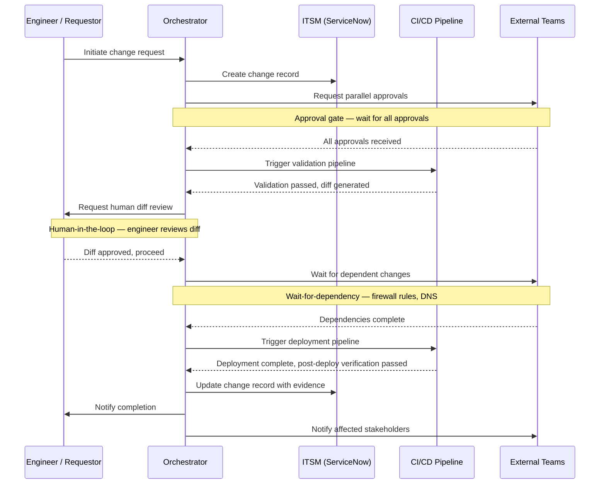

# Workflow Orchestration

> "In production, the bottleneck is coordination, not automation."

A well-built CI/CD pipeline can validate and deploy a network change in under five minutes. In most production enterprises, that same change still takes 48 hours. The bottleneck is not the technical execution — it is the coordination: the security review, the change advisory board approval, the dependency on a firewall update from another team, the DNS change that must happen concurrently, the notification to the application owner, the compliance ticket that must be closed at the end.

This is the workflow orchestration problem. It is distinct from the CI/CD pipeline problem, and it requires a different class of tooling to solve.

---

## The Distinction That Matters

CI/CD pipelines are sequential, automated, and operate within a single domain of control. They are excellent at: syntax validation, configuration rendering, model-based testing, and deterministic deployment. Every step is automated. Every decision is encoded in the pipeline logic. The pipeline either passes or fails.

Workflow orchestration coordinates across multiple systems, teams, and approval processes. It handles: steps that require human decisions, dependencies on external system states, conditional branching based on factors outside the pipeline, parallel workstreams that must converge before proceeding, retry and escalation logic, and the integration with ITSM systems that generates the compliance record.

The confusion between these two is common and expensive. Teams that try to solve orchestration problems with pipeline tools end up with brittle, opaque workflows that fail in unpredictable ways. Teams that try to solve pipeline problems with orchestration tools end up with slow, over-engineered validation processes.

Use both. Use each for what it is designed for.

---

## Orchestration Patterns

Six patterns appear repeatedly in production network change workflows. Understanding them is a prerequisite for evaluating any orchestration platform.

### Approval Gates

A human must review and approve before the workflow proceeds. This may be a network architect reviewing the change design, a security team validating policy impact, a change advisory board approving a risk assessment, or an application owner confirming a maintenance window.

The approval gate is not the same as the CI/CD merge request approval. A merge request approval validates technical correctness. An orchestration approval gate may validate business risk, timing, stakeholder readiness, or policy compliance — decisions that require human judgement, not technical verification.

### Wait-for-Dependency

The workflow pauses until an external condition is satisfied. The firewall rule must be applied before the network route is advertised. The DNS record must propagate before the application is cut over. The upstream change must complete successfully before the downstream change begins.

This pattern requires the orchestrator to monitor external state — polling an API, receiving a webhook, or waiting for an event — and resume the workflow when the condition is met. It is fundamentally incompatible with the synchronous, sequential model of a CI/CD pipeline.

### Conditional Branching

The workflow follows different paths based on the change type, risk level, environment, or outcome of a previous step. A standard change may bypass the change advisory board and proceed directly to deployment. An emergency change may require an expedited approval process. A failed deployment may trigger a rollback workflow rather than a retry workflow.

Conditional branching is where orchestration workflows earn their complexity. Well-designed branching makes the governance model explicit and enforceable. Poorly designed branching becomes an unmaintainable tangle of special cases.

### Parallel Execution

Independent workstreams run concurrently and converge at a defined gate. The network configuration change, the firewall policy update, and the load balancer reconfiguration all happen in parallel — each in their own domain, each with their own validation — and the workflow waits until all three complete successfully before proceeding to the final verification step.

Parallel execution is one of the most significant speed improvements that orchestration delivers over sequential manual processes. Changes that used to happen in series across multiple teams can be coordinated to happen simultaneously.

### Human-in-the-Loop

An engineer confirms intermediate state before the workflow proceeds. After the pre-deployment validation completes and the diff is generated, a human reviews the diff and confirms that the proposed change matches the intended outcome before deployment begins. This is distinct from an approval gate — the human is not approving a risk assessment, they are verifying a technical outcome.

The human-in-the-loop pattern is essential for high-risk changes where automated verification is necessary but not sufficient. It ensures that human expertise is applied at the point in the workflow where it adds the most value — reviewing a validated, pre-generated diff — not at every step.

### Retry and Escalation

When a step fails, the orchestrator can retry automatically, escalate to a human, or follow a defined failure path. A deployment that fails due to a transient connectivity issue may be safely retried. A deployment that fails due to a device configuration error requires human investigation. A deployment that fails after three retries should escalate to an on-call engineer, not retry indefinitely.

Retry and escalation logic is often underspecified in manual processes — the failure path is "call someone." In an orchestrated workflow, it is explicit and consistently applied.

---

## The Integration Model

Orchestration wraps the CI/CD pipeline. It does not replace it.

The CI/CD pipeline handles the technical steps — validation, rendering, testing, deployment, post-deployment verification. The orchestrator handles everything else — initiation, approvals, dependency coordination, scheduling, notification, and compliance closure.

---

## Platform Selection

The choice of orchestration platform should follow from the organisation's existing investments and the specific patterns that dominate the production change workflow.

### ServiceNow Flow Designer

**Best for:** Organisations where ServiceNow is the established ITSM and the change management process is already anchored there.

The integration between Flow Designer and ServiceNow's change management module is native. Change records, approvals, task assignments, and compliance evidence all live in the system the organisation already uses. The development model is low-code, which broadens who can build and maintain workflows. The governance and audit capabilities are enterprise-grade.

The limitations are real: performance is not suitable for high-frequency automation, the low-code model can be constraining for complex logic, and the platform is not designed for network-specific orchestration patterns. Use it for the governance and coordination layer; keep the technical execution in the CI/CD pipeline.

### Itential

**Best for:** Organisations where network automation orchestration is the primary requirement and existing ITSM integration can be achieved via API.

Purpose-built for network automation. The workflow builder is network-aware. The integration library covers major network platforms, ITSM systems, and automation frameworks. The data model is designed for network operations.

Itential is strongest when network-specific orchestration patterns dominate the workflow — where the coordination problems are primarily between network systems and teams, rather than between network and the broader enterprise IT governance layer. Organisations with a ServiceNow-centric change management process may find Itential less natural than ServiceNow's own flow capabilities.

### StackStorm

**Best for:** Organisations where event-driven automation is the primary driver and engineering capacity to build and operate the platform is available.

StackStorm's architecture — sensors detecting events, triggers mapping events to actions, rules executing actions — is well-suited for closed-loop automation and incident response workflows. An interface goes down, a sensor detects the event, a rule triggers a remediation workflow, the workflow executes the recovery steps automatically.

The operational overhead is higher than commercial platforms. StackStorm is a platform that must be deployed, operated, and maintained. It rewards organisations with strong engineering capacity and a clear event-driven automation use case.

### AWX / Ansible Automation Platform

**Best for:** Organisations already deeply invested in Ansible that need lightweight workflow orchestration without adopting an additional platform.

The workflow features in AWX and AAP are genuinely useful for sequential, Ansible-centric workflows. They are less capable than dedicated orchestration platforms for complex coordination patterns — particularly wait-for-dependency and cross-system integration.

Treat this as a transitional capability: sufficient for Phase 2 orchestration needs, likely to become a constraint as orchestration requirements mature in Phase 3 and beyond.

---

## Adoption Timing

Do not wait until orchestration is urgently needed to begin evaluating it. By the time the absence of an orchestration layer is actively blocking production automation, the organisation has already paid a significant cost in workarounds, manual coordination overhead, and frustrated engineers.

| Phase | Orchestration Activity |
|---|---|
| Phase 1 | No dedicated orchestration; pipeline approval gates sufficient |
| Phase 2 | Evaluate and pilot orchestration platform; identify top 3 coordination patterns to address |
| Phase 3 | Production orchestration deployed; one-touch deployment workflows operational |
| Phase 4 | Event-driven closed-loop workflows; incident response orchestration |

The evaluation and pilot in Phase 2 should involve the ITSM team, the security team, and the change management function — not just the network automation team. Orchestration touches all of them.

---

## What Not to Build

Occasionally, organisations consider building a custom orchestration layer — a bespoke system that coordinates workflow steps, manages approvals, and integrates with ITSM. This is almost always the wrong decision.

A production-grade orchestrator requires: persistent state management across long-running workflows, retry logic with backoff, role-based access control, a UI for workflow visibility, API integrations with ITSM and CI/CD systems, audit logging, failure recovery, and operational monitoring. Every mature platform has spent years solving these problems. Building equivalent capability from scratch requires multiple years of engineering investment to reach production quality — investment that could instead go toward the automation capabilities that actually differentiate the organisation.

The one exception: integration code between your orchestrator and your tools. The ServiceNow-to-GitLab integration, the Itential-to-Napalm connector, the StackStorm sensor for your specific monitoring platform — these are right to build, because they are specific to your environment and your toolchain. Build the integration. Buy the orchestrator.

---

*See also: [CI/CD Pipelines](../../07-implementation-guides/ci-cd-pipelines/) — the technical pipeline that orchestration coordinates.*
