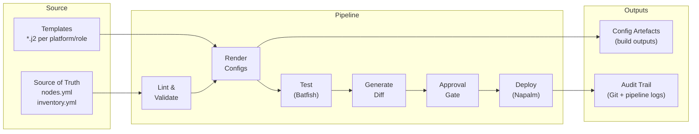
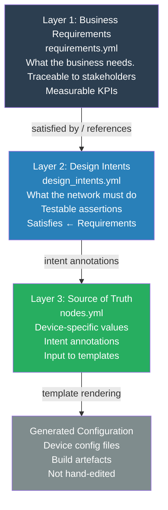
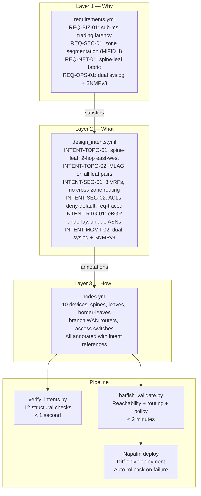

# Chapter 6: Architecture Patterns

> "Configuration is an output, not an input. The moment you accept that, the architecture becomes clear."

This chapter presents the reference architectures that underpin network automation at scale. These are not theoretical blueprints — they are patterns derived from working implementations, described at the level of design principles and structural choices rather than implementation detail. How to build these patterns is covered in [Chapter 7](../07-implementation-guides/). This chapter covers why they look the way they do, and the design decisions that make them robust rather than brittle.

The chapter is structured around a progression: from configuration as code — the foundational pattern that makes everything else possible — through to the intent-based architecture that represents the mature expression of that foundation. These are not competing approaches; they are layers. Configuration as code is the prerequisite for intent-based design. Intent-based design is what configuration as code becomes when it reaches full maturity.

---

## The Architectural Problem with Manual Configuration

Before describing what the architecture should look like, it is worth being precise about why the current approach fails at scale. Four structural weaknesses characterise manual, device-by-device configuration management.

**Intent is lost in translation.** A business requirement ("trading systems must be isolated from corporate users") passes through several interpretation steps — architecture discussion, design document, configuration template in someone's head — before becoming a device configuration. At each step, context is lost. By the time the configuration is on the device, the connection to the original requirement is invisible. When someone later asks "why is this ACL here?", the answer is in a Confluence page that nobody has read in two years.

**Configuration accumulates drift.** Networks change continuously. Devices are updated, configurations are adjusted, emergency fixes are applied. Over months and years, the actual running configuration diverges from whatever documentation exists. The source of truth becomes the device itself — which means there is no source of truth, only the accumulated history of changes that nobody fully remembers.

**Change management is expensive.** When knowledge exists in engineers' heads and configurations on devices, every change requires significant cognitive effort: understand the current state, reason about the impact, write the change, review it manually, apply it carefully. This is slow, error-prone, and dependent on specific individuals.

**Compliance is retrospective.** Policy verification happens after the fact. An audit reveals that a configuration does not conform to policy. An incident reveals that a security control was missing. The system has no mechanism to prevent non-compliant configurations from reaching production.

The architecture patterns in this chapter address each of these weaknesses systematically.

---

## Pattern 1: Configuration as Code

Configuration as code (CaC) is the foundational pattern. It establishes three principles that all subsequent patterns build on.

### Principle 1: Single source of edit

There is exactly one place where the intended state of the network is defined and modified. Engineers edit this source of truth; they do not edit device configurations directly. The source of truth is version-controlled, peer-reviewed, and the authoritative record of what the network is supposed to look like.

This is a governance discipline as much as a technical pattern. Its value is zero if engineers bypass it — making CLI changes to devices outside the workflow. The architecture must be designed so that the source of truth is genuinely the single point of edit, not merely the aspirational one.

### Principle 2: Configuration is generated, not written

Device configurations are build artefacts. They are generated by an automation pipeline from the source of truth, using templates. Engineers do not write device configurations. They write structured data (the source of truth) and templates. The pipeline produces configurations from those inputs.

This is the same discipline software engineering adopted with compiled languages. You change the source code; you do not edit the binary. The analogy is exact: the source of truth is the source code, the configuration templates are the compiler, and the rendered device configurations are the binaries.

The consequence is significant: if a configuration needs to change, the change is made in the source of truth, the pipeline re-renders, and the new configuration is deployed. The rendered configuration directory is always regenerable from the source of truth. Editing a rendered configuration directly is equivalent to editing a compiled binary — it may work immediately, but the next build will overwrite the change, and the source of truth no longer reflects reality.

### Principle 3: Version control is the governance layer

All changes to the source of truth — and by extension, all configuration changes — flow through version control with peer review. The Git history is the audit trail. Every change has an author, a reviewer, a timestamp, and a diff. The pull request or merge request is the change request.

This gives the organisation something that manual processes cannot provide: a complete, machine-readable history of every intended configuration change, with the context of who made it and why.

### The configuration as code architecture



The key structural insight in this diagram: the rendered configurations (artefacts) are outputs of the pipeline, not inputs. Nothing in the pipeline accepts hand-edited configurations. The source of truth and templates are the only inputs.

---

## Pattern 2: The Intent-Based Architecture

Configuration as code solves the governance problem: changes are version-controlled, peer-reviewed, and auditable. It does not, by itself, solve the intent problem: the connection between why a configuration exists and what it is.

The intent-based architecture adds a layer above the source of truth that captures the *reasoning* behind the network design — and makes that reasoning machine-readable, testable, and traceable all the way to the running configuration.

### The three-layer model



Each layer has a distinct purpose, a distinct audience, and a distinct level of abstraction.

**Layer 1 — Business Requirements** is where business stakeholders and network architects work together. Requirements are expressed in organisational language, not technical language. They are traceable to a specific driver (regulatory obligation, business decision, operational need) and, where possible, measurable via a KPI. They are committed to the repository as structured YAML — not as a Confluence page, not as a design document, but as the root of the dependency tree that governs the entire network design.

**Layer 2 — Design Intents** is where network architects work. Each intent translates one or more business requirements into a specific, testable network behaviour. The critical property of a design intent is that it must be verifiable: there must be a way to assert, programmatically, that the network satisfies the intent. Intents that cannot be verified are aspirations, not intents.

**Layer 3 — Source of Truth** is where the device-specific data lives: IP addresses, ASNs, VLANs, hostnames, routing policies, ACL entries. Each significant block of data carries an `intent:` annotation referencing the design intent it implements. This annotation is the machine-readable link between data and rationale.

### The traceability chain

The architectural value of the three-layer model is the unbroken traceability chain it creates between a regulatory requirement and a specific line in a running device configuration.

For ACME Investments, the chain for traffic segmentation looks like this:

```
REQ-SEC-01
"Network traffic must be segmented into distinct security zones:
Trading, Corporate, and DMZ. No direct traffic between Trading
and DMZ without inspection."
[driver: regulatory — FCA SYSC 8 / MiFID II Art 48]
        │
        ▼
INTENT-SEG-01
"Three VRFs map to three security zones. Inter-VRF routing
disabled by default. All cross-zone traffic exits to a firewall."
[satisfies: REQ-SEC-01, REQ-SEC-02]
[test: assert no route leaking between VRFs without firewall exit]
        │
        ▼
nodes.yml — every leaf switch
vrfs: [TRADING, CORPORATE, DMZ]   # intent: INTENT-SEG-01
inter_vrf_routing: disabled
        │
        ▼
leaf.j2 template
→ Rendered Arista EOS configuration
vrf definition TRADING
   rd 65101:10
   route-target import 65000:10
   route-target export 65000:10
```

This chain is machine-readable at every link. An auditor asking "how does the network comply with MiFID II Article 48?" receives a complete, automated answer: the requirement in `requirements.yml`, the intent in `design_intents.yml`, the annotated data in `nodes.yml`, and the rendered configuration on every leaf switch. The documentation is not a separate exercise — it is the network.

### Intent annotations in the source of truth

Intent annotations in the source of truth are load-bearing. They are not comments for human readers — they are machine-readable references that the verification layer uses to check compliance. An intent verification script can traverse the source of truth, find every block annotated with `INTENT-SEG-01`, and assert that each one correctly implements the intent's requirements.

In ACME's `nodes.yml`, the annotation pattern looks like this:

```yaml
# At device level — this device implements these intents
- hostname: leaf01
  intent: [INTENT-TOPO-01, INTENT-TOPO-02, INTENT-SEG-01, INTENT-RTG-01]

  # At field level — this specific value implements this intent
  bgp:
    asn: 65101    # intent: INTENT-RTG-01 (unique ASN per device)

  acls:
    - name: ACL_TRADING_IN
      default_action: deny    # req: REQ-SEC-02
      entries:
        - seq: 10
          action: permit
          comment: "REQ-SEC-01: intra-trading east-west"
```

The `comment` field in each ACL entry is not optional documentation — it is mandated by `INTENT-SEG-02`, which requires that every ACL entry be traceable to a named requirement. When the Jinja2 template renders this into an EOS configuration, the comment appears verbatim in the device config. The requirement lives in the device.

This is the architectural realisation of the principle: compliance is a by-product of good automation, not a separate workstream.

---

## Pattern 3: The Reference Repository Structure

The repository structure is itself an architectural decision. Its organisation communicates the mental model of the system to anyone who opens it — and a well-organised repository makes the dependency relationships between layers explicit.

```
network-as-code/
│
├── requirements.yml          # Layer 1: business requirements (root of dependency tree)
├── design_intents.yml        # Layer 2: design intents with satisfies + test fields
│
├── inventory.yml             # Site and device inventory (groups for template dispatch)
├── nodes.yml                 # Layer 3: source of truth (device data + intent annotations)
│
├── templates/
│   ├── arista_eos/
│   │   ├── spine.j2          # One template per platform per role
│   │   ├── leaf.j2
│   │   └── border_leaf.j2
│   └── cisco_ios/
│       ├── wan_router.j2
│       └── access_switch.j2
│
├── playbooks/
│   └── generate_configs.yml  # Ansible: reads SoT, dispatches templates
│
├── tests/
│   ├── verify_intents.py     # Layer 2 check: SoT structural compliance
│   └── batfish_validate.py   # Layer 3 check: behavioural correctness
│
├── generated/                # Build artefacts — never hand-edited
│   ├── arista_eos/
│   └── cisco_ios/
│
├── scripts/
│   └── generate_branch.py    # Intent-driven site generator
│
└── .gitlab-ci.yml            # Pipeline definition
```

### Why this structure is designed this way

**`requirements.yml` at the root.** The business requirements are the root of the dependency tree. Placing them at the root of the repository communicates this — they are not a subdirectory, not a documentation folder, not an appendix. Everything else traces back to them.

**Separation of data and templates.** `nodes.yml` contains data. `templates/` contains rendering logic. These are never mixed. A template that hard-codes a value that should be in the source of truth is a design failure — it creates a configuration that cannot be changed from the source of truth, breaking the single source of edit principle.

**One template per platform per role.** `arista_eos/leaf.j2` renders a leaf switch on Arista EOS. It is not a generic template with extensive platform conditionals — that path leads to templates that are impossible to maintain. Platform heterogeneity is managed by having separate templates, not by making a single template more complex.

**`generated/` is a build output directory.** It is gitignored in many implementations, or committed as a CI artefact. It is never the target of a hand-edit. If it is gitignored, the CI pipeline is the source of truth for what gets deployed. If it is committed, the commit is generated by the pipeline, not by a human.

**Tests are first-class.** The `tests/` directory sits alongside the data and templates, not in a subdirectory of something else. Automated verification is not an afterthought in this architecture — it is a core component.

---

## Pattern 4: Source of Truth Schema Design

The source of truth schema is the most consequential design decision in the entire architecture. A well-designed schema accommodates the full range of devices and configurations in the estate, supports multi-vendor environments cleanly, and can be extended as the network evolves. A poorly designed schema creates technical debt that propagates through every downstream component — templates, verification scripts, pipeline logic — and is expensive to correct.

### Design principles

**Platform-agnostic data model with platform-specific rendering.** The source of truth should capture network intent in terms that are not specific to any vendor's CLI syntax. IP addresses, ASNs, VLANs, routing policies, security zones — these are universal concepts. How they are expressed in Arista EOS versus Cisco IOS versus Juniper Junos is a template concern, not a data concern.

A field in `nodes.yml` named `default_action: deny` in an ACL entry is platform-agnostic. The Arista template renders it as `action deny` in EOS syntax. The Cisco template renders it as `deny any any` in IOS syntax. The data model stays clean; the complexity lives in the templates where it belongs.

**Hierarchical structure with consistent patterns.** The schema should be hierarchical — device → interface → address, or device → bgp → peers — but each level of the hierarchy should follow consistent patterns. If interfaces are defined as a list on one device type, they should be a list on all device types. Inconsistent structures make templates complex and verification scripts fragile.

**Explicit over implicit.** Values that might be assumed (default management VRF, default SNMPv3 settings, standard NTP servers) should be explicit in the source of truth, not implicit in templates. This has two benefits: the SoT verification layer can assert they are present, and the data model remains readable without requiring template knowledge to interpret.

**Intent annotations as first-class fields.** Intent annotations are not comments. They are structured data fields (`intent:`, `req:`) that the verification layer reads programmatically. Design the schema to accommodate them from the start.

### A representative schema pattern

The following illustrates the structural pattern for a device in ACME's `nodes.yml`. This is not a complete schema — it is an illustration of the design principles in practice.

```yaml
- hostname: spine01
  platform: arista_eos          # determines which template is used
  role: spine                   # determines which role-template within the platform
  site: lon-dc1
  intent: [INTENT-TOPO-01, INTENT-RTG-01, INTENT-RTG-02]  # device-level intents

  # Network addressing — platform-agnostic
  loopback:
    address: 10.0.254.1/32      # intent: INTENT-IP-01

  # Routing — expressed as intent, not as vendor CLI
  bgp:
    asn: 65001                  # intent: INTENT-RTG-01 (unique per device)
    router_id: 10.0.254.1
    peers:                      # list, not dict — consistent with all device types
      - peer_ip: 10.0.255.0
        peer_asn: 65101
        description: "leaf01 underlay"
        address_families: [ipv4_unicast]
    evpn:
      enabled: true
      role: route_server        # intent: INTENT-RTG-02

  # Management — identical structure across all platforms
  management:
    vrf: MGMT                   # intent: INTENT-MGMT-01
    address: 10.0.0.1/24
    syslog_servers:             # intent: INTENT-MGMT-02
      - 10.0.0.100
      - 10.0.0.101
    snmp:
      version: v3
      auth: SHA
      priv: AES128
```

Notice that there is nothing Arista-specific in this data. The `platform: arista_eos` field tells the automation framework which template to use. The data itself would be equally valid as input to a Juniper Junos template or a Cisco IOS-XR template. This is the platform-agnostic principle in practice.

### Schema evolution and migration

Schemas evolve. New device types require new fields. New design intents require new annotation patterns. The architecture should accommodate evolution without requiring a complete rewrite.

Two practices make schema evolution manageable:

**Version the schema.** Include a `schema_version` field in the source of truth. When the schema changes in a breaking way, increment the version. Verification scripts and templates can check the version and handle both old and new formats during a migration window.

**Validate the schema in the pipeline.** A JSON Schema or Pydantic model that defines the expected structure of `nodes.yml` can be validated in the first pipeline stage. Changes to the schema are changes to this validation definition — which means they are peer-reviewed and auditable. Schema drift (the source of truth diverging from its own intended structure) is caught automatically.

---

## Pattern 5: Multi-Vendor Template Architecture

Most enterprise networks are heterogeneous. ACME Investments runs Arista EOS in the datacentre and Cisco IOS at branch offices. The architecture must handle this cleanly — and the right place to handle it is the template layer, not the data layer.

### The design principle

Platform heterogeneity is managed at the template layer, not the data layer. The source of truth maintains a single, platform-agnostic data model. Each platform has its own set of templates that render that data into vendor-specific CLI syntax.

The alternative — a source of truth with platform-specific sections, or a single "universal" template with extensive platform conditionals — is significantly harder to maintain. Conditionals in templates multiply as platforms are added. Platform-specific sections in the data model make the schema complex and the verification logic fragile.

### One template per platform per role

The template hierarchy follows: `platform / role`. For ACME:

```
templates/
├── arista_eos/
│   ├── spine.j2          # spine-specific configuration (route server, full-mesh eBGP)
│   ├── leaf.j2           # leaf-specific configuration (MLAG, VXLAN, server-facing)
│   └── border_leaf.j2    # border-leaf specifics (external peering, firewall handoff)
└── cisco_ios/
    ├── wan_router.j2      # WAN router (dual uplinks, OSPF, NAT)
    └── access_switch.j2   # Access layer (VLANs, STP, DHCP snooping)
```

Each template handles one platform and one role. This is the most maintainable structure — a change to how Arista spines are configured touches only `arista_eos/spine.j2`. It does not require touching leaf templates or Cisco templates.

### Shared data, divergent rendering

The same data fields appear in the source of truth for both Arista and Cisco devices — `management.syslog_servers`, `management.snmp.version`, `bgp.asn`. Each platform template renders these fields into the vendor-specific syntax:

```
# Arista EOS (from leaf.j2)
logging host 10.0.0.100
logging host 10.0.0.101

# Cisco IOS (from wan_router.j2)
logging 10.0.0.100
logging 10.0.0.101
```

The data model is identical. The rendered output is vendor-specific. The management policy — dual syslog servers, SNMPv3 with SHA/AES128 — is enforced consistently across both platforms, because it is encoded once in the source of truth.

This is one of the most significant operational benefits of the CaC architecture: platform heterogeneity stops being a source of inconsistency. The policy is in the data; the syntax is in the templates; consistency follows automatically.

### Template design guidance for architects

**Templates should be thin.** A template that is hundreds of lines long with complex logic is a code smell. Templates should primarily be rendering logic — taking data and producing vendor syntax. Business logic (what should be configured) belongs in the source of truth and the design intents. Rendering logic (how to express it in vendor syntax) belongs in the template.

**Avoid template inheritance for configuration logic.** Template inheritance — where a base template provides common sections and role templates override specifics — introduces coupling that makes templates hard to reason about independently. Keep templates self-contained. If the same configuration block appears in multiple templates, extract it into a macro — a template snippet that can be called, not a parent template that is extended.

**Test templates independently.** A template can be validated by rendering it against a known input and comparing the output against an expected result. This is a fast, reliable test that catches template regressions when the source of truth schema changes. Include template rendering tests in the CI pipeline.

---

## The Maturity Progression

These patterns are not all-or-nothing. They are adopted progressively, aligned with the transformation roadmap from [Chapter 4](../04-transformation-roadmap/).

| Maturity Level | Architecture Pattern | What Changes |
|---|---|---|
| **Level 2 → 3** | Configuration as Code (basic) | Source of truth established; templates for common change types; version control and CI pipeline; single source of edit enforced |
| **Level 3 → 4** | CaC (complete) + intent annotations | Full pipeline coverage; intent annotations added to SoT; SoT verification checks run in pipeline; traceability chain established |
| **Level 4 → 5** | Intent-based architecture | `requirements.yml` and `design_intents.yml` formalised; verification against design intents automated; intent-driven generation for templated infrastructure |

The architecture does not need to be built in its final form from day one. Start with a clean source of truth and templates for one domain. Add intent annotations progressively as the model matures. Formalise the requirements and design intents layer when the organisation has the discipline to maintain it.

The key constraint on this progression: architectural decisions made early are hard to reverse later. A source of truth schema that mixes platform-specific data with platform-agnostic data will require a refactor before multi-vendor templates can be cleanly introduced. A template structure that uses complex conditionals to handle multiple platforms will resist decomposition into per-platform templates. Make the right architectural choices at Phase 1, even when their full value is not immediately visible.

---

## Worked Example: ACME Investments Architecture

ACME's full architecture, assembled from the patterns above, looks like this:



The architecture is complete when every device configuration can be regenerated from `requirements.yml` + `design_intents.yml` + `nodes.yml` + templates, and every line of that configuration can be traced back to a specific design intent and ultimately to a specific business requirement.

---

## Downloadable Templates

| Template | Purpose | Format |
|---|---|---|
| [SoT Schema Design Checklist](../templates/sot-schema-checklist.md) | Design principles checklist for schema decisions | Markdown |
| [Repository Structure Template](../templates/repository-structure.md) | Reference directory structure for network-as-code repositories | Markdown |

---

## Summary

The architecture patterns in this chapter address the four structural weaknesses of manual configuration management: intent is captured explicitly in `requirements.yml` and `design_intents.yml`; drift is prevented by making version control the single source of edit; change management cost is reduced by making the pipeline the governance layer; and compliance is continuous because policy violations are caught by the verification layer before reaching production.

Configuration as code establishes the foundation. The intent-based architecture completes it. The reference repository structure and schema design principles make the architecture maintainable as the network grows. The multi-vendor template architecture ensures that platform heterogeneity is an implementation detail, not an architectural constraint.

These patterns are not aspirational — they are implemented, running, and maintainable by the team at ACME Investments. The implementation guides in [Chapter 7](../07-implementation-guides/) show how to build them.

---

*Next: [Chapter 7 — Implementation Guides](../07-implementation-guides/) — building the CI/CD pipeline, testing strategy, and deployment patterns that bring these architectures to life.*
