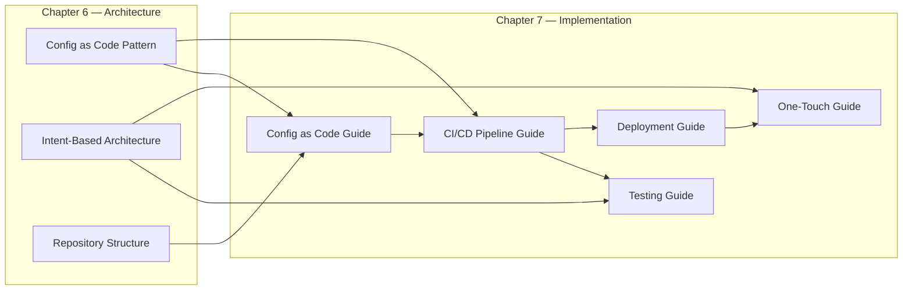

# Chapter 7: Implementation Guides

This chapter translates the architecture patterns from [Chapter 6](../06-architecture-patterns/chapter.md) and the tooling decisions from [Chapter 5](../05-tooling-strategy/chapter.md) into working implementation. It is the most technically detailed section of the handbook — written for the engineers and architects who must build what the earlier chapters describe.

The chapter is structured as five implementation guides, each addressing a distinct layer of the automation capability stack. They are designed to be read in order for a new implementation, or individually when working on a specific area.

| Guide | What It Covers |
|---|---|
| [Config as Code](config-as-code/chapter.md) | Building the source of truth, Jinja2 templates, and Ansible playbooks |
| [CI/CD Pipelines](ci-cd-pipelines/chapter.md) | End-to-end pipeline design across nine stages |
| [Testing Strategies](testing-strategies/chapter.md) | The layered testing taxonomy, from lint to live device verification |
| [Deployment Patterns](deployment-patterns/chapter.md) | Replace vs merge, canary, rollback, and blast radius containment |
| [One-Touch Deployment](one-touch-deployment/chapter.md) | Intent-driven generation, guardrails, and self-service provisioning |

---

## How These Guides Relate to the Architecture

Each guide implements a specific part of the architecture introduced in Chapter 6.

The guides build on each other. Config as code provides the source of truth and templates that the CI/CD pipeline consumes. The pipeline stages include the testing layers described in the testing guide. Deployment patterns are pipeline stages. One-touch deployment is the highest-order capability, built on all the layers below it.

---

## The ACME Investments Implementation

Throughout this chapter, ACME Investments' implementation is used as the running example. By the end of the five guides, you will have a complete picture of a working network-as-code implementation:

- `requirements.yml` → `design_intents.yml` → `nodes.yml` — the three-layer intent model
- `templates/arista_eos/` and `templates/cisco_ios/` — multi-vendor template library
- `verify_intents.py` + `batfish_validate.py` — the two-layer verification suite
- `.gitlab-ci.yml` — a nine-stage pipeline from lint to deployment
- `generate_branch.py` — one-touch branch provisioning with guardrails

This is not a proof of concept. It is a production-representative implementation that can serve as the foundation for a real programme.

---

## A Note on Depth and Audience

These guides include code examples and configuration fragments — YAML, Python, and pipeline definitions. The intent is architectural illustration, not step-by-step tutorial. The examples show what the implementation looks like and why it is structured the way it is. For the full working codebase, see the [`examples/acme-investments-demo/`](../examples/acme-investments-demo/) directory.

Engineers new to specific tools (Ansible, Batfish, Jinja2) should use the tool's own documentation alongside these guides. The handbook does not replicate what is already well-documented elsewhere.

---

*Begin with: [Config as Code](config-as-code/chapter.md)*
