# 7.2 — CI/CD Pipelines

The CI/CD pipeline is the governance layer for the network. Every proposed change — regardless of who initiates it or what it modifies — flows through the same sequence of validation, testing, approval, and deployment stages. The pipeline is not primarily a deployment tool. It is a validation and governance tool that also deploys.

This guide covers the nine-stage pipeline architecture, the design principles that make it robust, and the ACME Investments implementation as a working reference.

---

## Pipeline Design Principles

Before describing the stages, the principles that govern the pipeline design:

**Fail fast on cheap checks.** Linting runs in seconds. Intent verification runs in under a second. Batfish runs in under two minutes. Deployment takes longer. Run the fast, cheap checks first — they catch the most common errors before spending time on expensive stages.

**Each stage produces an artefact.** Rendered configurations, Batfish reports, diffs, deployment logs — each pipeline stage produces a structured output that is stored as a pipeline artefact. These artefacts are not just debugging aids; they are the audit trail. The artefact set for a pipeline run is the compliance evidence for that change.

**The approval gate reviews a validated, pre-diffed change.** The human reviewer is not being asked to validate correctness — the pipeline has done that. They are reviewing a diff that has already passed linting, intent verification, and Batfish behavioural testing. Their role is architectural judgement, not technical verification.

**Deployment is a separate stage from validation.** Validation stages run automatically on every commit. The deployment stage runs only after explicit approval. This separation means validation can be re-triggered freely (on every push to the MR branch) without triggering a re-deployment.

**Rollback is automatic.** If the deployment stage fails partway through, the pipeline rolls back automatically. Manual rollback — an engineer diagnosing a failure and manually reverting — is too slow and too error-prone for a production automation pipeline.

---

## The Nine-Stage Pipeline

```mermaid
graph LR
    S1["1. Lint"] --> S2["2. Verify<br>Intents"]
    S2 --> S3["3. Generate<br>Configs"]
    S3 --> S4["4. Validate<br>(Batfish)"]
    S4 --> S5["5. Diff"]
    S5 --> S6["6. Approve"]
    S6 --> S7["7. Stage<br>(optional)"]
    S7 --> S8["8. Deploy"]
    S8 --> S9["9. Verify<br>Post-Deploy"]

    style S1 fill:#27ae60,color:#fff
    style S2 fill:#27ae60,color:#fff
    style S3 fill:#2980b9,color:#fff
    style S4 fill:#2980b9,color:#fff
    style S5 fill:#2980b9,color:#fff
    style S6 fill:#e67e22,color:#fff
    style S7 fill:#8e44ad,color:#fff
    style S8 fill:#c0392b,color:#fff
    style S9 fill:#c0392b,color:#fff
```



### Stage 1: Lint

**What it does:** Syntax and structural validation of all YAML files (`nodes.yml`, `design_intents.yml`, `requirements.yml`, `inventory.yml`) and template files. Runs `yamllint` against all YAML, `ansible-lint` against playbooks, and the JSON Schema validator against `nodes.yml`.

**Why it matters:** Malformed YAML causes opaque failures in later stages. Catching it immediately — in under 10 seconds — means engineers get feedback on a trivial mistake before the pipeline even starts processing.

**Failure behaviour:** Pipeline stops. No subsequent stages run. The error message points to the specific file and line number.

### Stage 2: Verify Intents

**What it does:** Runs `verify_intents.py` — a custom Python script that loads `design_intents.yml` and `nodes.yml` and asserts that the data model structurally satisfies every design intent. This is the SoT-layer verification described in the architecture chapter.

Example checks for ACME:
- Every device has dual syslog servers (INTENT-MGMT-02)
- Every ACL has `default_action: deny` (INTENT-SEG-02)
- Every ACL entry has a `comment` field containing a requirement ID (INTENT-SEG-02)
- Every BGP ASN is unique across all fabric devices (INTENT-RTG-01)
- Every interface address falls within its declared zone prefix (INTENT-IP-01)
- No cross-zone route leaking in the VRF configuration (INTENT-SEG-01)

Output is emitted as JUnit XML, which GitLab CI renders natively as a test report. Every intent check appears as a named test case. A failure blocks the MR.

**Why it matters:** Structural violations caught here — in under one second — cannot surface later as deployment failures or compliance gaps. This stage encodes the organisation's design standards in executable form.

**Failure behaviour:** Pipeline stops. JUnit test report shows which intents failed and why.

### Stage 3: Generate Configs

**What it does:** Runs the Ansible generation playbook (`generate_configs.yml`), which renders every device configuration from `nodes.yml` + templates. Output is written to `generated/` and stored as a pipeline artefact.

**Why it matters:** Generated configurations are the input to the Batfish validation stage. They are also the exact configurations that will be deployed — the artefact guarantees that what was tested is what gets deployed.

**Artefact:** `generated/` directory containing one `.cfg` file per device.

### Stage 4: Validate (Batfish)

**What it does:** Runs `batfish_validate.py`, which loads the generated configurations into a Batfish network snapshot and executes behavioural assertions:

- Reachability: can a host in the trading zone reach the DMZ without traversing a firewall? (Should fail — if it succeeds, it's a violation.)
- Routing correctness: does every leaf have a valid path to every other leaf via the spine? Are there any routing black holes?
- BGP session establishment: are all eBGP sessions correctly configured to reach Established state?
- Policy compliance: does any ACL on any device permit traffic that `INTENT-SEG-02` prohibits?
- Blast radius: for the specific change being reviewed, what forwarding paths change?

Output is JUnit XML. Batfish runs in a Docker container, typically completing in 60–90 seconds for a network the size of ACME's estate.

**Why it matters:** Batfish answers behavioural questions that cannot be answered by inspecting the data model alone. A routing loop, a reachability gap, or a security policy violation in the rendered configuration is caught here — before any device is touched.

**Artefact:** JUnit XML report; Batfish analysis results stored for review.

### Stage 5: Diff

**What it does:** Runs `hier-config` (or equivalent) to compute the minimal diff between the current device configurations and the proposed configurations. Shows exactly which lines will change on each device.

This stage requires access to the current device configurations, obtained either from a configuration backup system (Oxidized) or by connecting to devices to retrieve the running configuration.

**Why it matters:** The diff is the primary input for the human reviewer in Stage 6. A well-formatted diff makes the approval gate efficient — reviewers can see precisely what will change on each device without reading the full configuration.

**Artefact:** Per-device diffs stored as pipeline artefacts and linked in the MR.

### Stage 6: Approve

**What it does:** Pauses the pipeline. The MR reviewer examines the diff artefacts and the Batfish report, then approves the MR. GitLab's protected branch approval rules enforce the requirement.

**Who reviews:** For standard changes, a single peer reviewer. For high-risk changes (routing policy changes, security zone modifications), the pipeline can be configured to require additional approvers — the security team, the architecture team, or a senior network engineer.

**What the reviewer is checking:** Not whether the configuration is syntactically correct (the pipeline verified that). Not whether the network will behave correctly (Batfish verified that). The reviewer exercises architectural judgement: is this the right change? Is this the right time? Are there business considerations the pipeline cannot assess?

**Artefact:** MR approval record with reviewer identity and timestamp — part of the compliance audit trail.

### Stage 7: Stage (Optional)

**What it does:** Deploys the change to a lab or staging environment before production. Useful for high-risk change types where additional validation against a live (non-production) environment is warranted.

**When to include it:** For changes to routing protocols, security policies, or significant topology modifications. For routine changes (VLAN additions, ACL rule updates on established templates), this stage is typically skipped.

**Why it is optional:** Staging environments are not always available or representative of production. Including this stage when it adds value without making it mandatory for every change.

### Stage 8: Deploy

**What it does:** Pushes the diff-only configuration change to production devices using Napalm. Napalm computes the diff between the candidate configuration (from the pipeline artefact) and the running configuration, then applies only the delta.

The replace model vs the merge model is a deployment decision with significant implications — addressed in detail in the [Deployment Patterns guide](../deployment-patterns/chapter.md). For ACME's Arista EOS environment, `napalm_install_config` with `replace=False` (merge mode) is used for incremental changes; full replace is reserved for new device provisioning.

**Failure behaviour:** If the deployment fails on any device, the pipeline triggers an automatic rollback for all devices that were modified in this pipeline run. The rollback applies the previous configuration (stored as a pre-deployment artefact) via the same Napalm mechanism.

**Artefact:** Deployment log with per-device status, timestamps, and configuration diffs applied.

### Stage 9: Verify Post-Deploy

**What it does:** Runs post-deployment verification checks against the live devices. These are lightweight checks — confirming that BGP sessions are in Established state, that the expected VLANs exist, that management plane connectivity is intact — rather than a full Batfish re-run.

If pyATS is in use, this stage runs the relevant test suite against the modified devices.

**Why it matters:** The pipeline should confirm that the deployment had the intended effect. A change that passed all validation stages but produced unexpected state on the device — due to a race condition, a device software bug, or an unanticipated interaction — should be caught and escalated here.

**Failure behaviour:** If post-deployment verification fails, the pipeline raises an alert and may trigger rollback depending on the severity of the failure and the configuration of the verification stage.

---

## The ACME GitLab CI Configuration

The following shows the structural layout of ACME's `.gitlab-ci.yml`. This is not the full file — it illustrates the stage organisation and key job definitions.

```yaml
# .gitlab-ci.yml — ACME Investments network automation pipeline

stages:
  - lint
  - verify_intents
  - generate
  - validate
  - diff
  - approve       # manual gate — pipeline pauses here
  - stage         # optional; skipped for standard changes
  - deploy
  - verify

variables:
  GENERATED_DIR: "generated"
  BATFISH_HOST: "batfish"   # Docker service

# ── Stage 1: Lint ────────────────────────────────────────────────
lint:yaml:
  stage: lint
  script:
    - yamllint nodes.yml design_intents.yml requirements.yml inventory.yml
  rules:
    - if: '$CI_PIPELINE_SOURCE == "merge_request_event"'

lint:schema:
  stage: lint
  script:
    - python scripts/validate_schema.py --schema schema/nodes_schema.json
                                        --data nodes.yml
  rules:
    - if: '$CI_PIPELINE_SOURCE == "merge_request_event"'

# ── Stage 2: Verify Intents ──────────────────────────────────────
verify_intents:
  stage: verify_intents
  script:
    - python tests/verify_intents.py --nodes nodes.yml
                                     --intents design_intents.yml
                                     --junit-xml reports/intents.xml
  artifacts:
    reports:
      junit: reports/intents.xml   # GitLab renders this as test report
  rules:
    - if: '$CI_PIPELINE_SOURCE == "merge_request_event"'

# ── Stage 3: Generate ────────────────────────────────────────────
generate:configs:
  stage: generate
  script:
    - ansible-playbook playbooks/generate_configs.yml -i inventory.yml
  artifacts:
    paths:
      - generated/               # Store rendered configs as artefact
    expire_in: 30 days
  rules:
    - if: '$CI_PIPELINE_SOURCE == "merge_request_event"'

# ── Stage 4: Validate (Batfish) ──────────────────────────────────
validate:batfish:
  stage: validate
  services:
    - name: batfish/batfish
      alias: batfish
  script:
    - python tests/batfish_validate.py --snapshot-dir generated/
                                       --junit-xml reports/batfish.xml
  artifacts:
    reports:
      junit: reports/batfish.xml
    paths:
      - reports/batfish_analysis.json
    expire_in: 30 days
  rules:
    - if: '$CI_PIPELINE_SOURCE == "merge_request_event"'

# ── Stage 5: Diff ────────────────────────────────────────────────
generate:diff:
  stage: diff
  script:
    - python scripts/generate_diff.py --generated-dir generated/
                                      --output-dir reports/diffs/
  artifacts:
    paths:
      - reports/diffs/
    expose_as: "Configuration Diffs"   # surfaces in MR UI
    expire_in: 30 days
  rules:
    - if: '$CI_PIPELINE_SOURCE == "merge_request_event"'

# ── Stage 6: Approve ─────────────────────────────────────────────
# Enforced by GitLab protected branch rules (minimum approvals)
# No explicit job required — approval gate is the MR approval itself

# ── Stage 8: Deploy ──────────────────────────────────────────────
deploy:production:
  stage: deploy
  script:
    - python scripts/deploy.py --generated-dir generated/
                               --inventory inventory.yml
                               --mode merge
                               --rollback-on-failure
  artifacts:
    paths:
      - reports/deployment_log.json
    expire_in: 90 days       # longer retention for compliance evidence
  environment:
    name: production
  rules:
    - if: '$CI_COMMIT_BRANCH == "main"'   # only runs on merge to main
      when: manual                          # explicit trigger after MR merge

# ── Stage 9: Verify Post-Deploy ──────────────────────────────────
verify:post_deploy:
  stage: verify
  script:
    - python tests/post_deploy_verify.py --inventory inventory.yml
  rules:
    - if: '$CI_COMMIT_BRANCH == "main"'
```

### Pipeline artefacts as audit trail

The artefact set from a complete pipeline run constitutes the compliance evidence for a change:

| Artefact | Content | Compliance Value |
|---|---|---|
| `reports/intents.xml` | Intent verification results | Confirms design standards were met |
| `generated/*.cfg` | Rendered configurations | Shows exactly what was deployed |
| `reports/batfish_analysis.json` | Behavioural validation results | Confirms network behaviour correctness |
| `reports/diffs/*.diff` | Per-device configuration diffs | Exact change applied to each device |
| MR approval record | Reviewer identity and timestamp | Change authorisation evidence |
| `reports/deployment_log.json` | Per-device deployment status | Deployment confirmation and timing |

For a MiFID II or FCA SYSC audit, this artefact set answers: what changed, who approved it, when was it deployed, and was it validated before deployment. The answer is available immediately, from the pipeline history, without manual assembly.

---

## Pipeline Governance Decisions

The pipeline design embeds governance decisions that should be made deliberately and documented as ADRs:

**Approval requirements by change type.** Standard changes (VLAN additions, ACL rule additions to existing ACLs) may require one approval. High-risk changes (routing policy modifications, security zone boundary changes, new device provisioning) should require two or more, potentially from specific roles.

**Staging gate criteria.** Define which change types trigger the optional staging stage. Make this a configuration parameter in the pipeline, not an ad-hoc decision per MR.

**Rollback scope.** If a deployment fails partway through (three devices deployed, one fails), what is the rollback scope? Roll back all four, or only the failed one? The right answer depends on the change type and the interdependencies between devices.

**Artefact retention period.** Compliance requirements may mandate how long pipeline artefacts must be retained. 90 days is a reasonable default for deployment logs; adjust based on regulatory requirements.

---

*Continue to: [Testing Strategies](../testing-strategies/chapter.md)*
