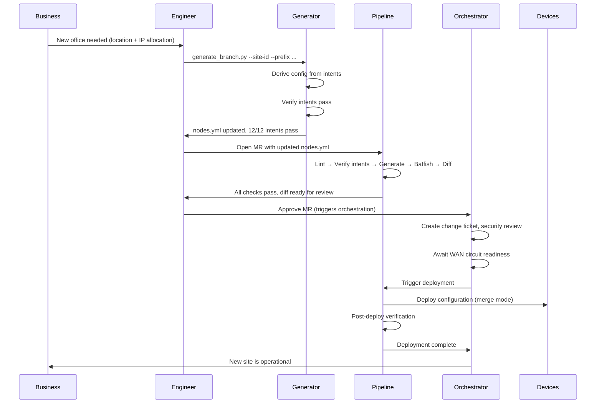

# 7.5 — One-Touch Deployment

One-touch deployment is the capability that most visibly changes the relationship between the network team and the business. When adding a new site is a business decision that triggers an automated provisioning workflow — rather than a multi-week engineering project — infrastructure stops being a constraint on organisational agility.

This guide covers intent-driven site generation, the guardrails that make automated generation safe, and the integration with workflow orchestration for production deployment.

---

## The Problem with Template-Based Generation Alone

A common intermediate state in network automation programmes is template-based provisioning: an engineer fills in a form or a YAML stub for a new site, the pipeline generates the configuration, and deployment proceeds. This is better than manual configuration, but it has a fundamental weakness: the correctness of the generated configuration depends on the engineer correctly populating all the required fields, remembering to apply all the relevant policies, and not making a mistake in a parameter that has non-obvious dependencies.

Intent-driven generation addresses this differently. Rather than asking the engineer to supply all the values, the generator derives every design decision from the intent model. The engineer supplies only the values that are genuinely site-specific — and the generator handles everything else.

---

## Intent-Driven Generation: How It Works

The generator — `generate_branch.py` in ACME's implementation — takes a minimal set of site-specific parameters and produces a complete, intent-compliant SoT entry for the new site.

The minimal inputs for a new ACME branch:

```bash
python generate_branch.py \
  --site-id     nyc-branch1 \
  --location    "New York, US" \
  --prefix      10.2.0.0/16 \
  --router-ip   10.2.20.1 \
  --router-lo   10.2.254.1 \
  --switch-ip   10.2.0.11 \
  --switch-lo   10.2.254.11 \
  --verify
```

These are the values only the engineer knows: the site identifier, the location, and the IP addressing. Everything else — OSPF configuration, management policy, security zone membership, ACL templates, logging configuration, SNMP settings — is derived from the design intents.

The generator produces output like this:

```
Generating branch site: nyc-branch1 (New York, US)
  Site prefix : 10.2.0.0/16
  WAN router  : nyc-branch1-rtr01  lo=10.2.254.1
  Access sw   : nyc-branch1-sw01   lo=10.2.254.11
  Intents     : INTENT-RTG-03, INTENT-SEG-01,
                INTENT-MGMT-01, INTENT-MGMT-02, INTENT-IP-01

Written 10 nodes to nodes.yml
  Added: nyc-branch1-rtr01, nyc-branch1-sw01

Running intent verification...
Results: 12 passed, 0 failed out of 12
```

The generated nodes have:
- OSPF Area 0 — because `INTENT-RTG-03` mandates it for all branch sites
- Dual syslog servers pointing to central collectors — because `INTENT-MGMT-02` mandates it
- SNMPv3 with SHA/AES128 — because `INTENT-MGMT-02` mandates it
- Deny-default ACLs with requirement-traced comments — because `INTENT-SEG-02` mandates it
- Dual WAN uplinks — because `REQ-NET-05` mandates it for all branch sites
- Management VRF — because `INTENT-MGMT-01` mandates it on all devices

The engineer did not need to remember any of these requirements. They are encoded in the generator, which derives them from the design intents. The generated SoT entry is automatically intent-compliant.

---

## Guardrails

Guardrails are constraints that prevent the generator from producing output that would violate operational or design rules. They are what make automation safe — not just fast.

ACME's generator implements the following guardrails:

### Prefix overlap detection

No two sites can use overlapping IP prefixes. The generator checks the new prefix against all existing site prefixes in `nodes.yml` before writing anything:

```python
def check_prefix_overlap(new_prefix: str, existing_nodes: list) -> None:
    new_net = ipaddress.ip_network(new_prefix, strict=False)
    for node in existing_nodes:
        for prefix in extract_prefixes(node):
            existing_net = ipaddress.ip_network(prefix, strict=False)
            if new_net.overlaps(existing_net):
                raise GuardrailError(
                    f"Prefix {new_prefix} overlaps with {prefix} "
                    f"on {node['hostname']} ({node['site']}). "
                    f"Choose a non-overlapping prefix."
                )
```

### Duplicate site detection

If the site ID already exists in `nodes.yml`, the generator exits with an error before writing anything. No partial updates, no silent overwrites.

### Intent verification before write

The generator runs the full intent verification suite against the updated `nodes.yml` before writing it to disk. If the proposed addition would violate any intent — for example, if the IP prefix falls outside the declared zone prefix ranges for branch sites — the generator exits with a clear error message.

```python
def generate_and_verify(site_params: dict, nodes: list) -> list:
    """Generate new nodes and verify intents before returning."""
    new_nodes = build_branch_nodes(site_params)
    candidate_nodes = nodes + new_nodes

    # Run full intent verification against candidate state
    results = verify_all_intents(candidate_nodes, load_intents())
    if results.failures:
        raise GuardrailError(
            f"Generated site would violate intents:\n"
            + "\n".join(f"  {f.intent_id}: {f.message}"
                        for f in results.failures)
        )

    return candidate_nodes   # only return if verification passes
```

### Parameter boundary enforcement

The generator validates that supplied parameters are within expected ranges:
- IP prefix must be within the declared branch allocation range
- Site ID must match the naming convention (`[a-z]{3}-branch[0-9]+`)
- Loopback addresses must fall within the allocated loopback range for the prefix

These are the constraints that prevent human error in the parameters the engineer does supply.

---

## The Full One-Touch Workflow

From the engineer's perspective, adding a new branch is:

1. Run `generate_branch.py` with the site-specific parameters
2. The generator adds the new site to `nodes.yml` and verifies intents
3. Open a merge request with the modified `nodes.yml`
4. The CI pipeline runs: lint → verify intents → generate configs → Batfish → diff
5. The MR reviewer approves the diff
6. The workflow orchestrator coordinates: ITSM change ticket, security review, WAN provisioning dependency
7. The pipeline deploys the new site configuration
8. Post-deployment verification confirms the site is operational

From the business perspective: request a new office, approve the connectivity specification, it is live.

The engineering work in this workflow is:
- Running the generator (minutes)
- Reviewing the generated diff (minutes)
- Orchestration-layer approvals (hours — not engineering time)

The engineering work that is *not* in this workflow:
- Designing the site configuration from scratch
- Remembering to apply the correct management policies
- Writing and reviewing handcrafted configuration
- Manual testing before deployment



---

## Extending to Other Infrastructure Templates

The branch generator pattern applies to any templated infrastructure type. The principle is the same: identify the genuinely site-specific inputs, encode all design decisions as derivations from the intent model, and implement guardrails for the parameters that could cause operational problems.

Additional generators that follow the same pattern:

**`generate_vlan.py`** — given a VLAN ID, name, and zone assignment, generates the SoT entry for a new VLAN on all appropriate leaf switches. Guardrails: VLAN ID not already in use, zone assignment valid, VLAN falls within zone's allowed range.

**`generate_venue.py`** — given a trading venue name, connectivity type, and IP addressing, generates the full configuration set for a new trading venue connection (network provisioning + BGP peering configuration + firewall policy stub). Guardrails: AS number not already in use, prefix not overlapping, venue name unique.

**`generate_segment.py`** — given a new security segment name and zone assignment, generates the VRF, VLAN, and ACL entries required. Guardrails: segment name unique, zone valid, prefixes within zone allocation.

Each of these generators reduces a multi-hour (or multi-day) engineering task to a single command, with the same intent-compliance guarantees as the branch generator.

---

## Integration with Workflow Orchestration

For production deployments, one-touch generation must integrate with the workflow orchestration layer described in [Chapter 5](../../05-tooling-strategy/workflow-orchestration/chapter.md). The generator and pipeline handle the technical steps; the orchestrator handles the coordination.

The integration points:

**Pre-deployment:** The orchestrator creates the ITSM change ticket, triggers the security review, and waits for any external dependencies (WAN circuit availability, firewall rule approval) before authorising the pipeline to proceed to deployment.

**Post-deployment:** The orchestrator closes the change ticket, attaches the pipeline artefacts as compliance evidence, and notifies the relevant stakeholders that the new site is operational.

Without orchestration, one-touch deployment is technically possible but operationally incomplete. The configuration reaches the device; the change ticket is still being manually managed. The orchestration layer is what makes the full workflow genuinely one-touch.

---

## The Business Value: Adding a Site as a Business Decision

The capability this represents, stated plainly: adding a new office or a new trading venue connectivity should be a business decision, not an engineering project.

When the lead time for a new branch drops from three weeks to same-day, the business's ability to act on strategic decisions is no longer constrained by infrastructure lead times. A new office can open when the business is ready — not when the network team has finished manually configuring and testing 200 lines of device configuration.

For ACME Investments, the original business requirement was:

> "New branch office network connectivity should be available on the day the office opens, not three weeks after the lease is signed."

The `generate_branch.py` implementation delivers this. The business case for the investment in intent-driven generation — the schema design, the generator code, the guardrails, the orchestration integration — is measured in the time saved per new site multiplied by the number of sites provisioned annually, plus the reduction in configuration errors that affect the first days of a new office's operation.

---

*Chapter 7 complete. See also:*
- *[Architecture Patterns](../../06-architecture-patterns/chapter.md) — the design decisions behind these implementations*
- *[Examples: ACME Investments Demo](../../examples/acme-investments-demo/) — the full working codebase*
