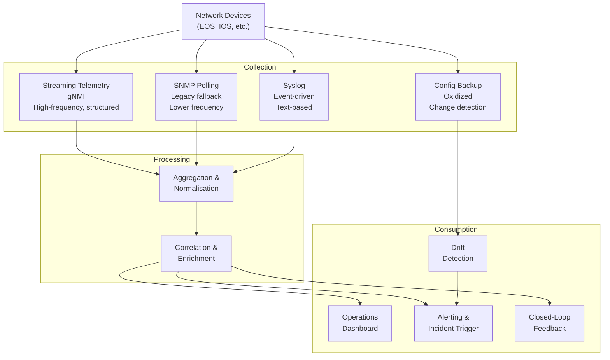
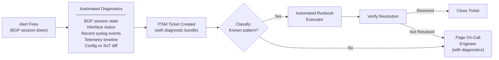
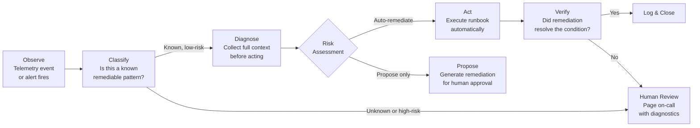

# Chapter 8: Operations Automation

> "The pipeline handles change. Operations automation handles everything that happens between changes."

The CI/CD pipeline is a well-defined, bounded workflow. It runs when a change is proposed, validates it, deploys it, and confirms the outcome. But the network operates continuously — faults occur outside change windows, configurations drift, incidents require diagnosis and response, and operational data accumulates that could inform better decisions if anyone had time to look at it.

Operations automation addresses all of this. It is the layer that monitors the network continuously, detects deviations from intended state, initiates diagnostic and remediation workflows, and ensures that the operational workload scales with the automation platform rather than with the number of engineers on shift.

This chapter covers the five components of operations automation — observability, incident response, change execution, auto-remediation, and the closed-loop principle — and applies the product thinking discipline that determines whether operational automation is sustained or abandoned.

---

## The Operational Maturity Shift

Before describing the components, it is worth being precise about how operations changes at each maturity level. The transition is not just from manual to automated — it is from reactive to proactive, and eventually to predictive.

| Maturity Level | Operational Model | Engineer's Primary Activity |
|---|---|---|
| **Level 1** | Ticket-driven, manual triage | Responding to incidents and change requests |
| **Level 2** | Some scripts reduce repetition | Responding to incidents; scripting for known patterns |
| **Level 3** | Standardised workflows, consistent execution | Triaging incidents; operating automation platform |
| **Level 4** | Automated detection, runbook automation, drift correction | Managing the automation platform; handling exceptions |
| **Level 5** | Closed-loop, self-healing for known classes | Governing intent; reviewing and refining automation |

The operational goal of this chapter's patterns is to move teams from Level 3 toward Level 4: shifting the engineer's primary activity from reactive execution to exception handling and platform improvement. Level 5 capabilities — the closed-loop, self-healing system — are addressed in [Chapter 11](../11-advanced-topics/).

---

## Monitoring and Observability

Operations automation begins with reliable observation. A system that cannot accurately detect what is happening cannot respond correctly. Alert noise — false positives that trigger unnecessary responses — is as damaging as detection gaps.

### The observability stack

A complete operational observability stack has three layers:



**Streaming telemetry (gNMI)** provides high-frequency, structured data — interface counters, BGP session state, hardware health, routing table changes — streamed continuously from the device. This is the data foundation for real-time operational visibility and, ultimately, for closed-loop automation. Modern devices supporting OpenConfig or vendor telemetry models should be configured for streaming telemetry as the primary collection mechanism.

**SNMP polling** remains necessary for older devices or for data not available via streaming telemetry. It is the legacy baseline, not the long-term strategy. Where both are available, prefer streaming telemetry for its lower overhead and higher granularity.

**Syslog** provides event-driven visibility — link state changes, BGP session events, authentication failures, hardware alerts. Centralised syslog with structured parsing turns device events into searchable, correlatable records.

**Configuration backup and change detection** (Oxidized or equivalent) periodically backs up running device configurations and detects when they change between backup cycles. A configuration change on a device that was not initiated through the automation pipeline is a drift event. The backup system is the observation layer for drift detection.

### Alert design: signal over noise

The most common observability failure is not insufficient data — it is too much noise. An operations team that receives hundreds of alerts per day develops alert fatigue, begins ignoring alerts, and misses the signals that matter.

Alert design principles:

**Alert on symptoms, not causes.** A BGP session going down is a cause. A trading platform becoming unreachable is a symptom. Alert on the symptom — what the business experiences — and use automated diagnostics to determine the cause. This reduces the number of alerts while increasing their actionability.

**Suppress correlated alerts.** If a spine switch fails and 20 downstream BGP sessions drop simultaneously, that is one incident with 20 correlated alerts, not 20 separate incidents. Alert correlation — grouping related alerts into a single incident — is the single most effective noise reduction mechanism.

**Define alert thresholds based on operational experience.** An interface at 80% utilisation may be normal for some links and alarming for others. Start with conservative thresholds and refine based on operational experience. Alerts that fire frequently without requiring action should be reconfigured or suppressed.

**Separate operational alerts from informational notifications.** An alert should require a response. An informational notification (a successful deployment, a drift correction, a capacity threshold reached) should be visible but not urgent. The distinction matters: if everything is an alert, nothing is.

### ACME's observability configuration

ACME's lon-dc1 fabric streams interface counters and BGP session state via gNMI every 30 seconds. BGP session state changes trigger immediate alerts regardless of the polling cycle. Interface utilisation alerts fire at 70% sustained for 5 minutes (warning) and 90% sustained for 2 minutes (critical).

The branch offices use SNMP polling at 5-minute intervals for capacity metrics, with syslog for event-driven alerts. Oxidized backs up all device configurations every 6 hours and triggers a drift alert on any change not present in the pipeline's deployment log within the last 8 hours.

---

## Incident Response Automation

When an alert fires, two things happen in sequence: diagnosis and response. In manual operations, both are human activities. In an automated operations environment, diagnosis is largely automated, and response is automated for known, low-risk incident patterns.

### Automated diagnostics

The first automated step after an alert fires is diagnostic data collection. Before a human engineer is paged, the system should have already gathered the information they would collect manually:

- Device state at the time of the alert (BGP session state, interface status, routing table)
- Recent syslog events from affected devices
- Telemetry data showing the state trajectory leading up to the alert
- Configuration diff between current state and the last known-good SoT backup
- Correlated events from other devices in the affected path

Packaging this information automatically — attached to the incident ticket when it is created — reduces mean time to diagnose (MTTD) significantly. An engineer receiving a page finds a complete diagnostic context, not a bare alert.



### Runbook automation

A runbook is a structured troubleshooting and resolution procedure for a known incident type. When automated, it becomes an executable workflow that the system can run in response to a classified alert.

The value of runbook automation is precision and consistency: the same steps, in the same order, every time, with every output logged. The human reviewer can see exactly what the automation did and verify that it was correct.

ACME's operational runbook library covers the following incident patterns:

| Incident Type | Classification Signal | Automated Response | Escalation Trigger |
|---|---|---|---|
| BGP session down | BGP session state alert + session has previously been stable | Check interface state; if interface up, attempt BGP clear | Interface also down, or session does not re-establish within 3 minutes |
| Interface flapping | Interface state changes >3 times in 5 minutes | Collect interface statistics, error counters; check port config | Physical error counters above threshold |
| Configuration drift detected | Oxidized diff alert | Compare drift to SoT; if drift is a known-safe pattern, log and suppress; otherwise alert | Drift affects security-relevant configuration |
| VLAN missing on leaf | Traffic blackhole alert on known VLAN | Verify VLAN in SoT; if present, re-apply SoT configuration to device | VLAN missing from SoT (design change required) |
| High CPU on device | CPU threshold alert | Collect process list; correlate with recent changes | CPU above threshold for > 10 minutes |

The classification logic determines which runbook runs. For known, well-understood patterns, the runbook may include an auto-remediation step. For others, it stops after diagnostics and hands off to a human with a complete diagnostic bundle.

### Escalation patterns

Escalation should be explicit, time-bound, and tracked. An incident that is not acknowledged within 5 minutes should escalate to a second on-call engineer. An incident not resolved within 30 minutes should escalate to the on-call manager. These thresholds are configured in the workflow orchestrator, not left to human initiative.

The integration between the incident response workflow and the ITSM system (ServiceNow for ACME) provides the audit trail: every alert, every diagnostic action, every escalation, and every resolution step is recorded with timestamps and actor identity.

---

## Change Execution in Operations

The CI/CD pipeline handles planned changes. Operations automation handles the change execution patterns that planned changes alone cannot address: scheduled maintenance windows, emergency changes, and the operational lifecycle of existing automation.

### Automated change windows

For change types that are well-understood and low-risk — scheduled firmware updates, certificate renewals, log file rotation on management systems — automation can execute changes in pre-defined maintenance windows without requiring an engineer to be present.

The pattern:
1. The change is scheduled via the workflow orchestrator (day, time, scope)
2. At the scheduled time, the orchestrator triggers the pipeline with the pre-validated change
3. The pipeline executes: validation → deployment → post-deploy verification
4. If verification passes, the orchestrator closes the change ticket and notifies stakeholders
5. If verification fails, the pipeline rolls back and pages on-call for investigation

The key governance requirement: automated change windows must have a human-approved change ticket and a defined verification criterion. The automation executes a human decision — it does not make the decision to change.

### Emergency changes

Emergency changes — network changes required outside the normal pipeline process to restore service during an incident — need a defined break-glass procedure. The procedure must be fast enough to be useful during an incident while maintaining the governance properties that make the automation trustworthy.

ACME's break-glass procedure:
1. The engineer obtains break-glass credentials (time-limited, tracked, separate from pipeline credentials)
2. The engineer makes the minimum necessary change directly to the device via CLI
3. The change is logged immediately in the ITSM incident ticket (what was changed, why, at what time)
4. Within 24 hours, the engineer raises a pipeline change to update the SoT to reflect the emergency change
5. Oxidized detects the drift and raises a drift alert; the drift is acknowledged against the open incident ticket
6. The pipeline change closes the loop: the emergency change is normalised into the automation model

Emergency changes that are never normalised into the SoT are the primary source of configuration drift. The break-glass procedure must include the normalisation step as a requirement, not a recommendation.

---

## Auto-Remediation

Auto-remediation is the capability that distinguishes a mature operations platform from a well-monitored manual operation. It is also the capability most often implemented recklessly — automating responses without sufficient classification logic, resulting in automation that makes problems worse.

The key design principle: **risk-tier first, automate second.**

### Configuration drift detection and correction

Drift — the divergence between a device's running configuration and the source of truth — is detected by comparing Oxidized backups against the last-deployed configuration from the pipeline.

Three categories of drift, each with a different response:

**Expected drift:** Drift that is known, documented, and acceptable. Dynamic routing state (BGP route tables, ARP/MAC caches) changes continuously and should not trigger alerts. The drift detection system must be configured to distinguish between static configuration drift and expected dynamic state changes.

**Benign drift:** Configuration changes that do not affect security, compliance, or operational correctness — a description field update, a log message format change applied by an automated platform upgrade. These should be logged and reported but not trigger an immediate response. The next pipeline run will correct them.

**Significant drift:** Configuration changes that affect security policies, routing behaviour, or management plane access. These require immediate attention: alert the operations team, identify the source of the drift, and remediate via the pipeline.

For benign and significant drift, the remediation path is the same pipeline used for planned changes — a merge request that updates the SoT to either accept the drift (if it was an intentional out-of-band change) or revert it (if it was unintended). This maintains the governance discipline even for remediation actions.

### Telemetry-driven remediation

Beyond drift, some operational conditions warrant automated response triggered by telemetry events rather than configuration comparison.

The pattern: observe → classify → decide → act.



### The risk-tiered remediation framework

Not all remediable conditions are equal. The risk tier determines the level of automation applied:

| Tier | Condition Examples | Automated Response | Human Involvement |
|---|---|---|---|
| **Tier 1 — Auto-fix** | BGP session clear after transient drop; VLAN re-apply after verified drift; interface error counter reset | Full automatic execution | Post-hoc notification only |
| **Tier 2 — Propose and approve** | Routing policy change; ACL modification; new static route | Generate proposed change as MR; alert engineer for approval | Approval required before execution |
| **Tier 3 — Alert only** | Security policy deviation; unexpected new BGP neighbour; management plane access anomaly | Immediate alert with full diagnostic bundle | Full human investigation required |
| **Tier 4 — Never auto-remediate** | Changes that affect trading system connectivity during market hours; changes to firewall zone boundaries; device replacement | Human-initiated only | Full change management process |

The tier assignments are not permanent — they evolve as the team gains confidence in specific automation patterns and as the verification logic matures. A remediation that starts at Tier 2 may move to Tier 1 after six months of successful execution. A remediation that produces unexpected side-effects should move up a tier until the root cause is understood.

### ACME auto-remediation in practice

ACME's Tier 1 automation handles two primary patterns:

**BGP session recovery:** If a BGP session drops and the interface remains up, the system waits 90 seconds (allowing for normal BGP hold-timer expiry) and attempts a soft BGP clear. If the session re-establishes, the incident is logged and closed automatically. If it does not re-establish within 3 minutes, the system escalates to on-call with the full diagnostic bundle.

**Management plane drift correction:** If Oxidized detects that a device's management configuration (syslog servers, SNMP configuration, management VRF) has drifted from the SoT, and the drift is not associated with any open change ticket, the system raises a pipeline merge request to re-apply the SoT configuration. The MR is auto-approved if the drift is exclusively in management configuration (Tier 1 scope) and the pipeline passes all validation stages.

These two patterns alone eliminate a class of manual operational tasks that previously consumed several hours of engineering time per week.

---

## The Closed-Loop Principle

The five components above — observability, incident response, change execution, and auto-remediation — each address a specific operational challenge. The closed-loop principle connects them into a continuous feedback cycle.

The loop has four steps:

```
        ┌──────────────────────────────────┐
        │                                  │
        ▼                                  │
   OBSERVE                            REMEDIATE
   Telemetry, logs,              Pipeline or runbook
   config backups                applies correction
        │                                  ▲
        ▼                                  │
   (deviation detected)                    │
        │                                  │
        ▼                                  │
   COMPARE                            DECIDE
   Actual state vs      ────▶   Risk tier determines
   intended state (SoT)         response type

```

**Observe:** Telemetry, syslog, and configuration backup systems continuously monitor actual network state.

**Compare:** The observed state is compared against the intended state — the source of truth and the design intents. Any deviation is a candidate for automated response.

**Decide:** The risk-tiered framework determines whether the response is automatic, proposed for approval, or escalated to a human.

**Remediate:** The correction is applied via the automation pipeline, maintaining the governance discipline that applies to all changes.

The loop then restarts: the post-remediation state is observed, compared against intent, and if the remediation was successful, the deviation no longer exists. If it is not successful, the loop escalates.

This is the operational expression of the handbook's core principle: configuration is an output of intent, not an input. The closed loop continuously re-asserts intent against actual state. Deviations are detected immediately and addressed systematically — not discovered in the next audit or during the next incident.

The closed-loop principle is the foundation for the self-healing capabilities described in [Chapter 11](../11-advanced-topics/). The difference between operations automation (this chapter) and self-healing (Chapter 11) is the scope of what is remediable: operations automation handles well-understood, bounded patterns; self-healing extends this to broader and more complex failure modes using intent-aware reasoning.

---

## Product Thinking for Operations Automation

Operations automation has all the properties of an internal product: it has users (the operations team), it has consumers (the teams that depend on the network), it has features (the runbooks, the alerts, the auto-remediations), and it accumulates technical debt if not actively maintained.

Treating it as a product rather than a configuration exercise determines whether it remains useful or slowly degrades.

### The operations automation backlog

Every operational pain point that automation could address should be in a backlog, prioritised by frequency and impact. The backlog is maintained by whoever owns the automation platform — the function introduced in the A-Team framework in [Chapter 2](../02-business-alignment/chapter.md).

Useful backlog items:
- A runbook for a recurring incident type that is currently handled manually
- An alert threshold that is generating false positives and needs refinement
- A drift pattern that is being manually corrected and should be automated
- A diagnostic data collection step that engineers always perform manually after an alert

The backlog should be reviewed quarterly and prioritised based on operational data: which incident types are consuming the most engineer time? Which alert patterns have the highest false-positive rate? Which manual tasks recur most frequently?

### Operational metrics

The metrics that demonstrate the value of operations automation and track its health:

| Metric | What It Measures | Target Direction |
|---|---|---|
| **MTTD** (Mean Time to Detect) | Time from incident occurrence to alert fire | Decreasing |
| **MTTR** (Mean Time to Resolve) | Time from alert to incident resolution | Decreasing |
| **Auto-resolution rate** | % of incidents resolved without human intervention | Increasing |
| **False-positive rate** | % of alerts that did not require action | Decreasing |
| **Drift frequency** | Rate of configuration drift events per week | Decreasing |
| **Runbook coverage** | % of recurring incident types with an automated runbook | Increasing |
| **Engineer time on reactive work** | % of ops team time spent on incident response | Decreasing |

These metrics should be visible to the operations team and to engineering leadership. The auto-resolution rate and MTTR are the most meaningful for business communication — they translate directly to service reliability and operational cost.

### Trust-building in operational automation

Operations automation has a specific trust problem: it acts on production infrastructure, often without a human in the loop. Engineers who do not trust the automation will disable it, bypass it, or override it. Engineers who over-trust it will not notice when it produces incorrect results.

Trust is built through transparency and graduated autonomy:

**Dry-run mode first.** When deploying a new runbook or auto-remediation pattern, run it in dry-run mode for two weeks: execute all the diagnostic steps, generate the proposed remediation, and log what the automation *would have done* — but do not execute the remediation. Review the dry-run logs. If the proposed actions are consistently correct, promote to Tier 1 or Tier 2 execution.

**Every automated action is logged.** Engineers should be able to see, at any time, exactly what the automation executed and why. Opaque automation — where the system acts but no one can see what it did — erodes trust even when the outcomes are correct.

**Make it easy to intervene.** The automation should never prevent an engineer from taking manual control. The break-glass procedure, the ability to disable specific runbooks, and clear escalation paths all demonstrate that the automation is a tool, not a replacement for human judgement.

---

## Downloadable Templates

| Template | Purpose | Format |
|---|---|---|
| [Incident Response Runbook Template](../templates/incident-response-runbook.md) | Structure for documenting and automating incident runbooks | Markdown |
| [Auto-Remediation Risk Register](../templates/auto-remediation-risk-register.md) | Risk tier assignments for automated responses | Markdown |

---

## Summary

Operations automation is where the investment in the automation platform pays its most continuous dividend. The CI/CD pipeline handles change; operations automation handles everything between changes — detecting deviations, diagnosing incidents, correcting drift, and maintaining the network in conformance with stated intent.

The five components work together as a system. Observability provides the signal. Incident response automation converts signals into structured, contextualised responses. Change execution applies the automation discipline to the full change lifecycle. Auto-remediation closes the loop for known, bounded patterns. The closed-loop principle connects all five into a continuous cycle of observe, compare, decide, and remediate.

Treat operations automation as a product: maintain a backlog, measure adoption and impact, build trust through transparency, and evolve the automation based on operational experience. The automation that is trusted, maintained, and actively improved is the automation that scales the team's capacity without scaling the team's headcount.

---

*Next: [Chapter 9 — Greenfield Design](../09-greenfield-design/) — applying automation-native principles from the start.*
