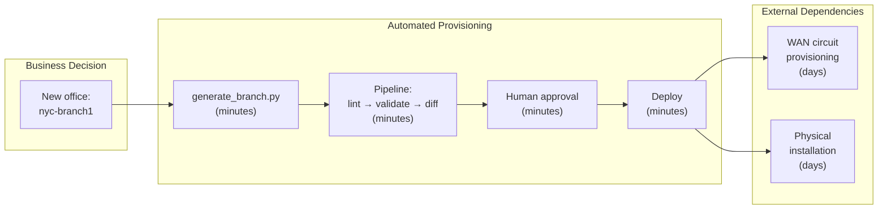

# Chapter 9: Greenfield Design

Most network automation programmes begin under pressure. There is existing infrastructure to maintain, a team stretched across operational demands, a backlog of deferred work, and a transformation programme layered on top of all of it. Automation is retrofitted onto a network that was never designed to be automated.

Greenfield is different. A new site, a new environment, a major platform refresh, a new business entity — these are opportunities to build automation-native from the start rather than automate into a design that was never intended for it. The architecture decisions made at the beginning of a greenfield programme compound forward. Building the right way from day one is substantially cheaper than correcting the wrong way three years later.

This chapter covers the principles that define automation-native design, the constraints that greenfield projects inevitably encounter, and the competitive argument for treating the network as a software-defined capability from the outset.

---

## Greenfield Is a Mindset, Not Just a Project Type

"Greenfield" is commonly understood as a completely new build — no existing infrastructure, no legacy constraints, a blank page. In practice, true blank pages are rare. What is more common is a greenfield moment: a point at which an organisation has more design freedom than usual. A new data centre. A cloud migration. A site expansion programme. A major hardware refresh. A new business line that needs network infrastructure.

The distinction matters because greenfield thinking can be applied to these moments even when the overall context is brownfield. An organisation that is automating an existing estate can still apply greenfield principles to new sites. The estate it builds will look fundamentally different — better — than the estate it is automating.

**The core greenfield principle:** Automation is not an add-on. It is the foundation. Every design decision should be evaluated against the question: does this make the network easier or harder to manage at scale through code?

---

## Automation-Native Design Principles

Six principles define an automation-native network. They are not dependent on budget, vendor selection, or team size. They are design choices.

### 1. API-First Infrastructure

Every device and platform must expose a programmable interface. This is not optional. A network device that can only be configured through a CLI is not a manageable component in an automated network — it is a manual exception that will persist indefinitely.

API-first means:
- Selecting platforms based partly on the quality and stability of their programmatic interfaces
- Requiring REST APIs or gRPC streaming telemetry from vendors, not just SSH access
- Treating the API contract as load-bearing infrastructure, not a convenience feature

For ACME's architecture, Arista EOS's eAPI and gNMI support were explicit selection criteria. A platform that required screen-scraping or CLI-based configuration would have failed the evaluation, regardless of its other capabilities.

### 2. Source of Truth From Day One

Before the first device is provisioned, the source of truth must exist. Not after the network is built, when the task becomes reverse-engineering the running configuration into a data model. The data model comes first, and the network is built from it.

This means:
- Defining the schema for `nodes.yml` before selecting which devices to deploy
- Populating the SoT for the first site, verifying intents, and generating configurations before a single device is racked
- Treating any configuration that does not originate from the SoT as technical debt from the moment it is created

The cost of establishing a SoT on a greenfield network is negligible. The cost of establishing it retroactively on an estate of 200 devices is significant. This is one of the highest-leverage decisions in a greenfield programme.

### 3. Pipeline From the First Commit

The CI/CD pipeline — lint, verify intents, generate, validate, diff, approve, deploy — should be running before the first configuration is pushed to a device. This is not premature investment. It is the right order of operations.

Networks built outside a pipeline accumulate manual configuration debt immediately. Every "quick change" made directly to a device outside the pipeline is a change that exists on the device but not in the SoT, a diff that will show up later as drift, a precedent that normalises manual intervention.

The pipeline is cheaper to establish on a new programme than on an existing one, and the habit of using it is easier to form when there is no established manual workflow to displace.

### 4. Intent-Based Design From the Outset

Design intents — the encoded, verifiable expression of the organisation's design standards — should be documented as `design_intents.yml` before the first configuration is generated. The discipline of making design decisions explicit, rather than implicit in handcrafted configurations, produces better designs and enables automated verification.

On a greenfield network, this means:
- Writing the intent model as the design deliverable, not a post-hoc documentation exercise
- Verifying intents automatically as part of the pipeline, so deviations are caught before deployment rather than discovered in audits
- Treating the intent model as the architecture document — if an intent is not codified, it is not reliably implemented

### 5. Telemetry and Observability as Infrastructure

Monitoring is often designed after the network is built, by a different team, against different requirements. On an automation-native network, observability is designed alongside the network — same project, same pipeline, same source of truth.

This means:
- Defining what will be monitored before provisioning devices (which metrics, which thresholds, which alerts)
- Streaming telemetry from the first device that is provisioned
- Treating the monitoring configuration as code, stored in the same repository as the network configuration

### 6. Immutable Infrastructure Thinking

Immutable infrastructure, in software, means servers are replaced rather than modified. Applied to networks, the principle is: a device's running configuration should always be derivable from its SoT entry. If it cannot be derived, the configuration is not under management.

Practically, this means:
- No out-of-band changes — if a change cannot be made through the pipeline, the pipeline needs to be extended to support it
- Configuration drift is not tolerated — if the running configuration diverges from the SoT, it is corrected automatically or flagged for correction
- "Temporary" manual changes are written into the SoT immediately or are explicitly time-bounded with a remediation plan

---

## Real-World Constraints

Greenfield programmes inherit constraints. Acknowledging them directly is more useful than pretending they do not exist.

**Vendor contracts and relationships.** Greenfield does not mean vendor-neutral in practice. Procurement frameworks, existing support contracts, and vendor relationships constrain device selection. The principle is to apply automation-native criteria within whatever vendor constraints exist — prioritise API quality, streaming telemetry support, and configuration management tooling among the available options.

**Team skillset gaps.** Building an automation-native network requires skills that most network teams are still developing. The greenfield moment is the opportunity to close those gaps — by hiring, by retraining, or by building a mixed team of network engineers and software engineers. The worst outcome is designing an automation-native network and then operating it with a team that defaults to manual processes because the tooling is unfamiliar.

**Integration with existing environments.** New sites must connect to existing sites. New environments must integrate with existing monitoring, ticketing, and security infrastructure. The integration layer is usually where automation-native principles are compromised first — the new environment is automated, but the boundary to the existing environment is manual. Design the integration points explicitly. Define the API or data exchange at the boundary and automate it from the start.

**Compliance and regulatory requirements.** Financial services, healthcare, and other regulated industries operate under constraints that affect network design, change management, and audit trails. Automation-native design should make compliance easier, not harder. The pipeline artefacts — rendered configurations, test reports, diffs, approval records, deployment logs — are compliance evidence. In a greenfield programme, the compliance requirements should inform the pipeline design, not be treated as a post-implementation audit exercise.

**Timeline pressure.** Greenfield programmes are often on deadline. The pressure to skip automation tooling and "just get the network running" is real. The correct response is to treat the pipeline as part of the critical path, not an optional capability to be added after go-live. A network that goes live without a pipeline goes live as a brownfield network in terms of manageability. The first three months of operation without a pipeline will produce more manual configuration debt than the automation programme can easily retire.

---

## The Self-Provisioning Network

The endpoint of automation-native design is a network that provisions itself in response to business decisions.

The ACME branch generator — described in detail in the [One-Touch Deployment guide](../07-implementation-guides/one-touch-deployment/chapter.md) — is a practical example. A new office requires a new branch network. The engineer runs `generate_branch.py` with the site identifier, location, and IP allocation. The generator derives every design decision from the intent model — OSPF configuration, management policies, security zone membership, ACL templates, logging — and produces a fully intent-compliant SoT entry for the new site. The pipeline validates it, generates the device configurations, runs Batfish behavioural analysis, and stages a diff for review. After approval, the configuration is deployed.

The engineering work for a new branch is measured in minutes. The lead time for new connectivity is measured in days — the time required for physical installation and WAN circuit provisioning — not weeks.

This is not a theoretical capability. It is achievable in a greenfield programme with the architecture patterns described in Chapters 6 and 7. The key enabler is designing for it from the start: a schema that supports parameterised site generation, an intent model that encodes all design decisions, a pipeline that validates and deploys without manual steps.

The network automation steps take minutes. The lead time is determined by physical and commercial dependencies — not by the network team's capacity to design and configure.

For most organisations, the inversion is striking. Historically, the network team's configuration and testing work was the binding constraint on how quickly a new site could open. In a greenfield automation-native programme, that constraint disappears. The business can open sites as fast as it can sign leases and install hardware.

---

## Buy vs Build in a Greenfield Programme

Greenfield does not mean building everything from scratch. The temptation, with a blank page, is to design and build a bespoke system for every capability. This is almost always the wrong choice.

The governing principle from the tooling strategy (Chapter 5) applies directly: buy commodity, build only competitive advantage.

In a greenfield network programme:

**Buy:** Source of truth platform (NetBox or equivalent), monitoring and alerting (Prometheus, Grafana), pipeline platform (GitLab or GitHub), workflow orchestration (ServiceNow, Itential), configuration validation (Batfish). These are solved problems. Buying them is faster, cheaper to maintain, and lower risk than building equivalents.

**Build:** The intent model and its verification logic, the configuration generators and guardrails, the integration layer between network automation and business systems. These are specific to the organisation's architecture, compliance posture, and business requirements. They encode the organisation's design decisions and competitive practices. They cannot be bought as-is.

The greenfield mistake is to conflate the two — either buying everything and losing the ability to encode competitive-advantage decisions, or building everything and creating a maintenance burden that exceeds the team's capacity.

A useful test: if a vendor sells the capability and multiple competitors use the same vendor, it is not competitive advantage — it is commodity. Buy it. If the capability encodes something specific to your design standards, your compliance requirements, or your operational model, build it.

---

## The Software Mindset

There is a deeper argument behind automation-native design that deserves to be stated plainly.

The network teams that will be most competitive in the next decade are not the ones that know the most CLI commands or have the deepest vendor relationships. They are the ones that can design, build, and evolve a software-defined network capability — that treat the network as a product with a development lifecycle, not as infrastructure managed by tribal knowledge and manual change control.

The same pattern has played out in other industries. Anduril disrupted the defence industry not by having better hardware but by building software as the central organising system. Stripe and Adyen disrupted payments not by having better banking relationships but by reducing the distance between concept and deployment. In both cases, the incumbents had more capital, more relationships, and more experience — and the disruptors won on learning speed and architectural velocity.

For a financial institution, the parallel is direct. The network's capacity to support new trading venues, new regulatory requirements, new office locations, and new business models should not be a constraint on business strategy. When the network team can provision new connectivity on the day the business needs it — not three weeks later — infrastructure stops being a limiting factor.

**"The most dangerous competitor is not the one with more capital — it is the one that designs with modern thinking, learns and ships faster."**

Automation-native greenfield design is the mechanism by which a network team closes that velocity gap. The intent model, the pipeline, the generators, the self-provisioning capability — these are not efficiency tools. They are the architectural foundation for a network organisation that can keep pace with business requirements at any scale.

---

## Team Design for a Greenfield Programme

The team that builds an automation-native network must be designed for it. Assembling a conventional network team and expecting automation-native outcomes is the most common greenfield mistake.

A minimum viable team for a greenfield automation programme:

| Role | What They Bring |
|---|---|
| **Network Architect** | Domain knowledge: protocol design, topology, security zoning. Translates business requirements into design intents. |
| **Automation Engineer** | Builds and maintains the pipeline, generators, and verification suite. Software engineering fluency is essential. |
| **Platform Engineer** | Operates the tooling platform: GitLab, NetBox, Batfish, monitoring stack. Owns the developer experience for the network team. |
| **Network SME(s)** | Deep expertise in the specific platforms being deployed. Writes templates, validates generated configurations, owns post-deployment verification. |

This is not a large team. Four to six people can build and operate a greenfield network of significant scale if the automation is well-designed. The team's capacity scales with the automation, not with the size of the estate.

What this team requires to succeed:

**Psychological safety to build differently.** Automation-native network design challenges established practices. Engineers who have spent careers building networks manually will encounter friction with the new approach — the pipeline as change control, the SoT as the only authorised source of edit, the prohibition on out-of-band changes. The programme needs leadership support for the approach, not just approval.

**Time to build before they operate.** The first six months of a greenfield automation programme are the investment period: building the pipeline, the intent model, the generators, the monitoring integration. During this period, the team is not operating the network in the conventional sense — they are building the capability to operate it. This is a different cost structure from a conventional network team, and it requires explicit leadership alignment.

**A product owner.** Someone who manages the automation capability as a product — prioritising the backlog, aligning with stakeholders, measuring adoption. Without this role, greenfield automation programmes tend to build technically excellent tooling that nobody outside the team uses.

---

## Applying Greenfield Principles to Brownfield Programmes

For organisations that are not starting from a blank page, the greenfield principles still apply — applied selectively to the moments of maximum design freedom.

**New sites in an existing estate.** Apply full automation-native design to every new site. Each new site is a greenfield site, regardless of the estate it joins. Over time, as sites are refreshed, the automation-native principles propagate through the estate.

**Platform refreshes.** A hardware refresh is a greenfield moment for the platforms being replaced. Design the new platforms for automation from the start, even if the surrounding estate is not yet automated.

**New environments.** A new DR site, a new cloud environment, a new test environment — each of these can be built automation-native from the start. They become the reference implementations that prove the approach and build the team's capability.

**Carve-outs.** Some organisations designate a portion of their estate as the automation-native target — new and refreshed infrastructure only — while continuing to operate legacy infrastructure through existing processes. This is a pragmatic approach for large programmes where full estate automation in a single programme is not feasible.

The principle in each case is the same: seize the moment of design freedom to build the right way, rather than replicating the patterns of the estate being replaced. A brownfield programme that applies greenfield principles to every opportunity will look substantially different in five years — and will be substantially easier to operate.

---

*Next: [Chapter 10 — People and Skills](../10-people-and-skills/chapter.md) — building the team that can execute this transformation.*
