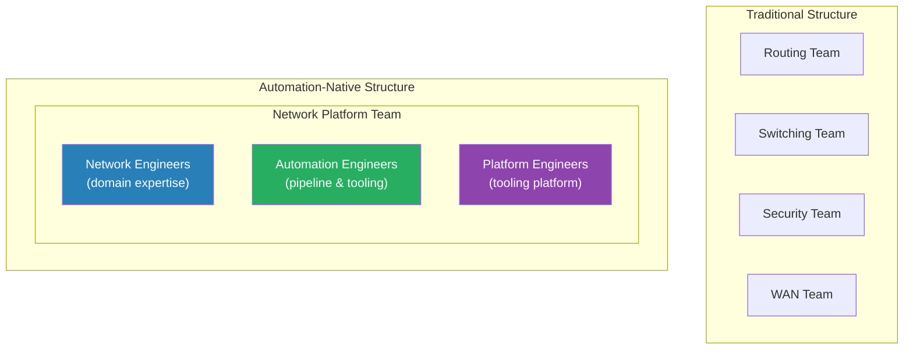

# Chapter 10: People and Skills

Every failed automation programme has the same story. The technology worked. The pipeline was built. The tools were licensed and deployed. The automation engineers were talented. And yet, six months after go-live, the network team had quietly reverted to the familiar: CLI sessions, manual change tickets, tribal knowledge passed through informal channels, the same processes that automation was supposed to replace.

The tools did not fail. The people strategy did.

Technology transformation is inseparable from organisational transformation. Automation changes who does what, how decisions are made, what skills are valued, and how success is measured. Organisations that treat the people dimension as a communication exercise — announce the programme, run some training, expect adoption — consistently underestimate the change they are asking people to make, and consistently underachieve against their automation objectives.

This chapter addresses the leadership challenge directly: how to build a team that can execute the transformation, sustain the capability, and evolve it over time.

---

## What Is Actually Being Asked of People

Before designing a people strategy, it is worth being clear about what automation asks of network engineers, because it is substantial.

An experienced network engineer who has spent a decade building expertise in BGP, OSPF, QoS, security policy, and troubleshooting is being asked to:
- Accept that their configuration will be generated by a system, not written by them
- Submit every change through a pipeline rather than applying it directly
- Write YAML and Python alongside IOS and EOS
- Have their work reviewed by a pipeline before a human ever looks at it
- Operate under version control, peer review, and automated testing — practices imported from software engineering

None of this negates their networking expertise. In fact, their expertise becomes more valuable: it is the content that populates the intent model, the knowledge that validates generated configurations, the experience that designs the tests that Batfish runs. But the way that expertise is expressed changes fundamentally.

This is not a minor process adjustment. It is a change in professional identity. The change management strategy must account for that.

---

## Reducing Resistance

Resistance to automation is not irrational. It is a rational response to a programme that, if poorly led, creates genuine risk for individuals:

- Engineers who do not adapt may find their roles diminished
- Institutional knowledge held by individuals may be devalued when it is codified
- Seniority structures based on depth of manual expertise may be disrupted
- The learning curve is steep for engineers who have not written code before

Resistance surfaces as scepticism, workarounds, and slow adoption. It is rarely expressed directly as fear. The leadership task is to address the underlying concern, not the surface behaviour.

**Do not lose the experts.** The most common and most damaging form of resistance is the departure of senior network engineers who decide that automation is not for them. These engineers carry the institutional knowledge that the automation programme needs — the understanding of why the network is designed the way it is, what constraints exist, what has been tried and failed. Their loss is not just a headcount problem. It is a capability problem that takes years to recover from.

The response is not to compromise the programme to retain resistant engineers. It is to design the programme in a way that makes experienced engineers genuinely more capable — not redundant — and to demonstrate this through early wins rather than promises.

**Involve engineers in the design, not just the execution.** Engineers who help design the intent model, template library, and pipeline architecture have ownership of the outcome. Engineers who are handed a finished system and told to use it have resistance baked in. The difference is involvement. The pipeline that an engineer helped design is the pipeline they will advocate for. The pipeline imposed from above is the pipeline they will work around.

**Name the fear directly.** "Automation removes toil, not jobs" is a messaging principle, but it only lands if it is backed by action. If the automation programme is designed to reduce headcount, do not say otherwise. If it is designed to shift the team's work from routine maintenance to higher-value capability development, say that clearly and show it in how the team is structured, how roles evolve, and how performance is evaluated.

---

## Building Momentum

Resistance falls fastest in the face of tangible evidence that automation makes engineers' working lives better. Abstract arguments about long-term efficiency do not move people who are currently managing an operational estate under daily pressure.

**Start with painkillers, not vitamins.** The first automation use cases should address the tasks that engineers find most tedious, most error-prone, or most stressful. Not the tasks that are strategically important to the programme manager. The tasks that the engineers themselves would most like to never do manually again.

Common painkillers in financial services network teams:
- Compliance reporting — generating evidence for audits that requires collecting data from dozens of devices
- Configuration backup and change detection — scheduled retrieval and diff generation that engineers currently do manually or not at all
- New VLAN provisioning — a repetitive, low-risk task that takes 30 minutes of manual configuration per switch
- Port activation for new workstations — consistent, templated, and currently done one-by-one

When the first automation use case eliminates a task that four engineers were spending two hours each on every week, the programme has made a concrete argument. That is more persuasive than any amount of briefing material.

**Automation ambassadors.** Identify engineers with early enthusiasm for the programme — the ones who are curious about the tools, who experiment independently, who ask constructive questions in training. These are the programme's internal advocates. Give them early access, meaningful involvement in design decisions, and recognition. Their peer influence is more credible than any top-down communication.

The ambassador is not a management role. It is an informal influence role. An engineer whose peers respect their technical judgement is the most effective adoption driver in the team. Their endorsement of the approach carries weight that no leadership announcement matches.

**Show the before and after.** For each automation use case, capture and share the concrete improvement: time saved, error rate reduced, audit evidence now available in minutes rather than days. Make these visible — in team meetings, in retrospectives, in communications to leadership. The accumulation of evidence builds the case for the programme and shifts the team's reference point for what is normal.

---

## The Skills Evolution

Network engineers in an automation programme do not need to become software engineers. They need to become network engineers who are fluent in automation tooling. These are different destinations.

The practical skills that every network engineer in an automated team needs:

| Skill | Why It Matters |
|---|---|
| Reading and writing YAML | The SoT, intent model, and pipeline configurations are all YAML |
| Basic Python | Reading verification scripts, understanding pipeline logic, writing simple tests |
| Git fundamentals | Branch, commit, merge request — the workflow for every change |
| Pipeline literacy | Understanding what each pipeline stage does and what its output means |
| Jinja2 template reading | Diagnosing generated configuration issues requires reading the templates |

These are not advanced software engineering skills. They are the equivalent of a network engineer learning a new CLI syntax. Most engineers with professional programming interest can reach functional competency in six to twelve months of supported learning.

Above this baseline, specialised roles develop:

**Automation Engineer** — the bridge role between network engineering and software engineering. Writes and maintains the generators, verification scripts, and pipeline logic. Requires genuine software engineering fluency. May be hired in or developed from engineers with strong programming interest.

**Network Automation Architect** — defines the intent model, the schema design, the pipeline architecture, and the verification strategy. Requires both deep networking expertise and automation systems design capability. This is typically the most difficult role to hire externally, because it requires expertise in both domains simultaneously.

**Platform Engineer** — operates the tooling platform: GitLab, NetBox, Batfish, monitoring stack. The developer experience owner for the automation programme. More DevOps/Platform Engineering background than networking.

The critical balance: **do not lose networking expertise while building automation capability.** Automation amplifies expert knowledge — it does not replace it. A pipeline that encodes the wrong intent, a template that generates subtly incorrect configurations, a Batfish test that misses an important reachability scenario — these failures are all failures of networking expertise, not automation tooling. The programme needs engineers who understand networks deeply, whatever tooling they work with.

---

## AI as a Learning Accelerator

AI tools — conversational coding assistants, code completion, documentation retrieval — have materially lowered the barrier to entry for engineers learning automation skills.

An engineer who has never written an Ansible playbook can describe a task in plain language, receive a working starting point, iterate through errors with the AI as a collaborator, and arrive at a functional solution in hours rather than days. This does not produce production-ready automation. It produces a foundation from which the engineer can learn — seeing how the pieces fit together, understanding why the tool structures the solution as it does, developing intuition through practical application rather than reading documentation in the abstract.

The implication for skills development: AI removes the steepest part of the learning curve. Engineers who would previously have abandoned their first automation attempt when they encountered an obscure YAML parsing error or an Ansible module they did not recognise can now work through those obstacles interactively.

For programme leaders: structured learning with AI assistance is more effective than unstructured time with documentation. Pair engineers with defined learning tasks — "automate this specific operational workflow using Ansible" — and let them use AI assistance to work through the task. Review the result together. Discuss the design decisions. This is faster and more effective than classroom training for most engineers.

In more mature programmes, AI-assisted development accelerates automation delivery. Engineers producing automation with AI assistance, under the discipline of version control, pipeline testing, and peer review, produce more automation with the same headcount. The safeguards of the development process — review, test, validate — are what make AI-assisted development safe, not avoidance of AI tools.

---

## Hiring vs Upskilling

Most programmes face a decision: invest in upskilling the existing team, or hire engineers who already have the required skills. The answer is almost always both, but the balance varies by context.

**Upskill the existing team when:**

The team has strong networking domain knowledge and genuine institutional knowledge of the specific environment. This knowledge is not easily replaceable and is essential to the automation programme's success. An automation engineer hired from outside will take twelve to eighteen months to develop the contextual knowledge that an existing engineer already has.

The team has engineers who are enthusiastic about automation — who are already experimenting, who ask about the tooling, who want to learn. These engineers can be upskilled faster than average and will be more effective than hired engineers because they combine new skills with existing knowledge.

The cultural continuity of the team matters. Wholesale replacement of the team with automation-specialist hires destroys the team culture and the peer relationships that make an operations team function. It also destroys the institutional knowledge that the automation programme needs.

**Hire when:**

The programme requires skills that the existing team genuinely cannot develop in time. If there is no software engineering capability in the team and the programme needs an Automation Engineer to build the pipeline in the next three months, hire rather than upskill. The upskilling timeline for software engineering skills is twelve to eighteen months; the pipeline cannot wait.

The programme requires architectural leadership that does not exist internally. The Network Automation Architect role is frequently the hardest to fill from internal candidates because it requires deep expertise in two different domains. External hiring is often the faster path.

A specific technical capability gap exists that is not addressable through generalist upskilling. GitOps expertise, Batfish testing methodology, complex Jinja2 template design — these can be hired in while the broader team develops general automation fluency.

**The balanced approach:** Hire automation-specialist engineers to lead the technical design and build the platform. Upskill the existing networking team to use and extend the platform. The specialists build the capability; the existing team owns and operates it. Over time, as the existing team's skills develop, the distinction between "network engineer" and "automation engineer" blurs. That is the desired endpoint.

---

## Organisational Model

Traditional network teams are structured by function or by technology: a routing team, a switching team, a security team, a WAN team. Each team manages its part of the estate through specialised knowledge and direct device access.

Automation changes the unit of organisation. When every change flows through a shared pipeline, the boundaries between teams become obstacles rather than structures. The routing change that requires a coordinated update to the switching configuration and the security policy cannot efficiently traverse three separate approval chains.

The automation-native team structure is cross-functional: network engineers, automation engineers, and platform engineers in the same team, working on the same codebase, following the same pipeline. Specialisation exists within the team — a BGP expert, a security specialist, an automation engineer who owns the pipeline — but the team operates as a unit rather than as adjacent silos.

**Platform ownership.** The automation tooling — the pipeline, the SoT platform, the monitoring stack — needs an owner. In traditional network teams, nobody owns the tooling; everybody contributes to it and nobody is responsible for its health. This produces tooling that gradually decays, pipelines that accumulate technical debt, and capability that erodes over time.

The platform engineering role owns the tooling platform as a product. This means maintaining it, evolving it, measuring its adoption and reliability, and managing a backlog of improvements. Without this ownership, the automation capability is not sustainable.

**The product model for automation.** As argued in the [Business Alignment chapter](../02-business-alignment/chapter.md), treating automation as a product rather than a project changes the outcome. The automation capability has a backlog, a release cadence, stakeholder feedback loops, and adoption metrics. It is maintained and evolved over time rather than built and handed over.

This is an organisational decision as much as a technical one. It requires:
- A product owner who manages the automation backlog and stakeholder relationships
- A stable team that owns the capability over time, rather than a project team that disbands
- A budget model that funds ongoing capability development, not just initial build
- Metrics that capture adoption, reliability, and business value — reported regularly to leadership

---

## The A-Team Framework in Practice

Chapter 2 introduced the A-Team framework — the four leadership roles that must be aligned for an automation programme to succeed: Senior Leadership, Product Management, Network Architecture, and Network Engineering. That framework applies to the people strategy as well as the business alignment.

The specific failure modes for each role in the people dimension:

**Senior Leadership** that is aligned in strategy but does not protect the programme from operational demands. If the automation engineers are routinely pulled into incident response because they are the best network engineers in the team, the automation programme does not progress. Leadership must protect the programme's capacity.

**Product Management** that does not represent the engineers' experience. If the product owner focuses exclusively on business stakeholder requirements and does not manage the engineer feedback loop — what is friction in the pipeline, what needs to be simpler, what is being worked around — the tooling will drift out of alignment with the team that uses it.

**Network Architecture** that designs the intent model without involving the engineers who will work with it daily. The SoT schema, the intent checks, the template library — these need input from the engineers who understand the operational reality. Architecture designed in isolation from operations produces a system that is theoretically correct and practically unusable.

**Network Engineering** that does not take ownership of the automation capability. Engineers who treat automation as something that happens to them, rather than something they build and improve, will not evolve the capability over time. The programme needs engineers who feel genuine ownership of the pipeline and will invest in improving it.

Trust among these four roles is the binding force. A programme where leadership micromanages technical decisions, where architecture ignores engineering input, or where engineering does not communicate blockers to leadership will underperform regardless of the technical quality of the automation tooling.

---

## Measuring the People Transformation

The maturity model in Chapter 3 provides a framework for assessing the team's automation capability. For the people dimension specifically, the leading indicators of progress are:

| Indicator | What It Measures |
|---|---|
| Percentage of changes going through the pipeline | Adoption of the new workflow |
| Number of engineers who have made a pipeline change | Breadth of engagement with the tooling |
| Time from change request to pipeline execution | Whether engineers are using automation or deferring to manual |
| Number of automation improvements raised by engineers | Whether the team has ownership of the capability |
| Ratio of manual to automated incidents handled | Operational automation maturity |

These are leading indicators — they reflect the team's behaviour, not just the system's capability. A pipeline that exists but is bypassed registers as 0% adoption. A team that uses the pipeline for routine changes but reverts to manual for anything complex is not yet at the maturity level the tooling would suggest.

The lagging indicators — reduced incident rate, faster change execution, lower operational cost — follow from sustained adoption of the new model. They validate that the investment is working, but they should not be the primary measures of programme progress. By the time the lagging indicators are visible, the investment decisions have already been made.

---

*Next: [Chapter 11 — Advanced Topics](../11-advanced-topics/chapter.md) — intent-based networking, AI-driven operations, and self-healing networks.*
