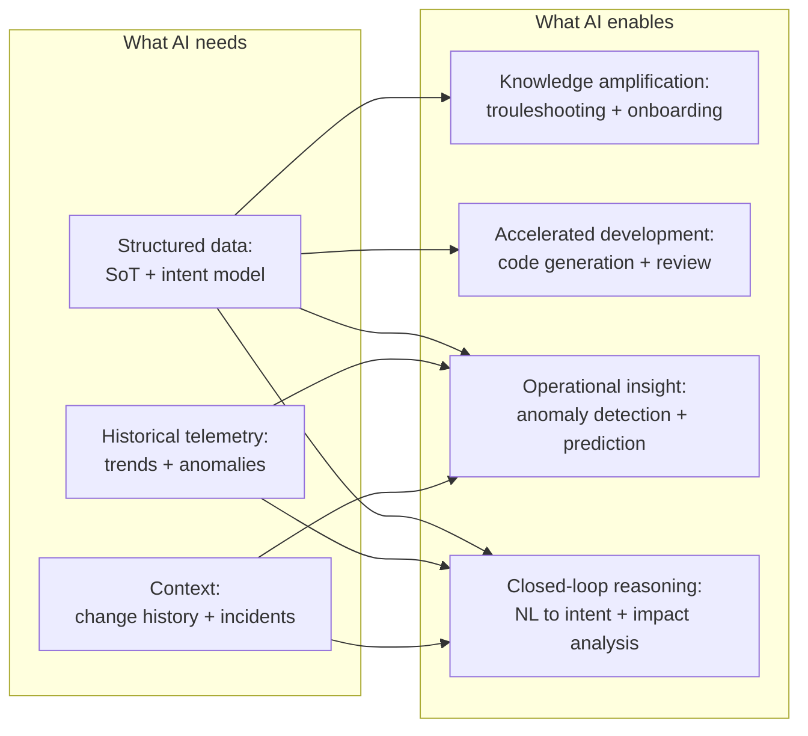

# 11.2 — AI-Driven Operations

AI in network operations is simultaneously over-marketed and under-utilised. Over-marketed because vendors position AI as a solution to problems that do not yet have the structured data AI needs to be useful. Under-utilised because organisations dismiss AI as hype and miss the genuine, near-term value it provides at earlier maturity levels.

The position in this chapter: **AI's value is real and maturity-gated.** An organisation that has not established structured, machine-readable intent and a disciplined automation foundation will get marginal value from AI tooling. An organisation that has will find that AI meaningfully accelerates every part of the operation.

For financial services organisations specifically — where regulatory compliance, risk management, and audit requirements constrain what can be automated — the maturity gate is not optional. Structured intent is not just a technical prerequisite for AI; it is the compliance framework within which AI can operate safely.

---

## The Maturity Gate

AI reasoning about networks needs structured, machine-readable data. The richer and more structured the data, the more useful the reasoning.

A network with no SoT gives AI a collection of running device configurations to parse. The AI can answer basic questions — "what interfaces are configured on this device?" — but cannot reason about intent, cannot verify compliance, and cannot propose changes that are guaranteed to satisfy design requirements. The data has no semantics. Configuration syntax is not intent.

A network with a structured intent model — `requirements.yml`, `design_intents.yml`, `nodes.yml` with full annotations — gives AI something to reason about at every level. The AI understands not just what is configured but why, what it is meant to achieve, and what constraints any proposed change must satisfy. This is the foundation for meaningful AI-driven operations.



The maturity gate is not absolute — AI provides value at every level. But the value at L2 maturity (task-based automation) is qualitatively different from the value at L4 or L5. Understanding where in the maturity curve an organisation sits determines which AI capabilities to pursue.

---

## Stage 1: AI as Knowledge Amplifier (Early Maturity)

At L2 and L3 maturity, before the intent model is fully established, AI provides the most value as a knowledge amplifier — surfacing information that exists in the organisation but is not easily accessible.

### Retrieval-Augmented Generation for Operations

A Retrieval-Augmented Generation (RAG) system ingests the organisation's technical documentation — runbooks, architecture documents, incident post-mortems, vendor documentation, change records — and makes it queryable through natural language. An engineer troubleshooting a BGP issue can ask "what is the correct troubleshooting procedure for BGP session failure on an Arista EOS device in our environment?" and receive an answer drawn from actual organisational documentation, not generic vendor guidance.

For financial services organisations, the compliance dimension is significant. A RAG system built on documented procedures, with outputs that cite the source document and version, provides auditable knowledge access. The answer to "what procedure was followed?" is traceable to a specific runbook at a specific version.

The limitations are equally important to understand: RAG retrieves and synthesises; it does not reason. It is as good as the documentation it indexes. Organisations with poorly maintained documentation will get poorly grounded answers. The RAG system is a force multiplier for the documentation that exists — it does not compensate for documentation that does not.

### AI-Assisted Learning for Engineers

AI dramatically lowers the barrier to entry for engineers developing automation skills. An engineer who has never written an Ansible playbook can describe a task in plain language, receive a working starting point, iterate through errors with AI assistance, and arrive at functional automation in hours rather than days.

This is a learning accelerator, not an automation shortcut. The value is in the engineer's developing capability — the understanding of how tools work, the intuition developed through practical application, the confidence built through successful first attempts. AI-produced automation that an engineer does not understand is not sustainable; AI-assisted automation that an engineer built, understands, and can maintain is.

The discipline that makes this safe is the same discipline that governs all automation development: version control, pipeline testing, and peer review. AI produces a starting point; the engineering process validates it.

---

## Stage 2: AI as Force Multiplier (Mature Automation)

At L4 maturity, with a functioning pipeline, a structured SoT, and a team fluent in automation, AI accelerates every part of the development cycle.

### AI-Assisted Automation Development

Engineers writing new intent verification logic, new Jinja2 templates, or new pipeline scripts use AI assistance to accelerate the work. The AI understands the codebase context — the schema, the existing patterns, the testing framework — and generates code that fits the existing architecture rather than generic code that requires adaptation.

The productivity gain is genuine and significant. This is not speculative. Teams using AI-assisted development consistently produce more automation with the same headcount. The safeguards are the same as for any code: review, test, validate before deployment.

In the pipeline context, AI assistance with template development is particularly valuable because the output is always validated by the existing test suite — Batfish will catch a template that generates incorrect routing policy, intent verification will catch a template that violates a design standard. The validation layer provides safety that allows faster iteration.

### Intelligent Change Review

When a merge request contains a change to `nodes.yml` or `design_intents.yml`, an AI reviewer can analyse the change in the context of the full intent model and produce a structured review: what intents are affected, what devices will be touched, what the blast radius is, whether there are any dependencies the human reviewer should be aware of.

This is not a replacement for human review — the human reviewer still exercises architectural judgement. It is a preparation of the review: the reviewer arrives at the diff having already had the implications surfaced. Decisions are better informed and reviews are faster.

---

## Stage 3: AI for Operational Insight and Prediction (Advanced)

At L5 maturity, with streaming telemetry, a complete intent model, and historical operational data, AI enables operational capabilities that are not achievable through deterministic automation alone.

### Anomaly Detection

Statistical models trained on historical telemetry identify deviations from normal operating patterns: an interface whose traffic volume is outside the expected range, a BGP session with an unusual churn pattern, a device with CPU utilisation trending upward before any threshold alert fires. These are signals that a deterministic threshold rule would not catch — because the threshold would need to be set per-device, per-time-of-day, and per-network-state to be accurate.

For a financial services network, anomaly detection on trading-critical paths provides early warning of degradation before it becomes a latency event. The value of catching a problem at "unusual behaviour" rather than "threshold breach" is measured in minutes — and in trading environments, minutes matter.

### Predictive Impact Analysis

When a proposed change is under review, AI analyses the change against historical data — past changes of the same type, past incidents on the same devices, current network load patterns — and surfaces predictions: "similar ACL changes in the past produced a 15-minute disruption to BGP sessions on leaf switches in the same VRF; consider scheduling this during a low-traffic window."

This does not require novel AI research. It requires structured change history, structured incident data, and a model trained on the correlation between changes and outcomes. The prerequisite is the audit trail that the pipeline already produces — the artefacts from every previous deployment run, linked to any subsequent incidents.

---

## AI-Driven Closed Loops

The advanced capability that IBN and AI together enable is closed-loop operation at the intent level — not just responding to device-level events, but reasoning about whether the network's behaviour is still aligned with its intent.

Four specific closed-loop patterns:

### Natural Language to Intent

A business stakeholder describes a new requirement in natural language: "we need to be able to connect the new Singapore office to the trading zone, but only for market data feeds, not for execution traffic." An AI model translates this into a structured intent candidate:

```yaml
- id: INTENT-SEG-XX
  title: Singapore office market data access to trading zone
  description: >
    Singapore office devices may reach trading zone market data endpoints.
    Execution system access from Singapore office is prohibited.
  satisfies: [REQ-NET-XX]
  implementation:
    permitted_flows:
      - source: SINGAPORE_OFFICE
        destination: TRADING_MKT_DATA
        protocol: tcp
        ports: [443, 8080]
    prohibited_flows:
      - source: SINGAPORE_OFFICE
        destination: TRADING_EXECUTION
  test: >
    Assert Singapore office can reach TRADING_MKT_DATA on permitted ports.
    Assert Singapore office cannot reach TRADING_EXECUTION on any port.
```

The architect reviews and refines the candidate, then commits it. The pipeline verifies it, generates the required configuration changes, and surfaces the diff for review. The time from business requirement to verified implementation candidate is hours rather than days.

### Anomaly-Driven Intent Refinement

Streaming telemetry reveals that a pattern of traffic is consistently hitting deny rules in an ACL — legitimate traffic that the intent model did not anticipate. An AI model identifies the pattern, correlates it with the intent model, and surfaces a proposed intent update: "there appears to be a consistent pattern of SWIFT traffic from the treasury VRF to the external settlement system that is not covered by any current intent. Consider whether INTENT-SEG-05 should be extended to permit this traffic."

The engineer reviews, decides, and either updates the intent or confirms that the traffic is being correctly denied. In either case, the decision is made explicitly and recorded — rather than discovered incidentally during an incident investigation.

### Predictive Blast Radius

Before a change is deployed, AI analyses the full topology model, the current traffic matrix, and the historical correlation between similar changes and disruptions, producing a blast radius estimate: which services are likely to be affected, for how long, and at what risk level. This informs the deployment decision — whether to proceed as planned, schedule for off-peak, stage across devices, or escalate for additional review.

### Self-Generating Intent

At the most mature state, AI assists with expanding the intent model itself. As the estate grows — new vendors, new sites, new business lines — AI proposes new intents derived from patterns in the existing model: "your intent model covers branch sites and data centre devices, but does not have intents for the recently added cloud gateways. Based on the existing segmentation and management intents, here are candidate intents for the cloud gateway class of device."

This keeps the intent model current without requiring architects to manually extend it for every new device class — a scaling problem that would otherwise constrain the intent model's comprehensiveness as the estate grows.

---

## What AI Cannot Do in Regulated Environments

For organisations operating under financial services regulation, some AI capabilities are not deployable in production, regardless of their technical maturity.

**Autonomous configuration changes without human review.** AI proposing and applying configuration changes without human approval in the loop is incompatible with the governance requirements of MiFID II, FCA SYSC, and comparable regimes. Human authorisation of material changes is a regulatory requirement, not an optional process. AI can prepare, validate, and accelerate the human decision — it cannot replace it.

**Opaque reasoning for compliance-relevant decisions.** If AI recommends a configuration change that affects a security control, the recommendation must be explainable and auditable. A model that produces a recommendation without a traceable rationale cannot be used for compliance-relevant decisions in a regulated environment.

**Untested models in production.** AI models trained on historical data reflect historical conditions. Models used for operational decisions — anomaly detection, impact prediction — must be validated in staging before production deployment, and their performance must be monitored continuously. A model that was accurate six months ago may not be accurate today if the network's operating conditions have changed.

The safeguard in each case is the same as the safeguard for all automation: human review, pipeline validation, and audit trail. AI that operates within the pipeline's governance framework is deployable. AI that bypasses it is not.

---

*Continue to: [Auto-Healing](../auto-healing/chapter.md)*
