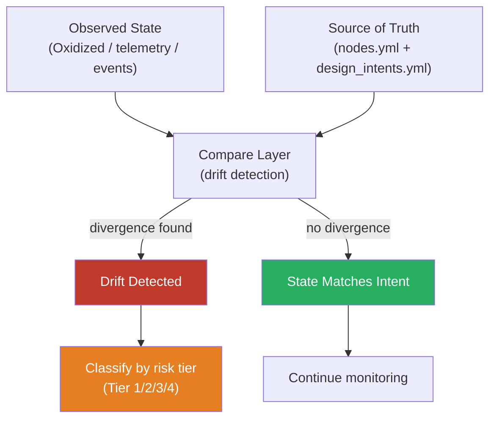
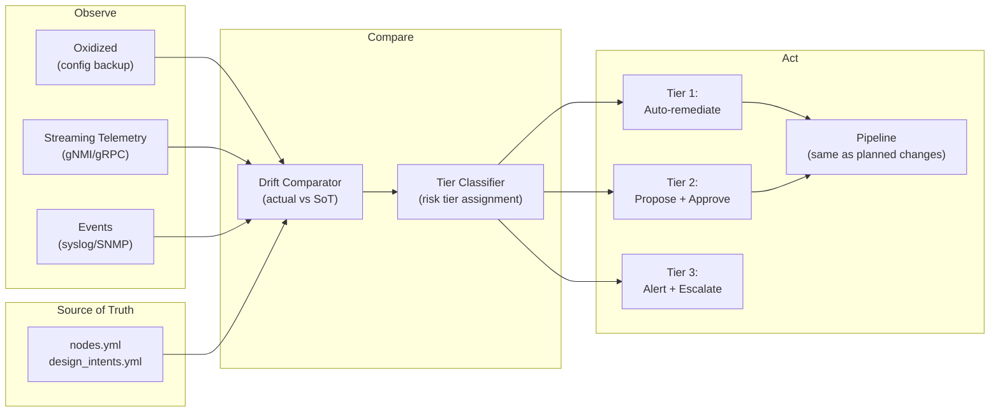

# 11.3 — Auto-Healing Networks

A self-healing network is not a network that never fails. It is a network where deviation from intended state is a remediable event — detected automatically, responded to automatically, and resolved without requiring engineer intervention in the routine case.

The distinction matters. Organisations that frame self-healing as "a network with no failures" set an unachievable goal and conclude that self-healing is impossible. Organisations that frame it as "a network where drift from intent is systematically corrected" can build it incrementally, validate it at each step, and realise the value progressively.

Chapter 8 introduced the closed-loop principle and the auto-remediation risk tier framework. This sub-chapter describes the full architecture: the three prerequisites, how the layers integrate, and the organisational discipline that makes self-healing sustainable.

---

## The Three Prerequisites

Self-healing requires three capabilities in composition. Any one of them in isolation is necessary but not sufficient.

### 1. Observe: Know What Is Actually Happening

The observation layer must produce a continuous, structured record of actual device and network state. Not periodic snapshots from scheduled polling. Not threshold alerts from a static monitoring rule. A continuous stream of structured data that can be compared against intent.

Three components:

**Configuration backup.** Tools like Oxidized retrieve and store device running configurations on a schedule. This provides the configuration baseline that the compare layer needs: what is on the device right now, in machine-readable form.

**Streaming telemetry.** gNMI or gRPC streaming telemetry from devices provides real-time operational state: interface counters, BGP session state, routing table changes, CPU and memory utilisation. This is the operational signal layer — the data that tells you what the network is doing, not just what it is configured to do.

**Event correlation.** Syslog, SNMP traps, and platform-specific event streams provide the event layer: specific state changes (interface down, BGP session reset, authentication failure) that trigger immediate response rather than waiting for the next telemetry poll cycle.

An observation layer that covers all three — configuration state, operational telemetry, and events — provides the input the compare layer needs to reason about network health comprehensively.

### 2. Compare: Know What Should Be Happening

The compare layer has a single, authoritative reference: the source of truth. The SoT defines intended state. Anything that diverges from the SoT is drift. The compare layer's job is to identify drift and classify it.

Drift classification uses the risk tier framework from Chapter 8:
- **Tier 1:** Known, low-risk drift with a proven automated fix. Remediate automatically.
- **Tier 2:** Known drift requiring human judgement on timing or scope. Propose and seek approval.
- **Tier 3:** Unknown or high-risk drift. Alert and escalate.
- **Tier 4:** Structural — alert, do not automate.

Classification is the decision layer. The compare layer does not decide what to do; it decides what kind of thing has happened. The risk tier determines the response.

### 3. Act: Correct Drift Through the Pipeline

The action layer is, deliberately, not a novel remediation mechanism. It is the same pipeline that handles planned changes — the same Ansible playbooks, the same Napalm deployment, the same artefact generation. The difference is the trigger: instead of an engineer opening a merge request, the observation layer detecting Tier 1 drift triggers the pipeline automatically.

This design decision is load-bearing. Self-healing that uses a separate, bespoke remediation mechanism bypasses the validation, the governance, and the audit trail. Self-healing that uses the same pipeline benefits from all of them. The auto-remediation path is the same code path as the human-initiated path — just triggered automatically after Tier 1 classification.

The consequence: if the pipeline handles a change type safely (with lint, intent verification, Batfish validation, and artefact generation), auto-remediation of that change type is safe by inheritance. If the pipeline does not handle a change type safely, neither does auto-remediation. The quality of self-healing is the quality of the pipeline.

---

## The Full Architecture

Each component in this architecture is independently valuable. An observation layer without automated remediation still provides better drift visibility than manual auditing. A compare layer that alerts without acting still provides compliance evidence. The components can be built incrementally; they do not need to be operational simultaneously.

---

## Configuration Drift as a Design Assumption

The conventional approach to configuration drift is tolerance. Organisations accept that devices will accumulate out-of-band changes, that the running configuration will diverge from documentation, and that periodic audits will reconcile the gap. Drift is expected, managed reactively, and corrected only when it becomes a problem.

Self-healing inverts this. Drift is not tolerated. It is a remediable event. The moment a device's configuration diverges from its SoT entry in a way that is within scope of Tier 1 auto-remediation, correction begins. The operator does not decide whether to fix it. The system fixes it.

This is a significant cultural change for teams that have operated under drift tolerance. The concerns that arise are reasonable:

**"What if the auto-remediation applies the wrong fix?"** The fix is the SoT entry, applied through the pipeline. If the SoT entry is wrong, the fix is wrong — but so is the planned configuration that would be deployed next time the device is touched. The auto-remediation is not more dangerous than the pipeline; it is the same pipeline. If the concern is that the SoT entry might be wrong, that is a concern about the quality of the SoT, not about auto-remediation.

**"What if an engineer made the manual change for a good reason?"** This is the most important concern, and it has a procedural answer: if an engineer needs to make an emergency change that differs from the SoT, that change should be reflected in the SoT within a defined time window (typically four to eight hours). If it is not, the auto-remediation system will revert it. The emergency change procedure requires a SoT update as part of normalisation — not because of auto-remediation, but because the SoT is the source of truth.

**"What if there is a bug in the automation?"** This is why the risk tier framework exists. Tier 1 auto-remediation is restricted to change types that are well-understood, low-risk, and proven. New automation starts at Tier 3 (alert only), moves to Tier 2 (propose, validate), and graduates to Tier 1 only after demonstrated reliability. The promotion path is deliberate.

---

## Organisational Discipline

Self-healing is technically achievable for any organisation with a mature pipeline and a structured SoT. The constraint that limits it is usually not technical. It is organisational discipline around the source of truth.

**Manual CLI changes are drift.** When an engineer makes a change directly to a device — outside the pipeline, not reflected in the SoT — from the auto-remediation system's perspective, that is a Tier 1 drift event. The system will revert it.

This creates a forcing function: engineers cannot make casual out-of-band changes in an auto-healing environment. The pipeline is not optional. This is, in most teams, the most disruptive aspect of auto-healing — not the technical implementation, but the discipline enforcement.

The right response is not to disable auto-remediation to allow out-of-band changes. It is to design the pipeline to be fast and low-friction enough that engineers want to use it for all changes, including changes that previously would have been "quick CLI fixes." If the pipeline takes 30 minutes to execute a minor change, engineers will bypass it. If it takes three minutes, they will use it.

**The SoT must always be current.** Auto-remediation corrects drift towards the SoT. If the SoT does not reflect the intended state of the network — because it has not been updated after an approved change — auto-remediation will undo approved changes. The discipline of keeping the SoT current is not a new requirement introduced by auto-healing; it is the existing requirement of configuration-as-code, made more consequential by the enforcement mechanism.

---

## What Self-Healing Does to Operations

For teams that have built the full auto-healing capability, the operational experience changes in three observable ways:

**The routine work disappears.** Drift correction, compliance remediation, BGP session recovery, NTP re-sync — the routine operational events that previously consumed on-call time either resolve automatically or are pre-staged for rapid human approval. The on-call engineer's time is spent on Tier 3 and Tier 4 events: the novel, the high-risk, the architecturally significant.

**Audit preparation approaches zero.** Demonstrating compliance is a pipeline query, not a manual exercise. Every device configuration was generated from a compliant SoT, verified against the intent model, approved, and deployed with artefacts. If drift has occurred, the auto-remediation log shows it was detected and corrected. The audit trail is the operational record.

**The team's focus shifts.** Engineers who are no longer spending time on configuration drift and routine remediation have capacity for design work, intent model improvement, new automation capabilities, and architectural evolution. This is the reinvestment dividend of mature automation: operational efficiency converts to development capacity.

---

*Chapter 11 complete. Continue to: [Chapter 12 — Security and Compliance](../../12-security-compliance/chapter.md)*
