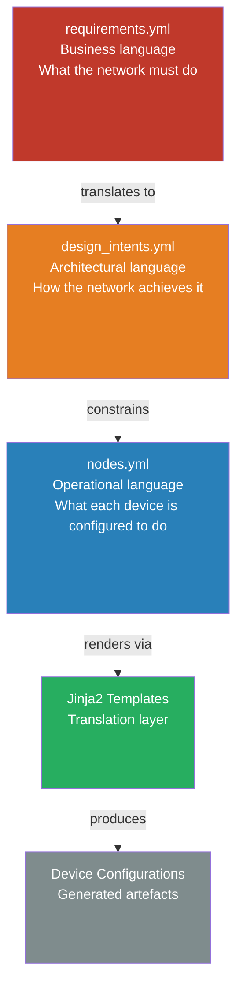

# 11.1 — Intent-Based Networking

Intent-based networking is not a product. It is not a vendor feature set. It is an architectural approach — a different answer to the question of how human decision-making and machine configuration should relate to each other.

The configuration-centric model that most networks still follow today places the engineer at the centre of configuration authoring. Engineers interpret business requirements, make design decisions, translate those decisions into device configuration, and apply it. The intent-based model inverts this: engineers express desired outcomes in structured, machine-readable form. Systems translate intent into configuration. The engineer's role shifts from configuration author to intent author and intent verifier.

This distinction — subtle in description, substantial in consequence — is what Chapter 6 established as the foundation of the architecture. This sub-chapter takes the full argument further: why the shift matters, how it progresses through organisational maturity, and what it enables at full realisation.

---

## Why Configuration-Centric Operations Fails at Scale

The structural weaknesses of manual, device-by-device configuration management become more severe as the estate grows. Four failure modes compound:

**Intent loss through translation.** A compliance requirement becomes a security policy becomes an architectural decision becomes a firewall rule becomes an ACL entry. At each translation step, context is discarded. By the time the configuration is on the device, the connection to the original requirement is invisible. When the requirement changes — a new regulation, a revised policy — there is no reliable mechanism to identify which configurations are affected. The change requires a manual audit.

**State divergence.** Networks accumulate changes. Emergency fixes. Temporary rules that were never removed. Vendor-recommended adjustments applied during an incident. Over years, the running configuration becomes the only true record of what exists — and it is unreadable at scale. The documentation is wrong. The source of truth is not a truth.

**Compliance as archaeology.** Audit readiness, in a configuration-centric model, requires gathering evidence from devices: retrieving running configurations, manually cross-referencing them against policy requirements, producing reports. This work is periodic, labour-intensive, and retrospective. Non-compliance discovered in an audit is non-compliance that existed throughout the review period.

**Institutional fragility.** When configuration knowledge lives in engineers' heads, it leaves when engineers leave. The network that two senior engineers can diagnose and modify fluently becomes opaque when those engineers depart. Onboarding takes months. The expertise cannot be transferred; it must be rebuilt.

None of these are edge cases. They are normal operating conditions in most enterprise networks. The intent model is the systemic response to all four.

---

## The Three-Layer Architecture

The intent model organises network knowledge into three distinct layers, each with a defined purpose and a defined relationship to the layers above and below. This was introduced in Chapter 6 and implemented in Chapter 7. The following describes the full architecture and the purpose each layer serves.

**Layer 1: Business requirements.** Requirements are written in business language by the stakeholders who own them — compliance, security, operations, architecture. They express what the network must accomplish, not how. A requirement like "trading systems must be isolated from corporate users" says nothing about VRFs, ACLs, or firewall policy. It says what the organisation needs. Requirements are version-controlled alongside technical artefacts. Every downstream decision traces to a requirement.

**Layer 2: Design intents.** Intents are written by architects. They translate business requirements into specific, testable network behaviours. An intent is not a high-level configuration template — it is a statement about desired network behaviour at the architectural level, with an explicit test that verifies it. Critically, intents are machine-readable and machine-verifiable. The intent model is the architecture document that also runs as a test suite.

**Layer 3: Source of truth.** The SoT captures the specific values — IP addresses, ASNs, VLANs, hostnames, interface assignments — for each device. It is annotated with references to the intents it implements. Configuration is generated from the SoT through templates. The SoT is the single point of edit. Anything not in the SoT does not exist from the pipeline's perspective.

The traceability chain runs through all three layers: a specific ACL entry on a production device exists because of a design intent, which was created to satisfy a business requirement. This chain has value in both directions: forward (proving that requirements are implemented) and backward (explaining why a specific configuration exists).

---

## The Maturity Journey to IBN

Organisations do not arrive at intent-based networking in a single step. The journey follows the maturity levels introduced in Chapter 3, and the progress is cumulative — each level builds on the one before.

| Maturity Level | Relationship to Intent |
|---|---|
| L1 — Reactive | Intent exists only in human memory. Configuration reflects accumulated decisions with no accessible rationale. |
| L2 — Task-Based | Scripts and templates encode some patterns, but there is no structured intent model. Configuration is generated in places but authored everywhere else. |
| L3 — Integrated Workflows | A source of truth exists. Configuration is generated from it. The SoT is version-controlled and reviewed. Intents are implicit in the structure but not yet formalised. |
| L4 — Network as a Platform | Intents are explicit and verifiable. The pipeline checks structural compliance with intents on every change. Batfish validates behaviour. The traceability chain is complete. |
| L5 — Adaptive / Intent-Based | Intent drives generation. New sites are provisioned from intent. Closed-loop verification monitors for divergence from intent. AI assists with intent authoring and impact analysis. |

Most organisations undertaking automation transformations are targeting L3 or L4. L5 is the destination for mature programmes, not the starting point.

**The practical progression:** Start with the SoT. Establish the single source of edit and the generation pipeline. Then formalise the intent layer — write `design_intents.yml`, add intent annotations to `nodes.yml`, build the verification suite. The intent layer is substantially easier to establish when the SoT already exists than when it must be built from scratch alongside the transformation. The organisation that builds a well-structured SoT at L3 is already most of the way to IBN at L4.

---

## What Becomes Possible at Full Maturity

The architecture patterns in Chapters 6 and 7 describe the foundation. This section describes what the foundation enables.

### Self-Provisioning

When new sites, new VLANs, new security segments, or new trading venue connections are needed, engineers do not write configuration. They declare intent — the new site identifier, its IP prefix, its network role — and the generator produces a fully intent-compliant SoT entry. Every design decision is derived from the intent model. Every guardrail is enforced automatically.

The ACME branch generator illustrates this: a single command produces a new branch site with the correct OSPF configuration, dual syslog, SNMPv3, deny-default ACLs, and dual WAN uplinks — because these requirements are in `design_intents.yml`, not because an engineer remembered to apply them.

This is not a future capability. It is operational today at organisations with mature automation foundations.

### Automated Design Verification

Every proposed change to the SoT triggers automated verification against the full intent model before any device is touched. Does the new ACL entry have a requirement ID in its comment? Does the proposed routing change violate the isolation intent between VRFs? Does the Batfish model show any new reachability violations?

These questions are answered automatically, in seconds to minutes, on every merge request. They are not answered by a human reviewer performing a manual check. The human reviewer exercises architectural judgement on a change that has already passed automated design verification.

### Continuous Compliance

In a configuration-centric model, compliance is demonstrated by auditing what is on devices. In an intent-based model, compliance is demonstrated by the pipeline: every change was generated from a compliant SoT, was verified against the intent model, was reviewed and approved, and was deployed with an artefact trail. The compliance evidence is the pipeline history, not a manually assembled report.

For ACME, the pipeline artefacts — intent verification results, Batfish analysis, configuration diffs, approval records, deployment logs — constitute the MiFID II and FCA SYSC evidence for every change. The answer to "demonstrate that this configuration change was authorised and validated" is: here is the pipeline run.

---

## The Mindset Shift That Determines Outcomes

Intent-based networking succeeds or fails as an organisational decision before it succeeds or fails as a technical one.

The configuration-centric engineer who is moved into an intent-based workflow faces a genuine identity challenge. Their expertise was expressed through configuration authoring. In the intent model, configuration is a build artefact — they do not author it. Their expertise is now expressed through intent authoring, template design, and verification logic. The work requires the same depth of networking knowledge; it is expressed differently.

This is not a marginal process change. Organisations that treat it as one consistently fail to sustain the adoption. The engineers revert to the familiar workflow: CLI sessions, direct changes, the source of truth that is never updated because it is never authoritative.

**The principle that matters most:** Configuration is an output, not an input. The moment that principle is genuinely accepted — by leaders, architects, and engineers — the architecture follows naturally. Until it is accepted, every implementation decision will be contested, and every shortcut ("just this once, directly on the device") will undermine the model.

---

*Continue to: [AI-Driven Operations](../ai-driven-operations/chapter.md)*
