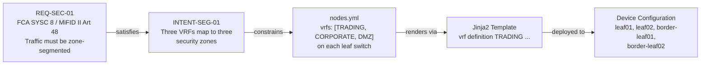

# Chapter 12: Security and Compliance Automation

Security and compliance work sits at the intersection of two different failure modes. The first is the configuration drift problem: networks accumulate changes over time, and the actual security posture of the network gradually diverges from what the policies say it should be. The second is the evidence problem: demonstrating that security controls are in place requires manual collection of configuration snapshots, manual cross-referencing against policy requirements, and manual assembly of audit reports — work that is periodic, labour-intensive, and retrospective.

Automation addresses both. A pipeline-managed network with a structured intent model has a security posture that is continuously enforced and continuously evidenced. The compliance artefacts are not assembled for an audit; they are a natural by-product of the operational workflow.

This chapter covers how to embed security and compliance into the automation pipeline — not as an add-on layer, but as properties of how the network is built and changed.

---

## The Compliance Problem with Traditional Network Operations

In a manually operated network, the gap between stated policy and actual configuration is inevitable. Policy documents define what the network should do. Device configurations define what the network does. The two converge in the immediate aftermath of a compliance audit and then diverge steadily until the next one.

The reasons are structural:

**Policy changes do not automatically propagate.** When a regulatory requirement changes — a new MiFID II obligation, a revised FCA SYSC expectation, an updated PCI-DSS control — the update to device configurations requires a deliberate engineering programme: identify affected devices, assess the impact, plan the change, execute it, verify it. This takes weeks, during which the organisation is non-compliant. The gap between policy update and configuration implementation is unmeasured and unmanaged.

**Change management cannot prevent all policy violations.** Change review depends on reviewers noticing that a proposed change would violate a compliance requirement. That knowledge is not always present in the reviewer. A change that inadvertently adds a broad permit rule to a trading zone ACL may pass review without the reviewer recognising the compliance implication.

**Audit preparation is a reconstruction exercise.** Demonstrating compliance requires gathering evidence that the network is configured as policy requires. In a manually operated network, this means running show commands on devices, comparing outputs against policy requirements, and assembling the results into a report. The report reflects the state of the network at the time of collection — not continuously, not verifiably. If the configuration changed between collection and submission, the report is incorrect.

**Out-of-band changes create undocumented exposure.** Emergency changes made directly to devices — the ACL modification applied during an incident, the firewall rule added to restore connectivity — create configuration state that has no corresponding record in change management. These changes may violate compliance requirements, and there is no mechanism to detect this until the next configuration audit.

The automation model addresses each of these structurally, by design.

---

## Security Policy as Code

The first principle: security policy lives in version control alongside network configuration, expressed as structured data, not as documents.

This means:
- ACL definitions are YAML in the source of truth, not handcrafted CLI
- Segmentation policy is expressed as design intents with explicit tests
- Firewall policy stubs are generated from the SoT, not authored device by device
- Every security control is traceable to the requirement it implements

### ACL Policy in the Source of Truth

ACME's ACL policy is defined in `nodes.yml` at the leaf level:

```yaml
acls:
  - name: ACL_TRADING_IN
    default_action: deny          # REQ-SEC-02: explicit deny-all
    entries:
      - seq: 10
        action: permit
        protocol: tcp
        src: 10.0.10.0/24
        dst: 10.0.10.0/24
        dst_port: any
        comment: "REQ-SEC-01: intra-trading east-west permitted"
      - seq: 20
        action: permit
        protocol: tcp
        src: 10.0.10.0/24
        dst: any
        dst_port: 443
        comment: "REQ-BIZ-01: market data HTTPS feeds"
      - seq: 9999
        action: deny
        protocol: ip
        src: any
        dst: any
        comment: "REQ-SEC-02: explicit deny-all"
```

Several properties of this definition are load-bearing for compliance:

**Requirement IDs in every ACL entry.** The `comment` field carries the requirement ID that justifies each rule. When this YAML renders through the Jinja2 template, the comment appears verbatim in the device configuration. The compliance evidence is in the running configuration itself — not in a separate document that may not reflect reality.

**Explicit deny-all.** The `default_action: deny` is not a configuration convention. It is enforced by `INTENT-SEG-02`, which is verified automatically on every pipeline run. A node missing the explicit deny-all fails the intent verification stage before any device is touched.

**No permit-any.** `permit_any: forbidden` in the intent definition means the verification suite will reject any ACL entry with a source or destination of `any` in the permit action. The prohibition is tested, not trusted.

The structural difference from manual ACL management: in the intent model, these properties are invariants. They cannot be violated by an individual change without failing pipeline verification. In a manually managed ACL, they are conventions — maintained by discipline, not by enforcement.

---

## The Traceability Chain

The traceability chain connects every device configuration to the business or regulatory requirement that justifies it. This is the mechanism that transforms compliance from a retrospective documentation exercise into an intrinsic property of how the network is built.



Each link in this chain is machine-readable and queryable:

- "Which intents satisfy REQ-SEC-01?" → query `design_intents.yml` for `satisfies: [REQ-SEC-01]`
- "Which devices implement INTENT-SEG-01?" → query `nodes.yml` for `intent: [INTENT-SEG-01]`
- "Does any device have a VRF configuration that does not reference INTENT-SEG-01?" → intent verification catches this
- "What would change if REQ-SEC-01 were updated?" → the dependency graph is explicit

For a financial services firm in a regulatory examination, this chain produces answers that are immediate, precise, and auditable. "Demonstrate that your network enforces zone segmentation as required by MiFID II Article 48" — the answer is the traceability chain, the intent verification results, and the Batfish reachability assertions, all available from the pipeline artefacts without assembly.

### Structuring Requirements for Regulatory Traceability

The `requirements.yml` structure matters for compliance. Each requirement should include:

```yaml
security:
  - id: REQ-SEC-01
    statement: >
      Network traffic must be segmented into distinct security zones:
      Trading, Corporate, and DMZ. No direct traffic between Trading
      and DMZ is permitted without inspection.
    priority: critical
    driver: regulatory
    regulatory_reference: "FCA SYSC 8.1.1 / MiFID II Article 48(1)"
    control_owner: CISO
    review_date: "2026-06"
```

The `regulatory_reference` field creates the direct link between the organisation's requirement and the specific regulatory text. The `control_owner` identifies who is accountable for the control. The `review_date` ensures requirements are periodically validated against current regulatory expectations.

This structure means that when a regulatory update changes the requirements — a new FCA guidance note, a PCI-DSS version update — the compliance team can update `requirements.yml`, and the impact cascades through the intent and SoT layers systematically rather than being manually traced across documentation.

---

## Automated Compliance Checks in the Pipeline

Compliance verification is a pipeline stage, not a periodic audit activity. Every proposed change triggers the full compliance check suite before any device is touched.

The checks operate at two layers:

### Layer 1: Structural Compliance (Sub-Second)

`verify_intents.py` checks whether the source of truth structurally satisfies every design intent. For security-relevant intents, this includes:

- **INTENT-SEG-02:** Every ACL has `default_action: deny`. Every ACL entry has a `comment` field containing a requirement ID. No ACL contains a `permit_any` entry.
- **INTENT-MGMT-01:** Every device has its management interface in the MGMT VRF. SSH access is restricted to the management VRF.
- **INTENT-MGMT-02:** Every device has exactly two syslog server entries pointing to the approved collectors. SNMPv3 is configured with SHA/AES128 on every device.
- **INTENT-SEG-01:** Every leaf has VRF definitions for TRADING, CORPORATE, and DMZ. Inter-VRF routing is disabled.

These checks run in under one second. They catch structural violations — missing fields, incorrect values, absent configurations — before the pipeline proceeds to more expensive validation stages.

### Layer 2: Behavioural Compliance (Batfish)

Batfish validates what the network actually does. For compliance, the critical assertions are:

**Reachability assertions (negative):** Can a host in the trading zone reach the DMZ without traversing a firewall? If this assertion succeeds — if the path exists — it is a security violation that should fail the pipeline. The intent is that this path does not exist.

```python
# Batfish reachability check: Trading → DMZ direct path must not exist
result = bfq.reachability(
    pathConstraints=PathConstraints(
        startLocation="/leaf.*/",
        endLocation="/border-leaf.*/",
        transitLocations="/^(?!fw).*/",   # must not pass through firewall
    ),
    headers=HeaderConstraints(
        srcIps="10.0.10.0/24",   # TRADING zone
        dstIps="10.0.30.0/24",   # DMZ zone
    ),
    actions="DELIVERED"
).answer()

# A non-empty result is a compliance violation
assert result.rows.empty, \
    f"COMPLIANCE VIOLATION: Trading zone can reach DMZ without firewall"
```

**Policy compliance (ACL analysis):** Does any ACL on any device permit traffic that INTENT-SEG-02 prohibits? Batfish's `searchFilters` function analyses every ACL against a set of traffic specifications and identifies any flow that would be permitted when it should not be.

**Blast radius:** For the specific change under review, which forwarding paths change? This is not purely a compliance check, but it is compliance-relevant — a change that unexpectedly modifies forwarding in a regulated zone triggers review even if it passes the structural checks.

These checks run in 60–90 seconds. They catch violations that cannot be detected by inspecting the data model alone: a configuration that is structurally correct but behaviourally wrong, a routing change that inadvertently creates a path that violates segmentation policy.

---

## The Audit Trail as a Pipeline Property

The pipeline's artefact set is the compliance evidence for every change. This is not a secondary use of pipeline output — it is a primary design goal.

| Artefact | Compliance Value |
|---|---|
| `reports/intents.xml` | Confirms design standards and security policies were structurally verified |
| `generated/*.cfg` | Shows exactly what was deployed — the configuration that was reviewed, tested, and approved |
| `reports/batfish_analysis.json` | Confirms network behaviour was validated before deployment — no reachability violations, no policy exceptions |
| `reports/diffs/*.diff` | Exact line-by-line change to each device — what changed and only what changed |
| MR approval record | Identity of the reviewer, timestamp, and the state of all artefacts at the time of approval |
| `reports/deployment_log.json` | Per-device deployment status and timing — confirmation of what was deployed and when |

For a MiFID II or FCA SYSC audit, this artefact set answers the core audit questions immediately:

- **What changed?** The configuration diffs, per device.
- **Was it authorised?** The MR approval record with reviewer identity and timestamp.
- **Was it validated before deployment?** The intent verification and Batfish reports, both timestamped before deployment.
- **Was it correctly implemented?** The deployment log confirming successful deployment.
- **Does the network currently satisfy the security requirements?** The most recent intent verification and Batfish reports from the latest pipeline run.

No retrospective assembly. No polling devices for current state. The audit evidence is a query against the pipeline history.

### The Absence of Evidence Problem

Traditional audit preparation has a structural weakness: it can only verify what was checked. If a change was made outside the change management process — an emergency CLI modification, a vendor-initiated change during a support session — it will not appear in the change records. The audit evidence is incomplete.

In a pipeline-managed network, any configuration that does not originate from the pipeline is drift. The drift detection layer (Chapter 11) identifies it; the auto-remediation tier framework determines the response. For security-relevant drift — an ACL modification outside the pipeline — this should be a Tier 3 event at minimum: alert, escalate to the security team, investigate before remediation.

The compliance implication: in a mature automation programme, out-of-band configuration changes become detectable as a class of event. The absence of such events in the drift detection log is positive evidence that all configuration changes went through the pipeline. This is a materially stronger compliance posture than "we have a change management process that we believe is followed."

---

## Regulatory Alignment Patterns

The patterns in this chapter apply across regulated environments, but the specific frameworks that financial services organisations most commonly encounter deserve explicit treatment.

### MiFID II and Network Infrastructure

MiFID II's operational resilience requirements — particularly Article 48 and the related RTS on organisational requirements — create specific obligations for network infrastructure:

**System resilience.** Trading systems must be capable of withstanding network failures. The network architecture must avoid single points of failure. `INTENT-TOPO-02` (MLAG pairs, no single point of failure) is a direct implementation of this obligation. The intent verification check that every leaf has an MLAG peer is a continuous assertion that the obligation is met.

**Change management.** Material changes to trading infrastructure require pre-change testing and post-change validation. The pipeline's validation stages — intent verification, Batfish, diff — are the pre-change testing. The post-deployment verification stage is the post-change validation. The pipeline artefacts are the evidence.

**Business continuity.** Disaster recovery capabilities must be tested. The infrastructure-as-code model means the DR site configuration is generated from the same SoT as the primary site — it is structurally identical and continuously tested through the same pipeline.

### FCA SYSC and Operational Risk

FCA SYSC Chapter 8 requires firms to have systems and controls appropriate to their business. For network infrastructure, this translates to:

**Access controls.** Management plane access must be controlled and auditable. `INTENT-MGMT-01` mandates management VRF isolation on every device. Every management access event is logged. The SoT is the authoritative definition of who can access what, and the pipeline enforces it.

**Audit trails.** The firm must maintain adequate records of systems changes. The pipeline history is the audit trail: every change, every approver, every test result, every deployment timestamp.

**Incident response.** The firm must have adequate procedures for detecting and responding to operational incidents. The observability stack, automated diagnostics, and runbook library (Chapter 8) constitute these procedures in executable form.

### PCI-DSS Network Segmentation

PCI-DSS Requirement 1 mandates network segmentation to protect cardholder data. For organisations with cardholder data in scope:

**Segmentation must be verified.** PCI DSS 4.0 requires that network segmentation be tested at least every six months, and after any change that could affect the segmentation controls. In the automation model, Batfish runs segmentation verification on every merge request. The segmentation is tested continuously, not periodically. The test results are artefacts that satisfy the PCI-DSS verification requirement.

**Firewall configuration must be reviewed quarterly.** PCI-DSS Requirement 1.3.2 requires reviewing firewall and router rule sets at least quarterly. In the intent model, the rule set is the `nodes.yml` ACL definitions. The quarterly review is a review of the SoT — structured, diffable, with full history. It is substantially faster and more thorough than reviewing running configurations device by device.

**No permit-any rules.** PCI-DSS prohibits broad permit rules in firewall and ACL configurations. `INTENT-SEG-02`'s `permit_any: forbidden` assertion enforces this continuously. Every pipeline run verifies it. The evidence of continuous enforcement is available in the pipeline artefacts.

---

## Security Drift as a Security Event

In Chapter 8's auto-remediation framework, configuration drift is an operational event — a deviation from the SoT that should be detected and corrected. For security-relevant configurations, drift is a security event that requires a different response.

The distinction:

| Drift Type | Example | Response |
|---|---|---|
| Operational drift | NTP server address changed | Tier 1: auto-remediate |
| Management plane drift | Syslog server removed | Tier 1: auto-remediate, alert |
| Security policy drift | ACL entry added outside pipeline | Tier 3: alert security team immediately, do not auto-remediate until investigated |
| Segmentation drift | VRF configuration modified | Tier 3: alert immediately, escalate |

Security policy drift should never be silently auto-remediated. The reason: an unexpected ACL modification might be a mistake, but it might be evidence of a compromise or a malicious insider action. Auto-remediating it — correcting the configuration without investigation — destroys evidence and may mask an ongoing security incident.

The appropriate response to security policy drift is:
1. Detect and alert immediately — do not wait for the next scheduled check
2. Notify the security team, not just the operations team
3. Preserve the drift state for investigation — before remediating, capture what changed and when
4. Investigate the root cause — was this an authorised emergency change that missed the pipeline? An error? Something else?
5. Only remediate after the investigation, through the pipeline

This requires the drift detection system to classify security-relevant configuration separately from operational configuration — a classification that should be explicit in the auto-remediation risk register.

---

## From Compliance Obligation to Design Principle

The operational model described in this chapter inverts the traditional relationship between compliance and network operations. In the traditional model, compliance is a constraint imposed on operations: a set of requirements that operations must demonstrate it satisfies, periodically, through audit evidence assembled retrospectively.

In the automation model, compliance is a property of how the network is built. The traceability chain is not assembled for auditors — it is the intrinsic structure of the intent model. The compliance checks are not run for audits — they run on every change. The audit evidence is not collected periodically — it is the continuous output of the pipeline.

The practical consequence: audit preparation time approaches zero. The organisation's compliance posture is demonstrable at any moment, from the pipeline history, without assembly. The gap between regulatory requirement and network configuration is not a risk to be managed — it is an invariant enforced by the pipeline.

For compliance officers and security engineers, this is the most significant operational consequence of a mature automation programme. The work changes from periodic evidence collection to continuous policy governance: updating `requirements.yml` when regulations change, reviewing intent verification results, and managing the classification of security-relevant drift. The audit is no longer an event to prepare for — it is a query against a continuous record.

---

*Next: [Chapter 13 — Dashboards and Metrics](../13-dashboards/chapter.md) — measuring and communicating the programme's outcomes.*
