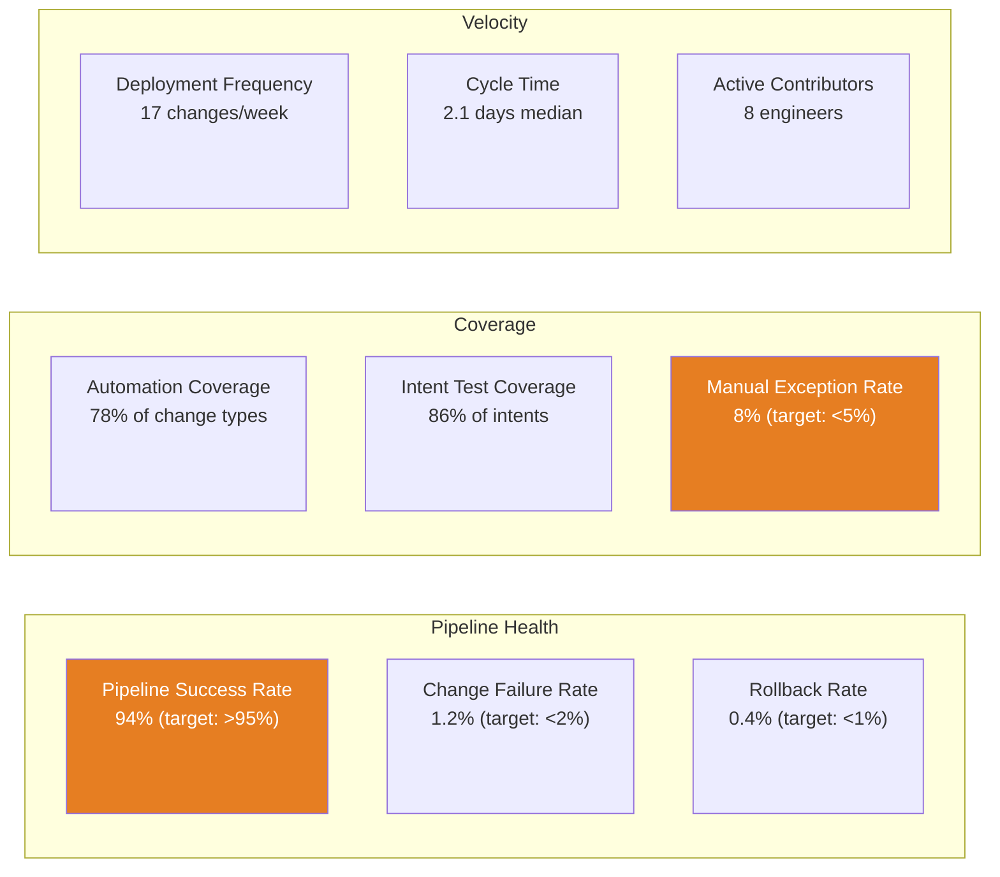

# Chapter 13: Dashboards and Metrics

Automation programmes that do not measure themselves become invisible. The engineering work is visible — pipelines are running, configurations are being generated, changes are flowing through the pipeline — but without a metrics layer that surfaces this activity in terms that resonate with different audiences, the programme's value is opaque to everyone outside the immediate team.

This invisibility has consequences. Executive sponsors lose confidence in programmes they cannot see making progress. Peer teams resist contributing to something whose value they cannot observe. Budget owners question whether the investment is delivering returns. And within the team itself, without metrics, it is impossible to identify where the programme is underperforming and what to prioritise next.

Dashboards are the mechanism that keeps the programme visible, aligned, and defensible. This chapter covers the three views that every automation programme needs, the metrics framework that populates them, and how to sustain executive support through the transformation journey.

---

## What Dashboards Are For

A common mistake is designing dashboards for the engineering team's self-interest — tracking the metrics that engineers find interesting and then presenting them to executives. Technical metrics without business translation do not sustain executive support. An executive looking at "pipeline success rate: 94%" does not know whether to be satisfied or concerned.

The dashboard is a communication tool before it is a measurement tool. Its purpose is to answer the questions that each stakeholder group is actually asking:

**Executives and sponsors** are asking: Is the programme delivering the returns we were promised? Is the risk posture improving? Are we getting faster? Is the investment justified?

**Operations leaders** are asking: Is the estate more stable than it was? Are we spending less time on routine maintenance? Are we responding to incidents faster?

**Engineering teams** are asking: Is the pipeline working? Are we shipping automation? Are we covering the estate? Are there blockers to adoption?

Three views, three audiences, one underlying data model. The metrics are often derived from the same sources — pipeline logs, change management records, incident data — presented at different levels of abstraction and in different terms.

---

## The Metrics Framework

Three categories of metrics cover the full lifecycle of an automation programme. These align with the value pillars established in Chapter 2 and the product thinking principles from Chapter 8.

### Category 1: Adoption Metrics

Adoption metrics answer the question: is the automation being used? A pipeline that exists but is not used delivers no value. Adoption metrics are the leading indicators — they tell you whether the investment is being realised before the business outcome metrics confirm it.

| Metric | Definition | Why It Matters |
|---|---|---|
| Automation coverage | % of eligible change types with an automated pipeline path | Measures completeness of the automation capability |
| Pipeline utilisation | % of changes executed through the pipeline vs manual | Measures whether engineers are using the automation |
| Active contributors | Number of engineers who have submitted a pipeline change in the last 30 days | Measures breadth of adoption, not just volume |
| Onboarding time | Days from a new engineer joining to first independent pipeline change | Measures whether the tooling is learnable |
| Manual exception rate | % of changes processed outside the pipeline by exception | Measures the gap between capability and compliance |

**Interpreting adoption metrics:** A programme with high pipeline coverage but low utilisation has a tooling adoption problem, not a tooling completeness problem. A programme with high utilisation but a rising manual exception rate is under operational pressure that is causing engineers to bypass the process. These patterns require different interventions.

### Category 2: Quality and Reliability Metrics

Quality metrics answer the question: is the automation reliable enough to trust? Adoption without reliability is worse than no automation — it creates inconsistent outcomes that erode engineer trust and drive manual exceptions.

| Metric | Definition | Why It Matters |
|---|---|---|
| Pipeline success rate | % of pipeline runs that complete without error | Measures reliability of the automation tooling |
| Change failure rate | % of deployed changes that require rollback or remediation within 24 hours | Measures quality of the validation and review process |
| Rollback rate | % of deployments that trigger automatic rollback | Measures whether the deployment stage is stable |
| Intent test coverage | % of design intents that have automated verification | Measures completeness of the compliance envelope |
| Drift detection rate | Drift events detected per week, by tier | Measures effectiveness of the observability layer |
| MTTR (automated) | Mean time to remediation for Tier 1 auto-remediated events | Measures effectiveness of auto-remediation |

**The quality gate:** These metrics set the floor. Pipeline success rate below 90% is not a minor issue — it means engineers cannot rely on the pipeline and will work around it. Change failure rate trending upward after a period of stability is an early signal that test coverage is falling behind the rate of change. Quality metrics should be reviewed weekly within the engineering team; they surface problems before they become adoption crises.

### Category 3: Business Impact Metrics

Business impact metrics answer the question: is the programme delivering the returns it was designed to deliver? These are the lagging indicators — they confirm what the adoption and quality metrics predict, but they take longer to materialise.

| Metric | Definition | Why It Matters |
|---|---|---|
| Change lead time | Median days from change request to production deployment | Tracks the agility value pillar |
| Incident rate | Network-related incidents per month, trending | Tracks the risk reduction value pillar |
| MTTD | Mean time to detect operational anomalies | Tracks observability maturity |
| MTTR (overall) | Mean time to restore service after incident | Tracks operational resilience improvement |
| Audit preparation time | Hours required to prepare for compliance audit | Tracks the compliance value pillar |
| Engineering hours recovered | Hours per month no longer spent on manual tasks | Tracks the cost reduction value pillar |
| New site provisioning time | Days from approval to operational connectivity | Tracks the agility value pillar for provisioning |

**Baselining before the programme starts:** Business impact metrics are only meaningful relative to a baseline. Capturing the pre-automation baseline — the change lead time, incident rate, MTTR, and audit preparation time before the pipeline exists — is the work that makes the business case defensible retrospectively. If the baseline was not captured before the programme started, the first six weeks should include a retrospective measurement exercise to establish it from historical records.

---

## Three Dashboard Views

### Executive Dashboard

The executive view should fit on a single screen and answer the four investment questions without requiring interpretation. It is updated monthly and presented at leadership review cadences.

```
┌─────────────────────────────────────────────────────────────────┐
│  Network Automation Programme — Executive View         Mar 2026 │
├──────────────────┬──────────────────┬──────────────────┬────────┤
│ Automation       │ Change           │ Incident         │ Audit  │
│ Coverage         │ Lead Time        │ Rate             │ Effort │
│                  │                  │                  │        │
│   78%            │   2.1 days       │   -34%           │ -60%   │
│ ↑ from 65%       │ ↓ from 8.4 days  │ vs. baseline     │ vs.    │
│ (6 months ago)   │ (6 months ago)   │                  │baseline│
├──────────────────┴──────────────────┴──────────────────┴────────┤
│  Value Delivered (last 12 months)                               │
│  • 340 changes deployed via pipeline (avg 0 rollbacks/month)    │
│  • 28 compliance incidents prevented by pipeline validation     │
│  • 180 engineering hours/month recovered from manual tasks      │
│  • New branch provisioning: 3 days → same day                   │
├─────────────────────────────────────────────────────────────────┤
│  Programme Health    ●●●●○  (4/5 phases complete)               │
│  Next Milestone      Auto-remediation Tier 2 expansion — Apr    │
└─────────────────────────────────────────────────────────────────┘
```

**What to show and what not to show:** The executive dashboard should never include pipeline technical metrics (success rate, test coverage) unless they have deteriorated to the point of programme risk — in which case they should be surfaced as a specific agenda item, not buried in a dashboard. Executives do not need to know that the pipeline succeeded 94% of the time; they need to know whether the programme is delivering the promised outcomes.

**The trend is the story.** Absolute numbers matter less than direction and velocity. A change lead time of 2.1 days is not inherently good or bad; 2.1 days trending down from 8.4 days over six months is demonstrably good. Always present metrics with a comparison period — month-on-month, or programme-start to present.

### Engineering Dashboard

The engineering view is operational. It is reviewed weekly by the team, with daily awareness for the pipeline health metrics. It drives the team's week-to-week prioritisation.



**Reading the engineering dashboard:** Orange indicates a metric that is within tolerable range but approaching the threshold — it requires attention before it becomes a problem. Red (not shown here) indicates a metric that has breached the target — it requires immediate action. Green indicates the metric is healthy and does not need active attention.

The manual exception rate at 8% against a 5% target is the highest-priority item in this view. It indicates that engineers are bypassing the pipeline for approximately one in twelve changes. The action is investigation: are they bypassing because the pipeline does not support those change types (a coverage gap), because the pipeline is too slow for urgent changes (a usability gap), or because they lack confidence in the pipeline for certain change types (a trust gap)?

**Actionable, not informational.** Every metric on the engineering dashboard should have a defined response: who is responsible for investigating when it falls below threshold, and what the escalation path is. A dashboard full of amber indicators with no owner is a status report, not a management tool.

### Operations Dashboard

The operations view tracks the estate's health and the automation's contribution to operational stability. It is reviewed daily for anomalies and weekly for trends.

| Metric | Current | 30-Day Trend | Target |
|---|---|---|---|
| Drift events detected | 12/week | ↓ from 18 | < 10/week |
| Tier 1 auto-remediated | 8/week (67%) | ↑ | > 75% |
| Tier 2 proposed + approved | 3/week | — | — |
| Tier 3 escalated | 1/week | ↓ | < 1/week |
| Incident auto-resolution rate | 42% | ↑ from 28% | > 60% |
| MTTD (operational anomaly) | 4.2 min | ↓ from 11 min | < 5 min |
| MTTR (all incidents) | 28 min | ↓ from 67 min | < 30 min |
| Alert noise (false positives) | 14% | ↓ from 31% | < 10% |

**The drift trend as a programme health signal.** Drift events detected per week should trend downward as the programme matures — not because the detection is improving (which would cause the number to rise initially), but because the disciplines of pipeline-only changes and SoT currency reduce the rate of drift. A rising drift rate after the estate was previously stable is a signal that operational discipline is eroding.

**Tier distribution matters as much as volume.** The ratio of Tier 1 to Tier 3 events tells the story of automation maturity. A high proportion of Tier 3 events means the team has not yet validated enough automation to handle the most common operational scenarios. As Tier 1 coverage expands, the proportion should shift — same total events, more resolved automatically, fewer escalated.

---

## Instrumentation: Getting the Data

A dashboard is only as good as its data sources. The three views above require instrumentation at three layers:

**Pipeline instrumentation** — GitLab (or GitHub) already produces the data for most engineering metrics. Pipeline run logs, merge request metadata, deployment timestamps, and artefact storage provide the raw material for pipeline success rate, change failure rate, deployment frequency, cycle time, and active contributors. Most of this can be extracted from the GitLab API or built into the pipeline jobs as structured log output.

**SoT coverage analysis** — Automation coverage and intent test coverage are derived from the SoT and the test suite. A script that queries `design_intents.yml` and cross-references which intents have corresponding `verify_intents.py` checks produces the intent test coverage metric. Automation coverage requires a defined list of eligible change types and a mapping to pipeline support.

**Operational telemetry** — Drift detection rate, MTTD, MTTR, and incident auto-resolution rate come from the operations layer: the drift detection system, the monitoring stack, and the ITSM. These require integration between the pipeline output (which incidents were auto-resolved) and the ITSM (which incidents were created and how they were resolved).

**Resist the urge to instrument everything at once.** Start with the metrics that are cheapest to capture and most important to your current programme stage. In Phase 1, adoption and pipeline health metrics are sufficient — the business impact metrics have not yet materialised. In Phase 2, add quality metrics. By Phase 3, the operational metrics are available. Building a comprehensive dashboard before the data exists produces a dashboard full of zeros that undermines confidence in the programme rather than building it.

---

## Sustaining Executive Support

Executive attention is finite and competitive. The automation programme competes with every other initiative for visibility and support. Dashboards are the primary mechanism for maintaining visibility without requiring executive time to investigate.

**The monthly value summary.** A one-page summary, distributed monthly to the programme sponsor and relevant stakeholders, provides the continuity of signal that sustains support between formal reviews. It should cover: what changed in the last month, what the programme delivered in business terms, what the next month's priorities are, and whether the programme is on track. The template for this summary is in the [Dashboard Value Summary template](../templates/dashboard-value-summary.md).

**Responding to the "is it working?" question.** Every sponsor will eventually ask this directly. The answer requires a clear narrative, not just numbers: "Six months ago, we were making eight changes per week manually, with an average lead time of eight days and three incidents per month attributable to change-related errors. Today, we are making seventeen changes per week through the pipeline, with a lead time of two days and zero change-related incidents in the last ninety days. The pipeline has prevented twenty-eight changes from reaching production that failed automated validation." This is the story the dashboards need to support.

**When metrics look bad.** Metrics do not always trend in the right direction. A quarter where incident rate increases, or pipeline success rate falls, or manual exception rate rises needs to be explained proactively — not defended reactively. The programme leader who brings a bad metric to the sponsor with an explanation and a plan retains credibility. The one who waits for the sponsor to notice loses it.

---

## Metrics Maturity by Programme Phase

Not every metric is relevant at every stage. Tracking metrics that do not yet have data produces zeros that look like failure rather than immaturity.

| Phase | Metrics to Track | Metrics to Ignore |
|---|---|---|
| **Phase 1: Foundation** | Pipeline success rate, deployment frequency, active contributors | Business impact metrics (insufficient data) |
| **Phase 2: Expansion** | + Automation coverage, intent test coverage, change lead time | MTTR, incident auto-resolution (not yet instrumented) |
| **Phase 3: Operational** | + MTTD, MTTR, drift rate, incident auto-resolution | All metrics now in scope |
| **Phase 4: Optimisation** | All metrics; add benchmark comparisons | — |

The shift from phase to phase in metrics tracking mirrors the shift in programme maturity. A Phase 1 programme reporting MTTR metrics is reporting numbers that reflect pre-automation baseline with no programme contribution — which may actively mislead stakeholders about whether the programme is working.

---

## The Dashboard as Programme Governance

Beyond stakeholder communication, the dashboard serves an internal governance function. Metrics with targets create accountability. Metrics with owners create responsibility. Metrics reviewed regularly create the feedback loop that keeps the programme on track.

Establishing a weekly metrics review within the engineering team — fifteen minutes, the engineering dashboard, what moved, what needs action — creates a discipline of continuous improvement. Over twelve months, this cadence compounds: small improvements each week, surfaced by the metrics, accumulate into the business impact that the executive dashboard later reports.

The automation programme is, as Chapter 8 and Chapter 10 argued, a product. Products are managed with metrics. Products without metrics are managed by opinion. Opinion is less reliable than data, and opinion erodes when the programme hits turbulence. Data does not.

## Templates

The following template supports the dashboard and reporting work described in this chapter.

| Template | Purpose | Format |
|---|---|---|
| [Dashboard Value Summary](../templates/dashboard-value-summary.md) | One-page monthly summary for programme sponsors and stakeholders | Markdown |

---

*This concludes the main chapters of the handbook. The [Executive Summary](../00-executive-summary/) provides the handbook's core arguments in a format for senior leaders who want the conclusions without the full text. The [Examples](../examples/) directory contains the ACME Investments working codebase.*
